# Java 基础

## 模块六 、方法

### 第一章、方法的使用

#### 1.方法介绍以及简单方法定义(无参无返回值)

```
1.问题描述:
  之前所有的代码都在main方法中写,如果我们将来将所有功能的代码都放到main方法中,会显得main方法代码太多,太乱,太臃肿-> 不好维护

  解决:将不同功能的代码放到不同的方法中,想执行某个功能,直接调用方法名就行了,对应的代码就自动执行起来了
      将来维护的时候,直接找到对应的方法,就可以对其直接修改维护

2.方法:
  拥有功能性代码的代码块
  将不同的功能放在不同的方法中,给每个方法取个名字,直接调用方法名,对应的方法就执行起来了,好维护

3.通用定义格式:
  修饰符 返回值类型 方法名(参数){
      方法体
      return 结果
  }

4.通过通用格式,分成四种方法来学习:
  a.无参无返回值方法
  b.有参无返回值方法
  c.无参有返回值方法
  d.有参有返回值方法
```

```
1.无参无返回值方法定义:
  public static void 方法名(){
      方法体 -> 实现此方法的具体代码

  }

2.调用:直接调用
  在其他方法中: 方法名()

3.注意事项:
  a.void关键字代表无返回值,写了void,就不要在方法中写return 结果
  b.方法不调用不执行, main方法是jvm调用的
  c.方法之间不能互相嵌套,方法之间是平级关系
  d.方法的执行顺序只和调用顺序有关
```

```java
public class Demo01Method {
    public static void main(String[] args) {
        farmer();
        cook();
        me();
        cook();
    }

    //农民伯伯
    public static void farmer(){
        System.out.println("播种");
        System.out.println("施肥");
        System.out.println("拔草");
        System.out.println("浇水");
        System.out.println("除虫");
        System.out.println("收割");
    }

    //厨师
    public static void cook(){
        System.out.println("洗菜");
        System.out.println("切菜");
        System.out.println("炒菜");
        System.out.println("装盘");
        System.out.println("上菜");
    }

    //我们自己
    public static void me(){
        System.out.println("洗手");
        System.out.println("吃菜");
    }
}
```

```
定义一个方法,实现两个整数相加
```

```java
public class Demo02Method {
    public static void main(String[] args) {
        sum();
        System.out.println("哈哈哈哈哈");
    }
    public static void sum(){
        int a = 10;
        int b = 20;
        int sum = a+b;
        System.out.println("sum = " + sum);
    }
}

```

#### 2.无参数无返回值的方法执行流程

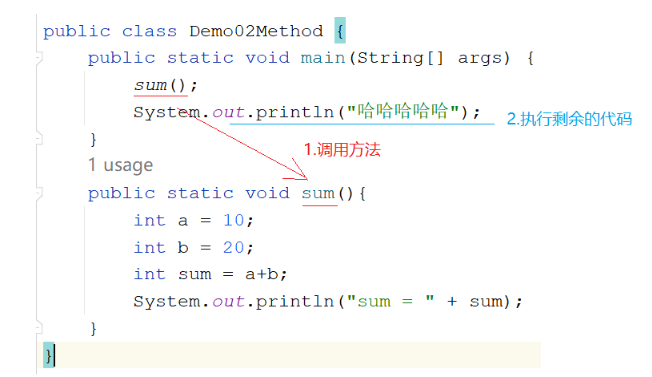

#### 3.方法定义各部分解释

```
1.通用格式:
  修饰符 返回值类型 方法名(参数){
      方法体
      return 结果
  }

2.各部分解释:
  a.修饰符: public static
  b.返回值类型:
    该方法最终返回的结果的数据类型
        比如: return 1 -> 方法上的返回值类型写int
             return 2.5 -> 方法上的返回值类型写double
             return "" -> 方法上的返回值类型写String
    如果没有返回值,不要写具体的返回值类型了,要写void


  c.方法名:见名知意(小驼峰式)
  d.参数:进入到方法内部参与执行的数据(数据类型 变量名,数据类型 变量名)
  e.方法体:实现该方法的具体代码
  f.return 结果: 如果有返回值,可以利用return 将结果返回
```

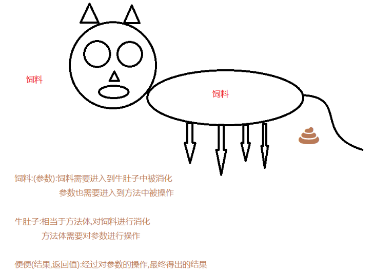

#### 4.有参数无返回值的方法定义和执行流程

```java
1.格式:
  public static void 方法名(数据类型 变量名){
      方法体
  }

2.调用:
  直接调用:方法名(具体的值) -> 调用的时候要给参数赋值
```

```
需求:定义一个方法,实现两个整数相加
```

```java
public class Demo03Method {
    public static void main(String[] args) {
       sum(10,20);
    }

    public static void sum(int a,int b){
        int sum = a+b;
        System.out.println("sum = " + sum);
    }
}

```

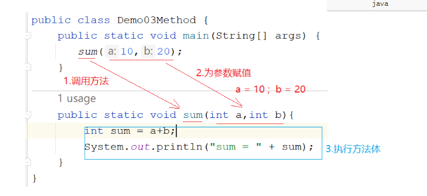

#### 5.无参数有返回值定义以及执行流程

```java
1.格式:
  public static 返回值类型 方法名(){
      方法体
      return 结果
  }

2.调用: 返回值返回给了谁? 哪里调用返回给哪里
  a.打印调用:sout(方法名()) -> 不推荐使用
  b.赋值调用:调用完之后用一个变量接收返回值结果 -> 极力推荐
    数据类型 变量名 = 方法名()
```

```
需求:定义一个方法,实现两个整数相加,将结果返回
```

```java
public class Demo04Method {
    public static void main(String[] args) {
        //打印调用 -> 涛哥不推荐
        System.out.println(sum());

        //赋值调用-> 极力推荐
        int result = sum();
        System.out.println("result = " + result);

    }

    public static int sum(){
        int a = 10;
        int b = 20;
        int sum = a+b;
        return sum;
        //return a+b;
    }
}

```

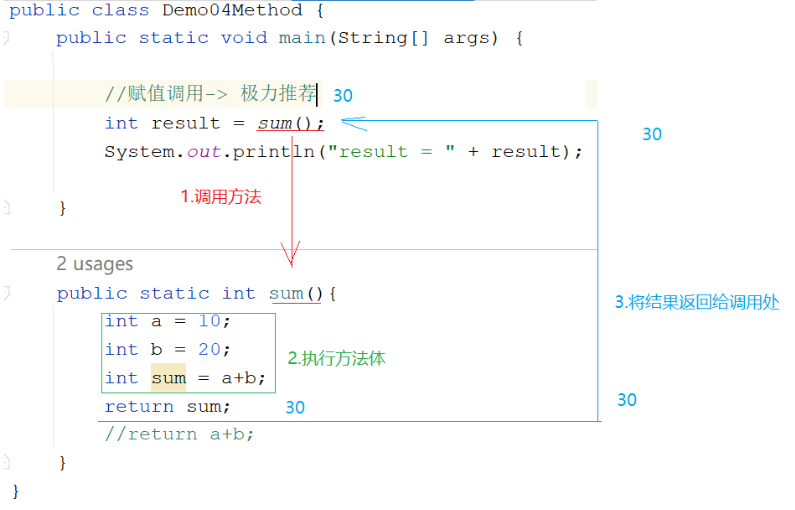

#### 6.有参数有返回值定义以及执行流程

```java
1.格式:
  public static 返回值类型 方法名(参数){
      方法体
      return 结果
  }

2.调用:
  a.打印调用:
    sout(方法名(具体的值))

  b.赋值调用(极力推荐)
    数据类型 变量名 = 方法名(具体的值)
```

```
需求:定义一个方法,实现两个整数相加,将结果返回
```

```java
public class Demo05Method {
    public static void main(String[] args) {
        int sum = sum(10, 20);
        System.out.println("sum = " + sum);
    }
    public static int sum(int a,int b){
        int sum = a+b;
        return sum;
    }
}

```

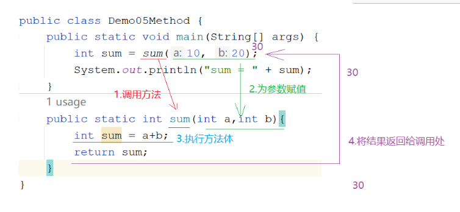

#### 7.形式参数和实际参数区别

```
1.形式参数(形参):在定义方法的时候形式上定义的参数,此参数还没有值
2.实际参数(实参):在调用方法的时候给形参赋予的具体的值
```

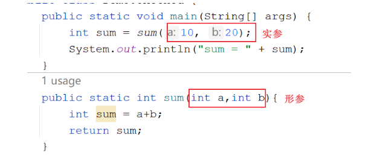

#### 8.参数和返回值使用的时机

```
1.参数:
  当想将方法A的数据传递到方法B时,那么定义方法B时就需要带个参数,在方法A中调用方法B时,可以将方法A中的数据通过参数传递到方法B中

2.返回值:
  调用方法A时,想要方法A的结果,去参与其他的操作,那么方法A就需要将自己的结果返回
```

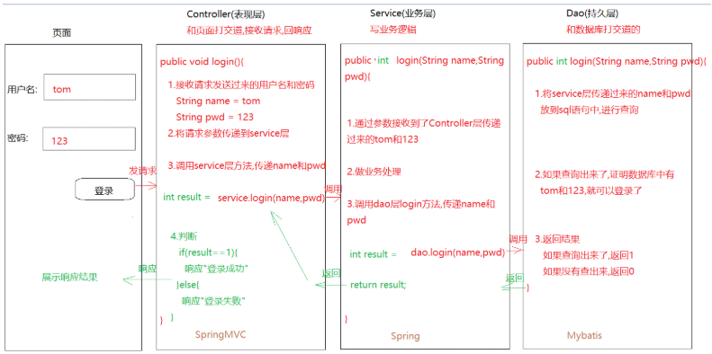

> 1.controller 接收的请求参数需要一层一层传递到 service 层,service 层需要将请求参数再传递到 dao 层
>
> 此时 service 的方法以及 dao 的方法都需要参数,去接收
>
> 2.dao 层的结果需要传递给 service,service 再传递给 controller 层,此时 dao 层和 service 方法需要返回值

#### 9.变量作为实参使用

```
需求:定义一个方法,比较两个整数的大小,如果第一个比第二个大,返回true,否则返回false
```

```java
public class Demo07Method {
    public static void main(String[] args) {
        int i = 10;
        int j = 20;
        //传递的是i和j,但是我们真正传递的是i和j代表的数据,不是变量本身
        boolean result = compare(i, j);
        System.out.println("result = " + result);
    }
    public static boolean compare(int a,int b){
        if (a>b){
            return true;
        }else{
            return false;
        }
    }
}

```

### 第二章、方法注意事项

```
1.方法不调用不执行
2.方法的执行顺序只和调用顺序有关
3.方法之间不能互相嵌套

4.void不能和[return 结果]共存,但是void能和[return]共存
  a.void:代表没有返回值
  b.return 结果:就代表有返回值了
               先将结果返回,然后结束方法

  c.return:仅仅代表结束方法,不代表有返回值

5.一个方法中不能连续写多个return(也就是说一个方法不能都多个返回值)

6.调用方法的时候要看看下面有没有这个方法,没有的方法直接调用会报错

```

```java
public class Demo08Method {
    public static void main(String[] args) {
        method01();
        //method04();
    }

    public static int method01(){
        return 1;
    }
    public static void method02(){
        return;
    }

    public static int method03(){
        return 1;
        //return 2;
    }
}
```

> ```
> 初学者怎么写:
>  1.先定义,再调用
>  2.如果是没有返回值的方法,直接在被调用的方法内部输出结果
>  3.如果是带返回值的方法,就调用完毕之后,用一个变量去接收结果,输出这个变量
>  4.调用方法:
>     直接调用:方法名() 或者 方法名(实参) -> 只针对于无返回值的方法
>     打印调用:sout(方法名()) 或者 sout(方法名(实参)) -> 针对有返回值的方法 -> 不推荐使用
>     赋值调用:数据类型 变量名 = 方法名() 或者 数据类型 变量名 = 方法名(实参) -> 针对于有返回值的方法 -> 推荐使用
> ```
>
> ```
> 怎么练习:
> 1.如果定义的方法没有返回值,写个void 不要写return 结果
> 2.如果定义的方法有返回值,就将void改成具体的返回值类型,在 方法体中最后写一个return 结果,将结果返回
> 3.如果方法有返回值,调用的时候推荐使用赋值调用,如果没有返回值,使用直接调用
> 4.练习的时候,只需要完成一个简单的需求(比如两个整数相加),针对此需求,定义4种方法,并成功调用
> ```

### 第三章、方法练习

#### 1.方法练习 1(判断奇偶性)

```
需求:
   键盘录入一个整数,将整数传递到另外一个方法中,在此方法中判断这个整数的奇偶性
   如果是偶数,方法返回"偶数"  否则返回"奇数"

方法三要素:
  方法名:要
  参数:要
  返回值:要
```

```java
public class Demo01Method {
    public static void main(String[] args) {
        Scanner sc = new Scanner(System.in);
        int data = sc.nextInt();
        String result = method(data);
        System.out.println("result = " + result);
    }
    /*
         键盘录入一个整数,将整数传递到另外一个方法中,在此方法中判断这个整数的奇偶性
         如果是偶数,方法返回"偶数"  否则返回"奇数"
     */

    public static String method(int data){
        if (data%2==0){
            return "偶数";
        }else{
            return "奇数";
        }
    }
}

```

#### 2.方法练习 2(1-100 的和)

```
需求 :  求出1-100的和,并将结果返回

方法名:要
参数:不要
返回值:要
```

```java
public class Demo02Method {
    public static void main(String[] args) {
        int result = method();
        System.out.println("result = " + result);
    }

    public static int method() {
        int sum = 0;
        for (int i = 1; i <= 100; i++) {
            sum+=i;
        }
        return sum;
    }
}
```

#### 3.方法练习 3(不定次数打印)

```
需求:
   定义一个方法,给这个方法传几,就让这个方法循环打印几次"我是一个有经验的JAVA开发工程师"

方法名:要
参数:要
返回值:不要
```

```java
public class Demo03Method {
    public static void main(String[] args) {
        method(3);
    }
    public static void method(int n){
        for (int i = 0; i < n; i++) {
            System.out.println("我是一个有经验的java开发工程师");
        }
    }
}
```

#### 4.方法练习 4(遍历数组)

```
需求:
  在main方法中定义一个数组,将数组传递到另外一个方法中,在此方法中遍历数组

```

```java
public class Demo04Method {
    public static void main(String[] args) {
       int[] arr1 = {1,2,3};
       method(arr1);
    }

    /*
       调用method方法,传递的实参时int[]数组
       所以形参也应该用int型数组来接收
     */
    public static void method(int[] arr2){//int[] arr2 = arr1
        for (int i = 0; i < arr2.length; i++) {
            System.out.println(arr2[i]);
        }
    }

}
```

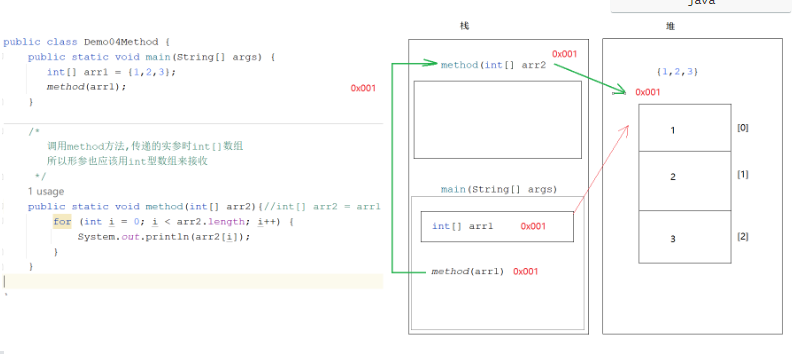

> 数组本身是引用数据类型,引用数据类型做方法参数传递,传递的是地址值

#### 5.练习 7 数组作为返回值返回

```java
public class Demo05Method {
    public static void main(String[] args) {
        int[] arr2 = method();//int[] arr2 = arr1
        for (int i = 0; i < arr2.length; i++) {
            System.out.println(arr2[i]);
        }
    }

    public static int[] method(){
        int a = 10;
        int b = 20;
        int sum = a+b;

        int sub = a-b;

        int[] arr1 = {sum,sub};
        return arr1;//返回的是一个int[],那么返回值类型也应该是int[]
    }
}
```

### 第四章、方法的重载

```
需求:定文三个方法，分别求2个整数相加,3个整数相加,4个整数相加
```

```java
public class Demo1OverLoad {
    public static void main(String[] args) {
        sum(10, 20);
        sum(10, 20, 30);
    }

    //  两个整数相加
    public static void sum(int a, int b) {
        System.out.println("两个整数相加的结果是：" + (a + b));
    }

    //    三个整数相加
    public static void sum(int a, int b, int c) {
        System.out.println("三个整数相加的结果是：" + (a + b + c));
    }
}
```

```
1.概述:方法名相同,参数列表不同的方法
2.什么叫参数列表不同:
  a.参数个数不同
  b.参数类型不同
  c.参数类型顺序不同

3.判断两个方法是否为重载方法,和什么无关:
  a.和参数名无关
  b.和返回值无关
```

```java
public static void open(){}
public static void open(int a){}
static void open(int a,int b){}
public static void open(double a,int b){}
public static void open(int a,double b){}
public void open(int i,double d){}
public static void OPEN(){}
public static void open(int i,int j){}
```

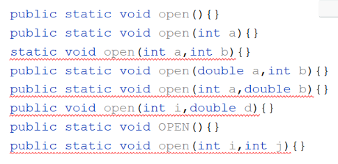

```
如果定义方法功能一样,只不过实现细节不一样,就可以考虑定义成重载的方法
```

## 模块七、面向对象

```java
模块六回顾:
  1.概述:拥有功能性代码的代码块
    将来干开发一个功能就应该对应一个方法
  2.方法的通用定义格式:
    修饰符 返回值类型 方法名(参数){
        方法体
        return 结果
    }

    a.修饰符:public static
    b.返回值类型:方法最终返回的结果的数据类型
    c.方法名:给方法取的名字,见名知意,小驼峰式
    d.参数:进入到方法内部参与执行的数据
    e.方法体:具体实现该方法的具体代码
    f.return 结果:该方法操作完参数之后,最终返回的一个数据

  3.无参无返回值方法:
    a.定义:
      public static void 方法名(){
          方法体
      }
    b.调用:方法名()

  4.有参无返回值方法:
    a.定义:
      public static void 方法名(形参){
          方法体
      }

    b.调用:
      方法名(实参)

  5.无参有返回值方法:
    a.定义:
      public static 返回值类型 方法名(){
          方法体
          return 结果
      }

    b.调用:
      数据类型 变量名 = 方法名()

  6.有参有返回值方法:
    a.定义:
      public static 返回值类型 方法名(形参){
          方法体
          return 结果
      }

    b.调用:
      数据类型 变量名 = 方法名(实参)

  7.注意事项:
    a.方法不调用不执行,main方法是jvm调用的
    b.方法之间不能互相嵌套
    c.方法的执行顺序只和调用顺序有关
    d.void不能和return 结果共存,但是能和return共存
      void:代表没有返回值
      return 结果:代表有返回值,先将结果返回,再结束方法
      return:仅仅代表结束方法

    e.一个方法中不能连续写多个return
    f.调用方法是,需要看有没有此方法


  8.参数和返回值使用时机:
    a.参数:当想将一个方法中的数据,传递到另外一个方法中操作,就需要参数了
    b.返回值:如果调用者需要使用被调用者的结果,被调用者就需要将自己的结果返回


  9.方法的重载:
    a.概述:方法名相同,参数列表不同
    b.什么叫参数列表不同:
      参数个数不同,类型不同,类型顺序不同
    c.和什么无关:
      和参数名无关,和返回值无关

模块七重点:
  1.知道为啥使用面向对象思想编程
  2.知道怎么使用面向对象思想编程
  3.知道什么时候使用面向对象思想编程
  4.会利用代码去描述世间万物的分类
  5.会在一个类中访问另外一个类中的成员 -> new对象
  6.成员变量和局部变量的区别
```

### 第一章.类和对象

#### 1.面向对象的介绍

```java
1.面向过程:自己的事情自己干,代表语言C语言
          洗衣服:每一步自己要亲力亲为 -> 找个盆,放点水,找个搓衣板,搓搓搓
2.面向对象:自己的事情别人帮忙去干,代表语言Java语言
          洗衣服:自己的事情别人干 -> 全自动洗衣机

3.为啥要使用面向对象思想编程:懒
  很多功能别人都给我们实现好了,我们只需要直接拿过来使用即可,简化了我们自己的编写过程,减少了我们的代码量

4.什么时候使用面向对象思想编程:
  调用别人的功能时
  在一个类中想使用别的类中的成员时,就使用面向对象思想编程
  至于我们使用的功能人家怎么实现的,我们不需要关心,我们只需要知道怎么使用即可

5.怎么使用面向对象思想编程:
  a.new呀,new完点呀-> 点代表的是调用
  b.特殊:如果调用的成员带static关键字,我们不需要new,我们直接类名点即可
```

```java
public class Demo01Object {
    public static void main(String[] args) {
        /*
           我们想在Demo01Object类中使用Scanner类中的next方法实现录入字符串
           那么我们就需要使用面向对象思想编程

           对象:Scanner-> new出来的
           对象实现好的功能:next()

           我们只需要知道找来Scanner这个对象,就可以调用这个对象中实现好的next方法
           至于next方法怎么实现的,我们不需要关心
         */
        Scanner sc = new Scanner(System.in);
        String data = sc.next();
        System.out.println("data = " + data);

        System.out.println("===================================");

        /*
           我们想在Demo01Object类中使用Random类中的nextInt方法实现随机整数
           那么我们就需要使用面向对象思想编程

           对象:Random -> new出来的
           对象实现好的功能:nextInt()

           我们只需要知道找来Random这个对象,就可以调用Random中的nextInt方法
           至于nextInt怎么实现的,我们不需要关心
         */
        Random rd = new Random();
        int data2 = rd.nextInt();
        System.out.println("data2 = " + data2);

        System.out.println("====================================");

        int[] arr = {1,2,3,4};//[1,2,3,4]
       /* System.out.print("[");
        for (int i = 0; i < arr.length; i++) {
            if (i== arr.length-1){
                System.out.print(arr[i]+"]");
            }else{
                System.out.print(arr[i]+",");
            }
        }*/

        /*
           Arrays就是我们找来的对象
           toStrig就是此对象中实现好的功能
           我们只需要调用,怎么实现我们不关心
         */
        System.out.println(Arrays.toString(arr));

    }
}

```

#### 2.类和对象

##### 2.1 类(实体类)\_class

```java
1.测试类:带main方法的类,主要是运行代码的
2.实体类:是一类事物的抽象表示形式
        世间万物的分类:比如: 人类   狗类   猫类   鼠标类
```

```java
组成部分:
  1.属性(成员变量):这一类事物有啥
    a.定义位置:类中方法外
    b.作用范围:作用于当前类
    c.定义格式: 数据类型 变量名
    d.默认值:
      整数:0
      小数:0.0
      字符:'\u0000'
      布尔:false
      引用:null

  2.行为(成员方法):这一类事物都能干啥
    只需要将模块六所学的方法中的static干掉,其他的都一样
```

```java
public class Person {
    //属性-> 成员变量
    String name;
    int age;

    //行为 -> 成员方法
    public void eat(){
        System.out.println("人要干饭");
    }

    public void drink(){
        System.out.println("人要喝水");
    }
}

```

##### 2.2 对象

```java
1.概述:一类事物的具体体现
2.使用:
  a.导包: import 包名.类名
    如果两个类在同一个包下,想要使用对方的成员不需要导包
    如果两个类不在同一个包下,想要使用对方的成员需要导包

    特殊包:java.lang -> 使用lang包下的类不需要导包 -> String

    友情提示:在学四种权限修饰符之前,尽量让两个类在同一个包下

  b.创建对象:想要使用哪个类中的成员,就new哪个类的对象
    类名 对象名 = new 类名() -> 比如: Person person = new Person()

  c.调用成员(成员变量,成员方法) -> 想要使用哪个类中的成员,就用哪个类的对象去点哪个成员
    对象名.成员变量名 = 值
    对象名.方法名() -> 调用的是无参无返回值方法
    对象名.方法名(实参) -> 调用的是有参无返回值方法
    数据类型 变量名 = 对象名.方法名() -> 调用的是无参有返回值方法
    数据类型 变量名 = 对象名.方法名(实参) -> 调用的是有参有返回值方法
```

```java
public class Person {
    //属性-> 成员变量
    String name;
    int age;

    //行为 -> 成员方法
    public void eat(){
        System.out.println("人要干饭");
    }

    public void drink(){
        System.out.println("人要喝水");
    }
}

public class Demo01Person {
    public static void main(String[] args) {
        Person person = new Person();
        System.out.println(person.name);
        System.out.println(person.age);
        person.name = "金莲";
        person.age = 26;
        System.out.println(person.name);
        System.out.println(person.age);

        person.eat();
        person.drink();

    }
}
```

#### 3.匿名对象的使用

> ```java
> 1.int i = 10
> a.int:是数据类型
> b.i:变量名
> c.等号右边的10:真正的数据
>
> 2.Person p = new Person()
> a.等号左边的Person:对象的类型,好比是int
> b.p:对象名
> c.等号右边的new Person():真正的数据,是一个Person对象,将这个对象真正创建出来了
> ```
>
> ```java
> 1.所谓的匿名对象:其实就是没有等号左边的部分,只有等号右边的部分(对象)
> 2.使用:
>  new 对象().成员
>
> 3.注意:
>  a.如果我们只想单纯的调用一个方法,让方法执行,我们可以考虑使用匿名对象
>  b.但是如果涉及到赋值,千万不要用匿名对象
> ```

```java
public class Person {
    String name;
    public void eat(){
        System.out.println("人要吃饭");
    }
}
```

```java
public class Demo01Person {
    public static void main(String[] args) {
        //原始方式
        Person p = new Person();
        p.name = "金莲";
        System.out.println(p.name);
        p.eat();

        System.out.println("=================");

        //匿名对象
        new Person().eat();

        new Person().name = "大郎";
        System.out.println(new Person().name);//null
    }
}

```

#### 4.一个对象的内存图

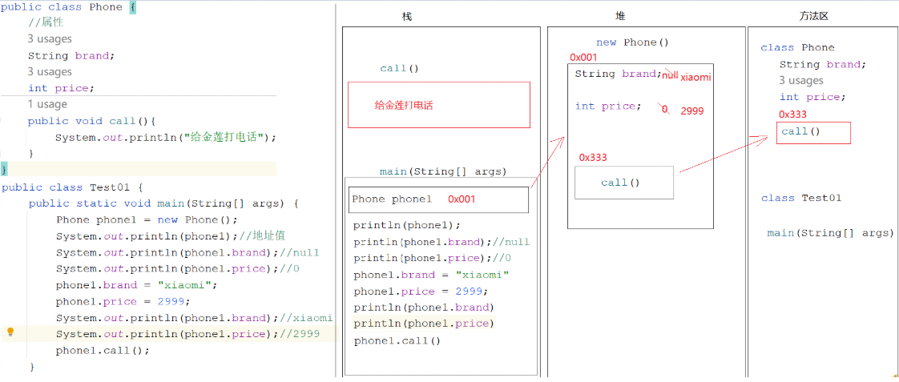

#### 5.两个对象的内存图

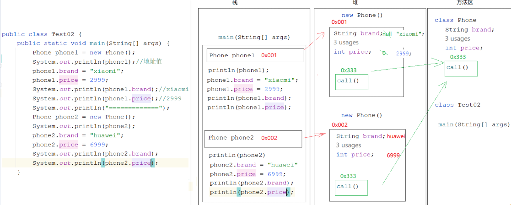

> phone1 和 phone2 都是 new 出来的,所以在堆内存中产生了两个不同的空间,所以改变一个空间的数据不会 影响另外一个空间中的数据

#### 6.两个对象指向同一片空间内存图

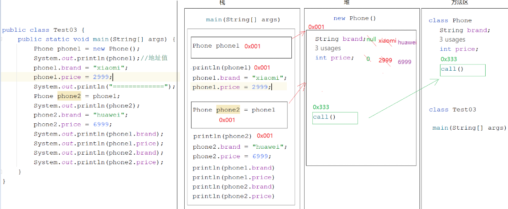

> phone2 是 phone1 给的,phone1 在内存中保存的是地址值,此时 phone1 和 phone2 地址值是一样的了,操作的是同一片空间的数据,所以改变一个对象的数据会影响到另外一个对象

### 第二章.成员变量和局部变量的区别

```java
1.定义位置不同(重点)
  a.成员变量:类中方法外
  b.局部变量:定义在方法之中或者参数位置

2.初始化值不同(重点)
  a.成员变量:有默认值的,所以不用先手动赋值,就可以直接使用
  b.局部变量:是没有默认值的,所以需要先手动赋值,再使用

3.作用范围不同(重点)
  a.成员变量:作用于整个类
  b.局部变量:只作用于自己所在的方法,其他方法使用不了

4.内存位置不同(了解)
  a.成员变量:在堆中,跟着对象走
  b.局部变量:在栈中,跟着方法走

5.生命周期不同(了解)
  a.成员变量:随着对象的创建而产生,随着对象的消失而消失
  b.局部变量:随着方法的调用而产生,随着方法的调用完毕而消失
```

```java
public class Person {
    String name;//成员变量
    public void eat(){
        int i = 10;//局部变量
        System.out.println(i);

        System.out.println(name);//成员变量不用手动赋值可以直接使用,因为有默认值
    }

    public void drink(){
        int j;
        //System.out.println(j);//局部变量没有默认值,所以需要手动赋值再使用
        System.out.println(name);

        //System.out.println(i);//i是eat方法的局部变量,在drink中使用不了
    }
}
```

### 第三章.练习

```java
需求:定义一个类MyDate,属性有 year  month  day

     再定义一个类Citizen(公民类),属性有 name(String类型)  birthday(MyDate类型)  idCard(String),为这三个属性赋值,然后将值取出来
```

```java
public class MyDate {
    int year;
    int month;
    int day;
}

public class Citizen {
    //姓名
    String name;  //默认值 null
    /*
      生日  MyDate类型

      MyDate属于自定义类型(引用数据类型)
      这种类型要操作之前必须要赋值
      怎么赋值?  需要new对象赋值
     */
    MyDate birthday = new MyDate(); // 默认值 null
    //身份证
    String idCard;  //默认值null
}

public class Test01 {
    public static void main(String[] args) {
        Citizen citizen = new Citizen();
        citizen.name = "涛哥";
        citizen.idCard = "111111111";

        /*
           citizen.birthday获取的是MyDate对象
           再去点year获取的是MyDate对象中的year

           链式调用
         */
        citizen.birthday.year = 2000;
        citizen.birthday.month = 10;
        citizen.birthday.day = 10;

        System.out.println(citizen.name+","+citizen.birthday.year+","+citizen.idCard);

    }
}
```

> 给引用数据类型赋值,需要 new 对象(String 比较特殊,可以直接=赋值)

## 模块八、面向对象

### 第一章.封装

#### 1.封装的介绍以及使用

```
1.面向对象三大特征:  [封装]     继承    多态

2.什么是封装思想:
  a.我们找来了一个对象(洗衣机),只需要按一下按钮就可以了(使用洗衣机功能的过程就是在使用面向对象思想编程的过程),每一个按钮下面都包含了很多内部结构的细节(细节被封装到按钮里面了->封装),在使用的时候有必要了解洗衣机的内部构造吗?我们没有必要去了解内部结构,我们只知道调用就可以了

    所以,洗衣机来说,将细节隐藏起来了,细节我们不要关注,会对外提供了一个公共的接口(按钮),供我们人类使用

  b.隐藏对象内部的复杂性,只对外提供公开,公共的接口,便于外界调用,从而提高了系统的可扩展性,可维护性,安全性,通俗来说,把该隐藏的隐藏起来(细节),把该暴露的暴露出来(对外提供的供别人使用的接口),这就是封装思想

  我们只需要调用这个接口(功能)即可,此接口背后封装起来的细节就开始执行了,但是我们不需要关注细节,只关注公共的接口怎么调用

  c.将细节隐藏起来,不让外界随便使用,但是我们可以提供一个公共的接口让外界间接使用隐藏起来的细节->封装思想
```

```java
1.问题:
  定义成员变量,只要是new出来对象,就可以随便调用,随便赋值,哪怕是不合理的值我们也挡不住,怎么办?
  将属性封装起来(隐藏细节)

  a.关键字:private(私有化的) -> 被private修饰的成员只能在本类中使用,在别的类中使用不了

  b.注意:
    将代码放到一个方法中,也是封装的体现
    一个成员被private修饰也是封装的体现,只不过private最具代表性

  c.private的使用:
    修饰成员变量:private 数据类型 变量名
    修饰方法:将public改成private,其他的都一样

2.问题:属性被私有化了,外界直接调用不了了,那么此时属性就不能直接赋值取值了,所以需要提供公共的接口
       get/set方法

      set方法:为属性赋值
      get方法:获取属性值
```

#### 2.this 的介绍

```java
情况：成员变量和局部变量重名的情况，Java使用的是就近原则
    问题：非要使用成员变量，咋么办？
    解决：使用this关键字进行区分
```

> this 关键字的作用：
>
> - this 可以调用本类成员(变量，方法)
> - `this.`本类成员变量
> - `this.`本类成员方法()
>
> `this.`的省略规则：
>
> - 本类成员方法：没有前提条件，`this.`可以省略
> - 本类成员变量:方法中没有出现重名的变量，`this.`才可以省略

> this 介绍：代表当前对象的引用

#### 3、构造方法

```java
构造方法(构造器)
	创建对象的时候，要执行的方法
格式:
    1.方法名与类名相同，大小写也需要一致
    2.没有返回值类型，连void都没有
    3.没有具体的返回值(不能由return语句带回结果数据)
```

> 构造方法的执行时机：
>
> - 在创建对象的时候，被调用执行
> - 每创建一次对象，就会执行一次构造方法

> 构造方法的作用：
>
> - 本质的作用：创建对象
> - 结合执行时机：可以创建对象的时候，给对象中的数据初始化

> 构造方法的注意事项：
>
> - 一个类中，没有编写构造方法，系统将会提供一个`[默认的]` `[无参数]`的构造方法
> - 一个类中，如果手动编写了构造方法，系统将不会再提供那个默认的无参构造了
>   - 建议:编写类的时候，无参构造，带参构造，全部手动给出
> - 构造方法不允许手动调用

#### 4、封装

> 权限修饰符
>
> - private：同一个类中
> - （default）：同一个类中，同一个包中
> - protected：同一个类中，同一个包中，不同包的子类
> - public：任意位置访问

## 字符串

> String 类的特点：
>
> - 1、Java 程序中所有双引号字符串，都是 String 这个类的对象
> - 2、字符串一旦被创建，就不可更改
> - 3、String 字符串虽然不可改变，但是可以被共享
> - 字符串常量池：当我们使用双引号创建字符串对象时，会检查常量池中是否存在该数据
>   - 不存在：创建
>   - 存在：复用

### String 类的常见构造方法

| 构造方法                           | 说明                             |
| ---------------------------------- | -------------------------------- |
| `public String（）`                | 创建空白字符串，不包含任何内容   |
| `public String（String original）` | 根据传入的字符串，创建字符串对象 |
| `public String（char[] chs）`      | 根据字符数组，创建字符串对象     |

### 字符串对象，两种创建方式的区别

> - 双引号直接创建
>
> - 通过构造方法创建

### String 类的常见面试题

#### 一

```java
public class StringTest1{
    public static void main(String[] args) {
        String s1 = "abc";
        String s2 = "abc";

        System.out.println(s1 == s2); // true
    }
}
```

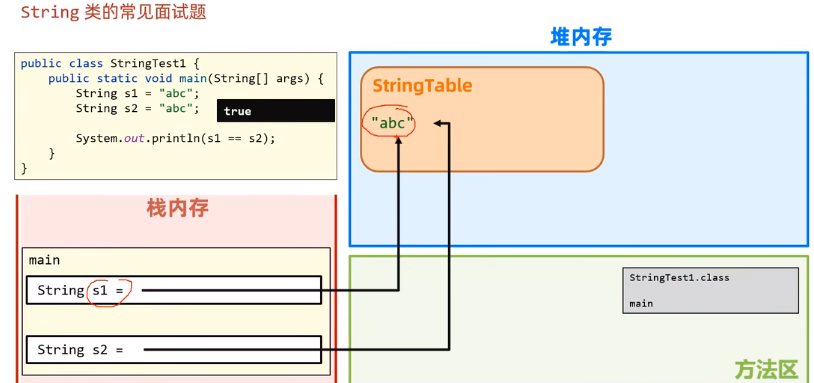

#### 二

```java
public class StringDemo1 {
    public static void main(String[] args) {
        String s1 = "abc";
        String s2 = new String("abc");

        System.out.println(s1 == s2); // false
    }
}
```

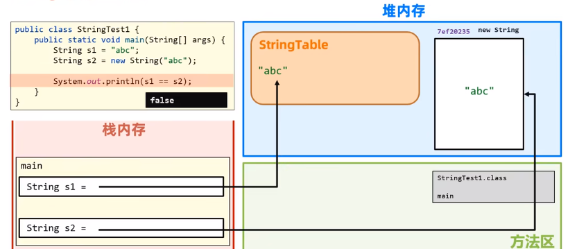

#### 三

```java
public class StringDemo1 {
    public static void main(String[] args) {
        String s1 = "abc";
        String s2 = "ab";
        String s3 = s2 + "c";
        System.out.println(s1 == s3); // false
    }
}
```

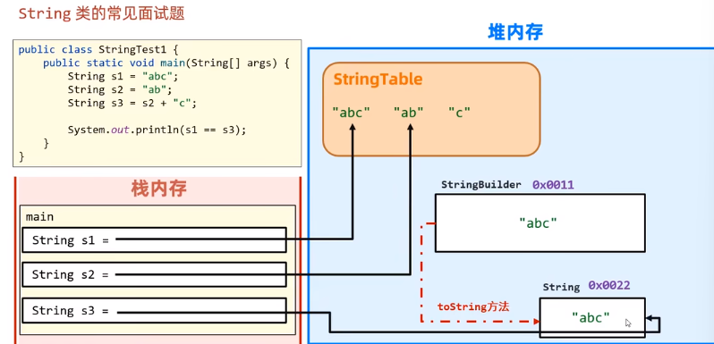

```java
public class StringDemo1 {
    public static void main(String[] args) {
        String s1 = "abc";
        String s2 = "a" + "b" + "c";
        System.out.println(s1 == s2); // true
    }
}
```

### String 类用于比较的方法

> `public boolean equals(Object anObject) ` 将此学符非与指定的对象比较
> `public boolean equalsIgnoreCase(string anotherString) ` 将此 String 与列一个 String 比较，不考您大小写

### String 字符串的遍历

> ```java
> public char[] toCharArray(); 将此字符串转换为一个新的字符数组
>
> public char charAt(int index); 返回指定索引处的char值
>
> public int length(); 返回此字符串的长度，即字符的个数
> ```

### String 字符串的截取方法

```java
public String substring(int startIndex) :根据传入的索引开始做截取，截取到字符串的末尾
public String substring(int startIndex,int endIndex) :根据传入的索引开始做截取，截取到传入的索引结束(包含头不包含尾)
```

### String 字符串的替换方法

> ```java
> public String replace(char oldChar, char newChar)将所有oldChar替换为newChar并返回替换后的新字符串
> ```

### String 字符串的切割方法

```java
public string[] split(String regex):
```

### String 方法小结

```java
public boolean equals方法(要比较的字符串):比较内容
public boolean equalsIgnorecase(要比较的字符串):比较内容，忽略大小写
public char[]toCharArray 将字符串转换为字符数组
public char chatAt(int index)根据索引找字符
public int length():返回字符串的长度
public String substring(int beginIndex)截取到末尾
public String substring(int beginIndex, int endIndex) 根据开始和结束索引做截取,包含头不包含尾
public String replace(旧值,新值)替换
public String[]split(String regex):切割
```

## StringBuilder 类

### StringBuilder 引入

- 提供字符串操作效率

### StringBuilder 的介绍

- 1、一个可变的字符序列
- 2、StringBuilder 是字符串缓冲区，将其理解是容器，这个容器可以存储任意数据类型，但是只要进入到这个容器，全部变成字符串

### StringBuilder 的构造方法

```java
public StringBuilder() :创建一个空白的字符串缓冲区（容器），其初始容量为16个字符

public StringBuilder(string str) :创建一个字符串缓冲区(容器)，容器在创建好之后，就会带有参数的内容
```

### StringBuilder 常用方法

| 方法名                                  | 说明                                                      |
| --------------------------------------- | --------------------------------------------------------- |
| `public StringBuilder append(任意类型)` | 添加数据，返回对象本身                                    |
| `public StringBuilder reverse()`        | 反转容器中的内容                                          |
| `public int length()`                   | 返回长度（字符出现的个数）                                |
| `public String toString()`              | 通过`toString()`就可以实现把`StringBuilder`转换为`String` |

## 集合基础

> 什么事集合？
>
> - 集合是一种容器，用来装数据的，类似与数组。
> - 数组定义完成并启动后，长度就固定了。
> - 集合大小可变，开发中用的更多

> 集合和数组的使用选择
>
> - 数组：存储的元素个数固定不变
> - 集合：存储的元素个数经常发生改变

```java
ArrayList集合的使用：
    细节：创建String，StringBuilder，ArrayList类的对象，打印对象名，都没有看到地址值，而是元素内容
    1、构造方法：
    	public ArrayList():创建一个空的集合容器
    2、集合容器的创建细节：
    	ArrayList list = new ArrayList();
		现象：可以添加任意类型数据
        弊端：数据不够严谨
```

```java
ArrayList<String> list = new ArrayList<>();
```

> <>:泛型
>
> - 目前：使用泛型，可以对集合中存储的数据，进行类型限制
> - 细节：泛型中，不允许编写基本数据类型
> - 问题：那我要是想集合中，存储 整数、小数、字符....这些数据
> - 解决：使用基本数据类型，所对应的包装类

| 基本数据类型 | 包装类    |
| ------------ | --------- |
| byte         | Byte      |
| short        | Short     |
| int          | Integer   |
| long         | Long      |
| float        | Float     |
| double       | Double    |
| boolean      | Boolean   |
| char         | Character |

### ArrayList 集合常用成员方法

| 方法名                                 | 说明                                   |
| -------------------------------------- | -------------------------------------- |
| `public boolean add(E e)`              | 将指定的元素添加到此集合的末尾         |
| `public void add(int index,E element)` | 在此集合中的指定位置插入指定的元素     |
| `public E get(int index)`              | 返回指定索引处的元素                   |
| `public int size()`                    | 返回集合中的元素的个数                 |
| `public E remove(int index)`           | 删除指定索引处的元素，返回被删除的元素 |
| `public boolean remove(Object o)`      | 删除指定的元素，返回删除是否成功       |
| `public E set(int index,E element)`    | 修改指定索引处的元素，返回被修改的元素 |
