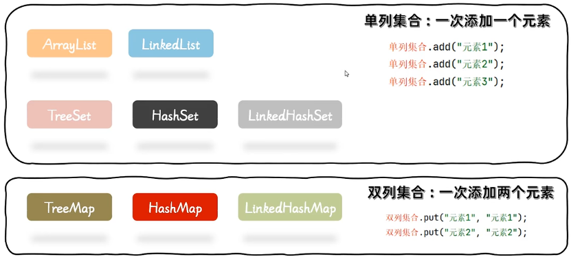
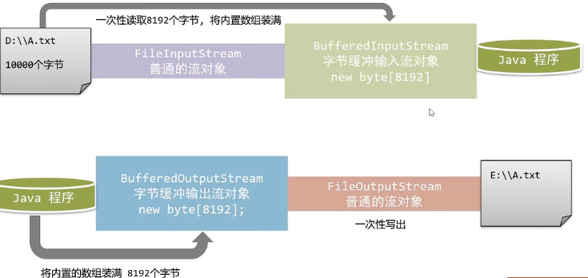

# Java 进阶

## 面向对象高级

### static 关键字

> static 是静态的意思，可以修饰成员变量，也可以修饰成员方法

**static 修饰成员的特点：**

- 1、被类的所有对象所共享
- 2、多了一种调用方式，可以通过类目进行调用
- 3、随着类的加载而加载，优先于对象存在

**static 成员变量**

- 共享数据

**static 成员方法**

- 常用与工具类

> 1、成员方法什么时候加入 static
>
> - 常用于制作工具类
>
> 2、工具类：不是描述事物的，而是帮我们完成一些事情（打工）
>
> 3、如果发现一个类中，所有的方法，全都是 static 所修饰
>
> - 私有该类的构造方法
> - 目的：为了不让其他类，再创建对象

> 注意事项：
>
> - static 方法中，只能访问静态成员（直接访问）
> - static 中不允许使用 this 关键字

### 继承

**继承介绍**

> 继承：让类与类之间产生关系（子父类关系），子类可以直接使用父类中非私有的成员

**继承的格式**

> - 格式 `public class 子类名 extends 父类名 {}`

**什么时候使用继承？**

> - 当类于类之间，存在相同的内容，并且产生了`is` `a `的关系，就可以考虑使用继承，来优化代码

**继承中的成员访问特点 -- 成员变量**

- 思考：子父类中，如果出现了重名的成员变量，使用的时候会优先使用？
  - `根据就近原则，优先使用子类的`
- this：调用本类成员
- super：调用父类成员
- 思考：子类继承了父类之后，是否可以自己继续定义方法？
  - `子父类中，出现了声明一模一样的方法（方法名，参数，返回值），在创建子类对象，调用方法的时候，会优先使用子类的方法逻辑，这虽然是就近原则的现象，但其实是子类的方法，对父类的方法进行了重写操作。`

> - 方法重写（Override）
> - 在子父类当中，出现了方法声明一模一样的方法（方法名，参数，返回值）
> - 判断一个方法是不是重写的方法
>   - 注解：`@Override`
> - 方法重写的使用场景：
>   - 当子类需要父类的方法，但觉得父类的方法逻辑不好（修改 | 增强）就可以对父类的方法进行重写
> - 方法重载(Overload)
> - 在同一个类中，方法名相同，参数不同，与返回值无关参数不同:类型不同，个数不同，顺不同

**继承中的成员访问特点 -- 成员方法**

> 在继承体系中，子类可以继承到父类的方法
>
> 但有时子类并不想原封不动地继承父类的方法，而是想作一定的修改
>
> 这就需要采用方法的重写，方法重写又称方法覆盖
>
> **注意事项**
>
> - 父类中私有的方法不能重写
> - 子类重写父类方法时，访问权限必须大于等于父类

**权限修饰符**


**Java 中继承的特点**

- Java 只支持单继承，不支持多继承，但支持多层继承

**继承中的成员访问特点 ---- 构造方法**

- 子类需要自己手动编写构造方法
- 子类在初始化之前，需要先完成父类的初始化
- 在所有的构造方法中，都默认隐藏了一句话 `super()`
  - 通过这句代码，来访问父类的空参构造方法
  - 细节：Java 当中所有的类，都直接或间接的继承到了`Object`类

**this 和 super**

- this：代表本类对象的引用
- super：代表父类存储空间的标识

| 关键字 | 访问成员变量       | 访问成员方法          | 构造方法                         |
| ------ | ------------------ | --------------------- | -------------------------------- |
| this   | this.本类成员变量  | this.本类成员方法（） | `this()，this(...)`本类构造方法  |
| super  | super.父类成员变量 | super.父类成员方法()  | `super(),super(...)`父类构造方法 |

**注：this（）和 super（）都在争夺构造方法第一行的位置，所以二者不能共存**

### final 关键字

**final 关键字的介绍**

final 关键字是最终的意思，可以修饰（方法，类，变量）

**final**修饰的特点

- **修饰方法**：表明该方法是最终方法，不能被重写
- **修饰类**：表明该类是最终类，不能被继承
- **修饰变量**：表明该变量是常量，不能再次被赋值

> final 修饰变量的命名规范：
>
> - 如果变量名是一个单词，所有字母大写 max => MAX
> - 如果变量名是多个单词，所有字母大写，中间使用下划线分割 maxValue => MAX_VALUE

> 基本数据类型：数据值不可改变
>
> 引用数据类型：地址值不可改变，但是内容可以改变

> final 修饰成员变量的注意事项：
>
> - 1、final 修饰成员变量，不允许修饰默认值
> - 2、final 修饰成员变了的初始化时机
>   - 1、在定义的时候直接赋值
>   - 2、在构造方法中完成赋值

### 包

> 什么是包？
>
> - 包本质来说就是文件夹，用来管理类文件的
> - 建包的语法格式:package 公司域名倒写.技术名称。报名建议全部英文小写，且具备意义

> 导包
>
> - 相同包下的类可以直接访问，不同包下的类必须导包,才可以使用!导包格式:`import 包名.类名`;
> - 假如一个类中需要用到不同类，而这个两个类的名称是一样的，那么默认只能导入一个类，另一个类要带包名访问。

### 抽象类

**抽象类是一种特殊的父类，内部可以编写抽象方法**

> 抽象类：特殊的父类
>
> 问题：特殊在哪里？
>
> 回答：内部允许编写抽象方法
>
> 问题：什么是抽象方法？
>
> 回答：当我们将共性的方法，抽取到父类之后，发现这个方法在父类中无法给出具体明确（描述不清了）而且这个方法，还是子类必须要有的方法，就可以设计为抽象方法

> **抽象方法和抽象类**
>
> - 抽象方法的定义格式：
>   - `public abstract 返回值类型 方法名（参数列表）`;
> - 抽象类的定义格式:
>   - `public abstract class 类目{}`

> - 抽象类不能实例化
>   - 如果抽象类允许创建对象，就可以调用内部没有方法体的，抽象方法了
> - 抽象类存在构造方法
>   - 交给子类，通过 super 进行访问
> - 抽象类中可以存在普通方法
>   - 可以让子类继承到继续使用
> - 抽象类的子类
>   - 要么重写抽象类中的所有抽象方法
>   - 要么是抽象类

> **abstract 关键字的冲突**
>
> - `final` ：被`abstract`修饰的方法，强制要求子类重写，被`final`修饰的方法子类不能重写
> - `private` ：被`abstract`修饰的方法，强制要求子类重写，被`private`修饰的方法子类不能重写
> - `static`：被 `static`修饰的方法可以类名调用，类名调用抽象方法没有意义

### 接口

**接口介绍**

- 接口：体现的思想是对规则的声明，Java 中的接口更多体现的事对行为的抽象
- 接口用关键字`interface`来定义
  - `public interface 接口名{}`
- 接口不能实例化
- 接口和类之间是实现关系，通过`implements`关键字表示
  - `public class 类名 implements 接口名{}`
- 接口的子类（实现类）
  - 1、重写所有抽象方法
  - 2、将实现类变成抽象类

**接口中的成员特点**

- 成员变量
  - 只能是常量
  - 默认修饰符：`public static final`
- 构造方法
  - 没有
- 成员方法
  - 只能是抽象方法
  - 默认修饰符：`public abstract`
  - 关于接口中的方法，`JDK8`和`JDK9`中有一些新特性

**类和接口之间的各种关系**

> ```
> 1、类和类之间：继承关系，只支持单继承，不支持多继承，但是可以多层继承
> 2、类和接口之间：实现关系，可以单实现，也可以多实现，还可以单继承多实现
> 3、接口和接口之间：继承关系，支持单继承，不支持多继承，可以多层继承
> ```

**抽象类和接口的对比**

- 成员变量
  - 抽象类：可以定义变量，也可以定义常量
  - 接口：只能定义常量
- 成员方法
  - 抽象类：可以是定义具体方法，也可以定义抽象方法
  - 接口：只能定义抽象方法
- 构造方法
  - 抽象类：有
  - 接口：没有

> 抽象类和接口的对比
>
> - 抽象类：对事物做抽象（描述事物）
> - 接口：对行为抽象（制定规则）

### 多态

**同一个行为具有多个不同表现形式或形态的能力**

> **多态的成员访问特点**
>
> - 成员变量：编译看左边（父亲），运行看左边（父亲）
> - 成员方法：编译看左边（父类），运行看右边（子类）

> 编译的时候，会检查父类中有没有这个方法
>
> - 没有：编译出错
> - 有，编译通过，但是运行的时候，一定会执行子类的方法逻辑
>
> 原因：担心你调用的方法，在父类中是一个抽象方法

> **多态的好处与弊端**
>
> - 多态的好处：提高了程序的扩展性
>   - 对象多态：将方法的形参定义为父类类型，这个方法可以接收父类的任意子类对象
> - 多态的弊端：不能使用子类的特有成员

> **多态中的转型**
>
> - 向上转型
>   - 从子到父（父类引用指向子类对象）
> - 向下转型
>   - 从父到子（将父类引用所指向的对象，转交给子类类型）
>
> 

> **多态中的转型问题**
>
> - 关键字 instanceof
> - 使用格式
>   - 对象名 instanceof 类型
>   - 判断一个对象是否是一个类的实例
>   - 通俗的理解：判断关键字左边的对象，是否是右边的类型，返回 boolean 类型结果

### 接口新特性

- JDK8 的新特性：接口中可以定义有方法体的方法。（默认、静态）
- JDK9 的新特性：接口中可以定义私有方法。


> **<span style="background-color: red;color:#fff">JDK8 接口特性</span>**
>
> 1、允许在接口中定义非抽象方法，但是需要使用关键字 default 修饰，这些方法都是默认方法
>
> - 作用：<span style="color:red">解决接口升级的问题</span>
>
> - 接口中默认方法的定义格式：
>
>   - 格式：`public default 返回值类型 方法名（参数列表）{}`
>   - 范例：`public default void show(){}`
>
> - 注意事项：
>
>   - 1、public 可以省略，但是 default 不能省略
>
>   - 2、默认方法，实现类是允许重写的，但是需要去掉 default 关键字
>   - 3、如果实现了多个接口，多个接口存在相同的方法声明，子类就必须对该方法进行重写
>
> 2、允许定义静态方法
>
> - 理解：既然接口以及允许方法带有方法体了，干脆也放开静态方法，可以类名调用
> - 注意事项：
>   - 1、`public`可以省略，但是`static`不能省略
>   - 2、接口中的静态方法，只允许接口名进行调用，不允许实现类通过对象调用

> **<span style="background-color: red;color:#fff">JDK9 接口特性</span>**
>
> 接口中允许定义私有方法
>
> 接口中私有方法的定义格式：
>
> - 格式 1：`private 返回值类型 方法名（参数列表）{}`
> - 范例 1：`private void show（）{}`
>
> - 格式 2：`private static 返回值类型 方法名（参数列表）{}`
> - 范例 2：`private static  void show（）{}`

### 代码块

**使用 { } 括起来的代码被称为代码块 **

分类：

- 局部代码块
  - 位置：方法中的一对大括号
  - 作用：限定变量的生命周期，提早的释放内存
- 构造代码块
  - 位置：类中方法外的一对大括号
  - 特点：在创建对象时，执行构造方法的时候，就会执行构造代码块（优先于构造方法执行）
  - 作用：将多个构造方法中，重复的代码，抽取到构造代码块中，从而提升代码的复用性
- 静态代码块、
  - 位置：类中方法外的一对大括号，需要加入 static 关键字
  - 特点:随着类的加载面执行，因为类只加载一次。所以也就只执行一次
  - 作用:对数据进行初始化
- 同步代码块

### 内部类

- 内部类就是定义在一个类里面的类

- ```java
  class Outer{
      class Inner{}
  }
  ```

- 创建对象的格式

- ```java
  格式：外部类名。内部类名 对象名 = new 外部类对象().new 内部类对象()
  范例: Outer.Inner in  = new outer().newInner();
  ```

> 成员访问细节：
>
> - 1、内部类中，访问外部类成员：直接访问，包括私有
> - 2、外部类中访问内部类成员：需要创建对象访问
>
> ```java
> class Outer{
>     int num = 10;
>     class Inner{
>         int num = 20;
>         public void method(){
>             int num = 30;
>             System.out.println(num); 			// 30
>             System.out.println(this.num);		// 20
>             System.out.println(Outer.this.num);	// 10
>
>         }
>     }
> }
> ```

> 内部类的分类
>
> - 成员内部类
>
> - 静态内部类
>
>   - 有 static 修饰的成员内部类
>
>   - ```java
>     class Outer{
>         static class Inner{
>
>         }
>     }
>     ```
>
>   - 静态内部类创建对象的格式：
>
>   - ```java
>     格式：外部类名.内部类名 对象名 = new 外部类名.内部类对象();
>     范例：Outer.Inner in = new Outer.Inner();
>     ```
>
>   - 注意：静态只能访问静态
>
> - 局部内部类
>
>   - 放在方法、代码块、构造器等执行体中
>
> - 匿名内部类

> **匿名内部类**
>
> 概述:匿名内部类本质上是一个特殊的局部内部类(定义在方法内部)
>
> 前提:需要存在一个接口或类
>
> 格式：
>
> ```java
> new 类名 / 接口 (){
>
> }
>
> new 类名(){} :代表继承这个类
> new 接口名(){} :代表实现这个接口
> ```
>
> 结论：可以让代码变得更加简洁，在定义类的时候对其进行实例化
>
> 问题：方法的形参是接口类型，我们该传入的是什么？
>
> 答案：传入的是该接口的实现类对象

### Lambda 表达式

- Lambda 表达式是 JDK8 开始后的一种新语法形式
- <span style='color:red;font-weight:600'>作用：简化匿名内部类的代码写法</span>

**Lambda 表达式的简化格式**

```java
()->{}

(匿名内部类被重写方法的形参列表)->{
    被重写方法的方法体代码
}
注：=>是语法形式，无实际含义
```

> Lambda 表达式，只允许操作函数式编程接口：有，且仅有一个抽象方法的接口

#### Lambda 表达式的省略写法

- 参数类型可以省略不写
- 如果只有一个参数，参数类型可以省略，同时（）也可以省略
- 如果 Lambda 表达式的方法体代码只有一行代码。可以省略大括号不写，同时要省略分号！
- 如果 Lambda 表达式的方法体代码只有一行代码。可以省略大括号不写。
  - 此时，如果这行代码是 return 语句，必须省略 return 不写，同事也必须省略`";"`不写

#### Lambda 表达式和匿名内部类的区别

> 使用限制不同
>
> - 匿名内部类：可以操作类，接口
> - Lambda 表达式：只能操作函数式接口
>
> 实现原理不同
>
> - 匿名内部类：编译之后，产生一恶搞单独的.class 字节码文件
> - Lambda 表达式：编译之后，没有一个单独的.class 字节码文件

### 窗体、组件、事件

#### 窗体对象 JFrame

```java
// 创建 JFrame 对象
JFrame jf = new JFrame();
// 设置 JFrame 标题
jf.setTitle("JFrame 窗口");
// 设置 JFrame 宽高
jf.setSize(400, 300);
// 设置 JFrame 关闭时的操作
jf.setDefaultCloseOperation(JFrame.EXIT_ON_CLOSE);
// 设置窗体的标题
jf.setTitle("我的第一个 JFrame 窗口");
// 设置 JFrame 可见
jf.setVisible(true);
```

#### 组件

> 1.窗体对象.setLayout(null); 取消默认布局
>
> 2.创建组件对象
>
> 3.组件对象.setBounds(x,y.width.height);设置摆放位置
>
> 4.窗体对象.getContentPane().add(组件对象)

**JLabel 组件**

- 用于展示文本和图片
- JLabel（String text）使用指定的文本创建一个 JLabel 对象
- JLabel（Icon image）创建一恶搞具有指定图像的 JLable 对象

**注：如果多个组件摆放在同一个位置，后添加的组件，会被压在底部**

#### 事件


> 焦点：程序的注意力集中在了某一个组件上

> 注意：按钮组件比较特殊，在创建好之后，程序的焦点，默认就停留在按钮组件上面
>
> - 但按钮组件，其实不需要占用程序的焦点
> - 可以通过 `setFocusable(false)` 取消焦点

### 适配器设计模式

- 设计模式(Design pattern)是一套被反复使用、多数人知晓的、经过分类编目的、代码设计经验的总结。
  使用设计模式是为了可重用代码、让代码更容易被他人理解、保证代码可靠性、程序的重用性。
- 适配器设计模式:解决接口与接口实现类之间的矛盾问题


- 实现步骤
  - 1.编写一个 `xxxAdapter` 类，实现对应接口
  - 2.重写内部所有抽象方法，但方法都是空实现
  - 3.让自己的类去继承适配器类，重写自己需要的方法即可
  - 4.为了避免其他类创建适配器类的对象，使用 `abstract` 进行修饰

### 模版设计模式

- 模板设计模式:把抽象类整体就可以看做成一个模板，模板中不能决定的东西定义成抽象方法让使用模板的类(继承抽象类的类)去重写抽象方法实现需求

## 常用 API

### 第一天

#### Object 类

> - 所有的类，都直接或者间接的继承了 Object 类
> - Object 类的方法是一切子类都可以直接使用的

| 方法名                     | 说明                                                              |
| -------------------------- | ----------------------------------------------------------------- |
| `public String toString()` | 默认是返回当前对象在对内存中的地址信息：类的全类名@十六进制哈希值 |

- 开发中直接输出对象，默认输出对象的地址其实是毫无意义的。
- 开发中输出对象变量，更多的时候是希望看到对象的内容数据而不是对象的地址信息。

**toString 存在的意义**

- 父类 tostring()方法存在的意义就是为了被子类重写，以便返回对象的内容信息，而不是地址信息!!

#### Objects 的常见方法：

| 方法名                                            | 说明                                                                             |
| ------------------------------------------------- | -------------------------------------------------------------------------------- |
| `public static boolean equals(Object a,Object b)` | 比较两个对象的，底层会先进行非空判断，从而可以避免空指针异常。再进行 equals 比较 |
| `public static boolean isNull(Object obj)`        | 判断变量是否为 null                                                              |

#### Math 类

- 包含执行基本数字运算的方法

> - `public static int abs(int a)`:获取参数绝对值
> - `public static double ceil(double a)`:向上取整
> - `public static double floor(double a)`:向下取整
> - `public static int round(float a)`:四舍五入
> - `public static int max(int a,int b)`:获取两个 int 值中的较大值
> - `public static double pow(double a,double b)`: 返回 a 的 b 次幂的值
> - `public static double random()`:返回值为 double 的随机值，范围[0.0,1.0)

#### System 类

- System 的功能是静态的，都是直接用类名调用即可

| 方法名                                                                               | 说明                                         |
| ------------------------------------------------------------------------------------ | -------------------------------------------- |
| `public static void exit(int status)`                                                | 终止当前运行的 Java 虚拟机，非零表示异常终止 |
| `public static long currentTimeMillis()`                                             | 返回当前系统的时间毫秒值形式                 |
| `public static void arraycopy(数据源数组，起始索引，目的地数组，其实索引，拷贝个数)` | 数组拷贝                                     |

```java
int[] arr = {11, 22, 33, 44, 55};
int[] destArr = new int[3];
System.arraycopy(arr, 2, destArr, 0, 3);
for (int i = 0; i < destArr.length; i++) {
    System.out.println(destArr[i]);
}
//22
//33
//44
```

#### BigDecimal 类

- 用于解决小数运算中，出现的不精确问题

> **创建对象**
>
> - `public BigDecimal(double val)`
> - <span style='color:red'>`public BigDecimal(String val)`</span>
> - <span style='color:red'>`public static BigDecimal valueOf(double val)`</span>

> **常用成员方法**
>
> - `public BigDecimal add(BigDecimal b)`:加法
> - `public BigDecimal subtract(aigDecimal b)`:减法
> - `public BigDecimal multiply(BigDecimal b)`:派法
> - `public BigDecimal divide(BigDecimal b)`:除法
> - `public gigDecimal divide(另一个Bigpecinal对象，精确几位，舍入模式)`:除法

> 注意：如果使用 BigDecimal 运算，出现了除不尽的情况，就

#### 包装类

- 将**基本数据类型**，包装成**类**（变成引用数据类型）

| 基本数据类型 | 引用数据类型                             |
| ------------ | ---------------------------------------- |
| byte         | Byte                                     |
| short        | Short                                    |
| int          | <span style="color:red">Integer</span>   |
| long         | Long                                     |
| char         | <span style="color:red">Character</span> |
| float        | Float                                    |
| double       | Double                                   |
| boolean      | Boolean                                  |

**Integer 类**

- 将基本数据类型，手动包装为类
- `public Integer(int value)`
- `public static Integer valueOf(int i)`
- `public static string toBinaryString(int i)`:转二进制
- `public static string toOctalString(int i)`:转几进制
- `public static string toHexString(int i)`:转十六进制
- `public static int parseInt(string s)`:将数字字符串，转换为数字

**面试题**


### 第二天

#### Arrays 类

**Arrays 类介绍**

- 数组操作工具类，专门用于操作数组元素

| 方法名                                             | 说明                                 |
| -------------------------------------------------- | ------------------------------------ |
| `public static String toString(类型[] a)`          | 将数组元素拼接为带有格式的字符串     |
| `public static boolean equals(类型[] a, 类型[] b)` | 比较两个数组内容是否相同             |
| `public static int binarySearch(int[] a,int key)`  | 查找元素在数组中的索引（二分查找法） |
| `public static void sort(类型[] a)`                | 对数组进行默认升序排列               |

#### 冒泡排序

- 相邻的两个数进行比较，如果第一个比第二个大，就交换他们两个


```java
// 冒泡排序
// 外循环:比较的轮数
for (int i = 0; i < arr.length; i++) {
    // 内循环：比较的次数
    // -1：避免索引越界
    // -i:提高效率
    for (int j = 0; j < arr.length - i - 1; j++) {
        //希望的是arr[j] < arr[j+1]
        if (arr[j] > arr[j + 1]) {
            //交换arr[j]与arr[j+1]
            int temp = arr[j];
            arr[j] = arr[j + 1];
            arr[j + 1] = temp;
        }
    }
}
```

#### 选择排序

- 从 0 索引开始，拿着每一个索引上的元素跟后面的元素依次比较


```java
int[] arr = {22, 33, 11, 55, 44};

for (int i = 0; i < arr.length - 1; i++) {
    for (int j = i + 1; j < arr.length; j++) {
        if (arr[i] > arr[j]) {
            int temp = arr[i];
            arr[i] = arr[j];
            arr[j] = temp;
        }
    }
}
System.out.println(Arrays.toString(arr)); // [11, 22, 33, 44, 55]
```

#### 二分查找

```java
int[] arr2 = new int[]{2, 4, 5, 8, 12, 15, 19, 26, 37, 49, 51, 66, 89, 100};

int target = 15;
int head = 0; //默认的首索引
int end = arr2.length - 1; // 尾部边界下标初始值

boolean flag = false;// 判断是否找到了指定的元素

while (head <= end) {
    int middle = (head + end) / 2;
    if (target == arr2[middle]) {
        System.out.println("找到了" + target + ",对应的位置为：" + middle);
        flag = true;
        break;
    } else if (target > arr2[middle]) {
        head = middle + 1;
    } else {
        end = middle - 1;
    }
}
if (!flag) {
    System.out.println("未找到");
}
```

#### 快速排序

```java
public static void main(String[] args) {
		int[] data = {9, -16, 30, 23, -30, -49, 25, 21, 30};
		System.out.println("排序之前：");
		for (int i = 0; i < data.length; i++) {
			System.out.print(data[i]+" ");
		}

		quickSort(data);//调用实现快排的方法

		System.out.println("\n排序之后：");
		for (int i = 0; i < data.length; i++) {
			System.out.print(data[i]+" ");
		}
	}

	public static void quickSort(int[] data) {
		subSort(data, 0, data.length - 1);
	}

	private static void subSort(int[] data, int start, int end) {
		if (start < end) {
			int base = data[start];
			int low = start;
			int high = end + 1;
			while (true) {
				while (low < end && data[++low] - base <= 0)
					;
				while (high > start && data[--high] - base >= 0)
					;
				if (low < high) {
					//交换data数组[low]与[high]位置的元素
					swap(data, low, high);
				} else {
					break;
				}
			}
			//交换data数组[start]与[high]位置的元素
			swap(data, start, high);

			//经过代码[start, high)部分的元素 比[high, end]都小

			//通过递归调用，对data数组[start, high-1]部分的元素重复刚才的过程
			subSort(data, start, high - 1);
			//通过递归调用，对data数组[high+1,end]部分的元素重复刚才的过程
			subSort(data, high + 1, end);
		}
	}

	private static void swap(int[] data, int i, int j) {
		int temp = data[i];
		data[i] = data[j];
		data[j] = temp;
	}
```

#### 正则表达式


> String telRegex = "编写规则"
>
> "需要做校验的字符串".matches(telRegex)

#### String 类中与正则有关的常见方法

| 方法名                                                 | 说明                                                       |
| ------------------------------------------------------ | ---------------------------------------------------------- |
| `public String replaceAll(String regex,String newStr)` | 按照正则表达式匹配的内容进行替换                           |
| `public String[] split(String regex)`                  | 按照正则表达式匹配的内容进行分割字符串，返回一个字符串数组 |


### 第三天

#### 时间 API

**JDK8（-）时间类**

> **Date 类**
>
> - 代表的是日期和时间
>
> | 构造器                   | 说明                                             |
> | ------------------------ | ------------------------------------------------ |
> | `public Date()`          | 创建一个 Date 对象，代表的是系统当前此刻日期时间 |
> | `public Date(Long time)` | 把时间毫秒值转换成 Date 日期对象                 |
>
> | 常见方法                         | 说明                                                  |
> | -------------------------------- | ----------------------------------------------------- |
> | `public long getTime()`          | 返回从 970 年 1 月 1 日 00:00:00 走到此刻的总的毫秒数 |
> | `public void setTime(long time)` | 设置日期对象的时间为当前时间毫秒值对应的时间          |

> **SimpleDateFormat 类**
>
> 
>
> ```java
> String date = "1999-12-24"
>
> SimpleDateFormat simpleDateFormat = new SimpleDateFormat("yyyy-MM-dd");
>
> System.out.println(simpleDateFormat.format(date));
> // Fri Dec 24 00:00:00 CST 1999
> ```

> **总结**
>
> 1、日期对象如何创建，如何获取时间毫秒值？
>
> - `public Date()`
> - `public long getTime()`
>
> 2、时间毫秒值怎么转化成日期对象？
>
> - `public Date(long time)`
> - `public void setTime(long time)`
>
> 3、SimpleDateFormat 代表什么，有什么作用？
>
> - 可以把日期对象格式化成我们想要的形式
> - 可以把字符串的时间形式解析成 Date 日期对象
>
> 4、SimpleDateFormat 的对象如何创建？
>
> - `punlic SimpleDateFormat(String pattern)`
>
> 5、SimpleDateFormat 格式化，以及解析时间的方法是哪些？
>
> - `public final String format(Date d)`：格式化日期对象
> - `public Date parse(String source)`：解析字符串时间

#### Calendar 类介绍

- 代表的是系统此刻时间对应的日历，通过它可以单独获取、修改时间中的年、月、日、时、分、秒等。

> 创建对象：
>
> - `public static Calendar.getInstance()`：获取当前时间的目历对象
>
> 常用方法:
>
> - `public int get(int field)`:取日历中的某个字段信息
> - `public void set(int field,int value)`:修改日历的某个字段信息
> - `public void add(int field,int amount)`:为某个字段增加/减少指定的值
> - `public final Date getTime()`：获取日期对象
> - `public final setTime(Date date)`：给日历设置日期对象


> 日历类
>
> - `LocalDate`：年、月、日
> - `LocalTime`：时、分、秒
> - `LocalDateTime`：年、月、日

> 日期格式化类
>
> - `DateTimeFormatter`：用于时间的格式化和解析

> 时间类
>
> - `Instant`：时间戳\时间线
> - `ZoneId`：时区
> - `ZonedDateTime`：带时区的时间

> 工具类
>
> - `Period`：时间间隔（年、月、日）
> - `Duration`：时间间隔（时、分、秒、纳秒）
> - `ChronoUnit`：时间间隔（所有单位）


> **修改年月日时分秒相关的方法**
>
> - LocalDateTime、LocalDate、LocaTime 都是不可变的，下列方法返回的是一恶搞新的对象
>   

#### DateFormatter 类

- 用于时间的格式化和解析


```java
LocalDateTime nowDate = LocalDateTime.now();
System.out.println("格式化之前：" + nowDate);
// 格式化之前：2024-04-23T11:24:35.121747

// 获取格式化对象
DateTimeFormatter formatter = DateTimeFormatter.ofPattern("yyyy年MM月dd日");

String result = formatter.format(nowDate);

System.out.println("格式化之后：" + result);
// 格式化之后：2024年04月23日

// 解析
String time = "2024年04月23日";
LocalDate par = LocalDate.parse(time, formatter);
System.out.println(par);
// 2024-04-23
```

#### Instant 类

> 
>
> ```java
> // 获取当前时间
> Instant now = Instant.now();
> System.out.println(now);
>
> // 获取东八区的时间戳
> ZonedDateTime zonedDateTime = Instant.now().atZone(ZoneId.of("Asia/Shanghai"));
> System.out.println(zonedDateTime);
> ```

> **ZoneId 类**
>
> 常见方法：
>
> - `static Set<String> getAvailableZoneIds()`：获取 Java 中支持的所有时区
> - `static ZoneId systemDefault()`：获取系统默认时区
> - `static ZoneId of(String zoneId)`：获取一个指定时区

#### Duration、Period、ChronoUnit

> Duration：用于计算两个“时间”间隔（秒，纳秒）
>
> Period：用于计算两个“日期”间隔（年月日）
>
> ChronoUnit：用于计算两个“日期间隔”

## 递归、异常

### 递归介绍和使用

**递归介绍**

- 方法直接或间接调用本身
  - **注：递归如果没有控制好终止，会出现递归死循环，导致栈内存溢出现象**

### 异常介绍

**异常介绍**

- 指的是程序在编译或执行过程中，出现的非正常的情况（错误）

**异常体系**


> Error
>
> - 严重级别问题
>   - 常见的：栈内存溢出（StackOverflowError） 堆内存溢出（OutOfMemoryError）

> Exception
>
> - RunTimeException 及其子类：运行时异常
> - 除 RunTimeException 之外所有的异常：编译时异常
>   - 需要再运行之前，给出解决方案

> **运行时异常**
>
> 数组索引越界异常：`ArrayIndexOutOfBoundsException`
>
> 空指针异常：`NullPointerException`
>
> 数学操作异常：`ArithmeticException`
>
> 类型转换异常：`ClassCastException`
>
> 数字转换异常：`NumberFormatException`

### 异常处理方式

**异常的默认处理流程**

- ① 虚拟机会在出现异常的代码那里自动的创建一个异常对象
- ② 异常会从方法中出现的点这里抛出给调用者，调用者最终抛出给 IVM 虚拟机
- ③ 虚拟机接收到异常对象后，先在控制台直接输出异常信息数据
- ④ 终止 Java 程序的运行
- ⑤ 后续代码没有机会执行了，因为程序已经噶了

> 1.try...catch 捕获异常
>
> ```java
> 好处：异常对象可以被捕获，后续代码继续执行
> 格式：
>     try{
>         可能会出现异常的代码
>     } catch {
>         异常的处理方案
>     }
> ```
>
> 2.throws 抛出异常
>
> ---
>
> 问题：正在面临的异常，是否需要暴露出来
>
> - 不需要暴露：try...catch 捕获
> - 需要暴露：抛出异常

### 自定义异常

- Java 无法为这个世界上全部的问题提供异常类。
- 如果企业想通过异常的方式来管理自己的某个业务问题，就需要自定义异常类了。

#### **自定义异常的分类**

- 1、自定义编译时异常
  - 定义一个异常类继承 Exception
  - 重写构造器
- 2、自定义运行时异常
  - 定义一个异常类继承 RuntimeException
  - 重写构造器

#### 异常的细节

- Throwable 的常用方法：

| 方法名                        | 说明                   |
| ----------------------------- | ---------------------- |
| `public String getMessage()`  | 获取异常的错误原因     |
| `public void printStackTrace` | 展示完整的异常错误信息 |

- 子类重写父类方法时，不能抛出父类没有的异常，或者比父类更大的异常

## 集合



### 单列集合


### Collection 的使用

Collecttion 的使用

| 方法名称                              | 说明                             |
| :------------------------------------ | -------------------------------- |
| `public boolean add(E e)`             | 把给定的对象添加到当前集合中     |
| `public void clear()`                 | 清空集合中所有的元素             |
| `public boolean remove(E e)`          | 把给定的对象在当前集合中删除     |
| `public boolean contains(Object obj)` | 判断当前集合中是否包含给定的对象 |
| `public boolean isEmpty`              | 判断当前集合是否为空             |
| `public int size()`                   | 返回集合中元素的个数/集合的长度  |

### 集合的通用遍历方式

- 迭代器
- 增强 for 循环
- forEach 方法

> **迭代器**
>
> ```java
> // 获取迭代器
> Iterator<Student> iterator = c.iterator();
> // 循环判断，集合中是否还有元素
> while (iterator.hasNext()) {
>     Student next = iterator.next();
>     System.out.println(next);
> }
> ```
>
> `hashNext()`：判断集合中是否还有元素
>
> `next()`：取出集合元素，饼将指针向后移动
>
> 注意：在循环过程中 next 方法最好只调用一次

> **增强 for 循环**
>
> - 简化迭代器的代码书写
> - 它是 JDK5 之后出现的，其内部原理就是一个 Iterator 迭代器
>
> 

> **forEach 方法**
>
> | 方法名                                             | 说明     |
> | -------------------------------------------------- | -------- |
> | `default void forEach(Consumer<? super T> action)` | 遍历集合 |
>
> ```java
>  c.forEach(s -> System.out.println(s));
> ```
>
> forEach 的底层就是增强 for 循环

### List 接口


> 并发修改异常
>
> ```
> 使用【迭代器】遍历集合的过程中，调用了【集合对象】的添加，删除方法，就会出现此异常
> ```
>
> ```
> 解决方案：迭代器的遍历过程中，不允许使用集合对象的添加或删除，那就使用迭代器，自己的添加或删除方法
> ```

### ArrayList 类和 LinkList 类

- ArrayList 底层是基于数组实现的，根据查询元素快，增删相对慢

**ArrayList 长度可变原理**

- ① 使用空参构造器床架的集合，在底层创建一个默认长度为 0 的数组
- ② 添加第一个元素时，底层会创建一个新的长度为 10 的数组
- ③ 存满时，会扩容 1.5 倍

**LinkedList 类**


### 泛型

**泛型介绍**

- JDK5 引入的，可以在编译阶段约束操作的数据类型，并进行检查


- 泛型的好处：
  - 统一数据类型
  - 将运行期的错误提升到了编译期

**泛型的学习路径：**

> **注意：泛型中只能编写引用数据类型**
>
> ```java
> 常见的泛型标识符：E V K T
> E - Element (在集合中使用，因为集合中存放的是元素)
> V - Value (表示具体类型的值)
> K - Key (在Map集合中使用，因为Map集合中存放的是键值对)
> T - Type (表示具体类型)
> ```

- 泛型类
- 泛型方法
  - 1、非静态的方法：内部的泛型，会根据类的泛型去匹配
  - 2、静态的方法：静态方法中如果加入了泛型，必须声明出自己独立的泛型
    - 时机：在调用方法，传入实际参数的时候，确定到具体的类型
- 泛型接口
  - 1、实现类，实现接口的时候确定到具体的类型
  - 2、实现类实现接口，没有指定具体类型，就让接口的泛型，跟着类的泛型去匹配
- 泛型通配符
  - `？`：任意类型。
  - `？ extends E `：可以传入的是 E，或者是 E 的子类。
  - `？super E` ：可以传入的是 E，或者是 E 的父类。
- 泛型的限定

### TreeSet 集合

- 作用：对集合中的元素进行排序操作(底层红黑树实现)

#### TreeSet 排序

1、类实现 Comparable 接口

2、重写 compareTo 方法

3、根据方法的返回值，来组织排序规则

- 负数：左边走
- 正数：右边走
- 0：不存


### HashSet 集合类

#### HashSet 介绍

- HashSet 集合底层采取哈希表存储数据
- 哈希表是一种对于增删改查数据性能都比较好的结构

> HashSet：保证元素唯一性
>
> 需要同事重写对象中的 hashCode 方法和 equlas 方法

> hashCode 方法和 equals 方法的配合流程
>
> - 当添加对象的时候，会先调用对象的 hashCode 方法计算出一个应该存入的索引位置，查看该位置上是否存在元素
>   - 不存在：直接存
>   - 存在：调用 equals 方法比较内容
>     - false：存
>     - true：不存

> hashCode 方法介绍
>
> 

> **HashSet 的添加过程**
>
> - 底层结构：**哈希表<span style="color:red">（数组、链表、红黑树的结合体）</span>**
> - ① 创建 HashSet 集合，内部会存在一个长度为 16 个大小的数组，数组名为 table
> - ② 调用集合的添加方法，会拿着对象的 hashCode 方法计算出存入的索引位置<span style="color:red">(哈希值%数组长度)</span>
> - 
> - ③ 判断当前位置是否为 null，如果是 null 直接存入，如果位置不为 null，表示有元素，则调用 equals 方法比较属性值，如果一样，则不存，如果不一样，则存入数组
> - 当数组存满到 16\*0.75 = 12 时，就自动扩容，每次扩容原先的两倍

> **如何能够提高查询性能？**
>
> 

### LinkedHashSet 集合类

- 有序、不重复、无索引
- 原理：底层数据结构依然是哈希表，只是每个元素又额外的多了一个双链表的机制记录存储的顺序


> 1、如果想要集合中的元素可重复
>
> - 用于`ArrayList`集合，基于数组的
>
> 2、如果想要集合中的元素可重复，而且当前的<span style="color:red">增删操作明显多于查询</span>
>
> - 用`LinkedList`集合，基于链表的
>
> 3、如果想对集合中的元素去重
>
> - 用`HashSet`集合，基于哈希表的
>
> 4、如果想对集合中的元素去重，而且保证存取顺序
>
> - 用`LinkedHashSet`集合，基于哈希表和双链表，效率低于`HashSet`

### Collections 集合工具类

#### 可变参数

- 可变参数用在形参中可以接收多个数据
- 可变参数的格式：**数据类型...参数名称**

- 传输参数非常灵活，方便，可以不传输参数，可以传输 1 个或者多个，也可以传输一个数组
- <span style="color:red">**可变参数在方法内部本质上就是一个数组**</span>

**注意事项：**

1、一个形参列表中可变参数只能有一个

2、可变参数必须放在形参列表的最后面

#### Collections 集合工具类

- java.utils.Collections：是集合工具类
- <span style="color:red">作用：Collections 并不属于集合，是用来操作集合的工具类</span>


```java
ArrayList<String> list = new ArrayList<>();
Collections.addAll(list, "a", "b", "c", "d");
System.out.println(list);
// 二分查找
System.out.println(Collections.binarySearch(list, "c"));
// 洗牌
Collections.shuffle(list);
System.out.println(list);
ArrayList<Integer> nums = new ArrayList<>();
Collections.addAll(nums, 1, 2, 3, 4, 5, 6, 7, 8, 9);
System.out.println(nums);
// 最大值
System.out.println(Collections.max(nums));
// 最小值
System.out.println(Collections.min(nums));
// 交换
Collections.swap(nums, 0, 3);
System.out.println(nums);

//[a, b, c, d]
//2
//[d, b, c, a]
//[1, 2, 3, 4, 5, 6, 7, 8, 9]
//9
//1
//[4, 2, 3, 1, 5, 6, 7, 8, 9]
```

### Map 接口


#### Map 的常见 API

- Map 是双列集合的顶层接口，它的功能是全部双列集合都可以继承使用的


> 双列集合底层的数据结构，都是针对于键有效，跟值没有关系
>
> - HashMap：键唯一（重写 hashcode 和 equals 方法）
> - TreeMap：键有序（实现 CompareTo 接口，重写 compareTo 方法）
> - LinkedHashMap：键唯一，且可以保证存取有序


### Map 集合的遍历方式


> 
>
> - 调用 keySet 方法获取所有的键（得到的是 Set 集合）
> - 遍历 Set 集合，获取每一个键
> - 遍历的过程中调用 get 方法，根据键找值
>
> ```java
> // 添加元素
> map.put("张三", 18);
> map.put("李四", 20);
> map.put("王五", 19);
> map.put("赵六", 21);
> // 输出Map集合对象
> System.out.println(map);
> // 获取到所有的键
> Set<String> keySet = map.keySet();
> System.out.println(keySet);
> // 遍历所有的键
> for (String key : keySet) {
>    // 获取到对应的值
>    Integer value = map.get(key);
>    System.out.println(key + "=" + value);
> }
> ```

> 
>
> - 调用 entrySet 方法获取所有的键值对对象（得到的是 Set 结合）
> - 遍历 Set 集合，获取每一个键值对对象
> - 通过键值对对象的`getKey()` `getValue()`获取键和值
>
> ```java
> Map<String, Integer> map = new HashMap<>();
> // 添加元素
> map.put("张三", 18);
> map.put("李四", 20);
> map.put("王五", 19);
> map.put("赵六", 21);
>
> Set<Map.Entry<String, Integer>> entrySet = map.entrySet();
> for (Map.Entry<String, Integer> entry : entrySet) {
>    // 获取到所有的键
>    String key = entry.getKey();
>    // 获取到对应的值
>    Integer value = entry.getValue();
>    System.out.println(key + "=" + value);
> }
> ```

> 
>
> ```java
> Map<String, Integer> map = new HashMap<>();
> // 添加元素
> map.put("张三", 18);
> map.put("李四", 20);
> map.put("王五", 19);
> map.put("赵六", 21);
>
> // forEach方法
> map.forEach((key, value) -> {
>    System.out.println(key + "-----" + value);
> });
> ```

## 数据结构

- 数据结构是计算机底层存储、组织数据的方式，是指数据相互之间是以什么方式排列在一起的
- 通常情况下，精心设计的数据结构可以带来更高的运行或者存储效率

常见的数据结构

- 栈
- 队列
- 数组
- 链表
- 二叉树
- 二叉查找树
- 平衡二叉树
- 红黑树
- 哈希表

> **栈、队列**
>
> 

> **数组**
>
> 

> **链表**
>
> 
>
> 

> 树
>
> **二叉查找树**
>
> 

> 平衡二叉树
>
> 

> 红黑树
>
> - 红黑树是一种自平衡的二叉查找树，是计算机科学中用到的一种数据结构。
> - 1972 年出现，当时被称之为平衡二叉 B 树。后来，1978 年被修改为如今的"红黑树"。
> - 它是一种特殊的二叉查找树，红黑树的每一个节点上都有存储位表示节点的颜色
> - 每一个节点可以是红或者黑;红黑树不是高度平衡的，它的平衡是通过"红黑规则"进行实现的
>
> 
>
> | 平衡二叉树                                  | 红黑树               |
> | ------------------------------------------- | -------------------- |
> | 高度平衡                                    | 是一个二叉查找树     |
> | 当左右子树高度差超过 1 时，通过旋转保持平衡 | 但是不是高度平衡     |
> |                                             | 条件：特有的红黑规则 |
>
> **红黑规则**
>
> - 每一个节点是红色的，或者是黑色的
> - 根节点必须是黑色
> - 如果一个节点没有子节点或者父节点，则该节点相应的指针属性值为 NiL，这些 Nil 视为叶节点，每个叶节点(Nil)是黑色的
> - 如果某一个节点是红色，那么它的子节点必须是黑色(不能出现两个红色节点相连的情况)
> - 对每一个节点，从该节点到其所有后代叶节点的简单路径上，均包含相同数目的黑色节点;
>
> **添加节点的规则**
>
> 

## Stream 流 File 类

### Stream 流

> **Stream 流介绍**
>
> - 配合 Lambda 表达式，简化集合和数组操作


#### Stream 流对象

- 集合获取 Stream 流对象(使用 Collection 接口中的默认方法)

  - `default Stream<E> stream()`
  - Map 集合获取 Stream 流对象，需要间接获取
    - `map.entrySet().stream()`

- 数组获取 Stream 流对象（使用 Arrays 数组工具类中的静态方法）
  - `static <T> Stream<T> stream (T[] array)`
- 零散的数据获取 Stream 流对象（使用 Stream 类中的静态方法）
  - `static <T> Stream<T> of(T... values)`

#### Stream 流中间操作方法


- **中间方法调用完成后返回新的 Stream 流可以继续使用，支持链式编程**

**注意事项：流对象已经被消费过了（使用过），就不允许再次消费了。**

#### Stream 流终结操作方法


#### Stream 收集操作

- 把 Stream 流操作后的结果数据转回到集合


```java
 long count = Stream.of(1, 2, 3, 4, 5, 6).filter(s -> s % 2 == 0).count();
System.out.println(count);
```

- Collectors 工具类提供了具体的收集方法


```java
/*
    现在有两个 ArrayLiSt 患合。分别存储6名男演员和6名女演员。求完成如下的操作:
        1。男演员只婴名字为3个字的前两人
        2。女演员只要姓林的，并且不要第一个
        3。把过滤后的男演员姓名和女演员姓名合并到一起
        4。把上一步操作后的元素作为构造方法的参数创建演员对象，遍历数据
        5，演员类Actor，里面有一个成员变量，一个带参构适方法，以及成员变对应的get/set方法
     */
public static void main(String[] args) {
    ArrayList<String> manList = new ArrayList<>();
    manList.add("周润发");
    manList.add("成龙");
    manList.add("周星驰");
    manList.add("李连杰");
    manList.add("吴京");
    manList.add("刘德华");

    ArrayList<String> womanList = new ArrayList<>();
    womanList.add("林心如");
    womanList.add("林青霞");
    womanList.add("张曼玉");
    womanList.add("柳岩");
    womanList.add("林志玲");
    womanList.add("王祖贤");

    Stream<String> manStream = manList.stream().filter(s -> s.length() == 3).limit(2);
    Stream<String> womanStream = womanList.stream().filter(s -> s.startsWith("林")).skip(1);
    Stream<String> actorStream = Stream.concat(manStream, womanStream);

    ArrayList<Actor> actorList = new ArrayList<>();
    actorStream.forEach(s -> actorList.add(new Actor(s)));
    actorList.forEach(s -> System.out.println(s));
}
```

- Stream 流操作，不会修改数据源

### File 类

- File 类代表操作系统的文件对象（文件、文件夹）

#### File 类创建对象


- File 对象可以定位文件和文件夹
- File 封装的对象仅仅是一个路径名，这个路径可以是存在的，也可以是不存在的

```java
File f1 = new File("D:\\Learn\\123.txt");
System.out.println(f1);
File f2 = new File("D:\\Learn");
System.out.println(f2.exists());
File f3 = new File("D:\\", "Learn");
System.out.println(f3.exists());
File f4 = new File(new File("D:\\Learn"), "123.txt");
System.out.println(f4.exists());
```

#### 相对路径和绝对路径

- 绝对路径:从盘符根目录开始，一直到某个具体的文件或文件夹
- 相对路径:相对于当前项目

#### File 类中的常用方法


#### File 类的创建和删除方法


#### File 类的遍历方法


- 当调用者 File 表示的路径不存在时，返回 null
- 当调用者 File 表示的路径是文件时，返回 nul
- 当调用者 File 表示的路径是一个空文件夹时，返回一个长度为 0 的数组
- 当调用者 File 表示的路径是需要权限才能访问的文件夹时，返回 null

#### 案例：

键盘录入一个文件夹路径，统计文件夹中每种文件的个数并打印(考子文件夹)

```java
public static void main(String[] args) {
    File dir = FileTest1.getDir();
    HashMap<String, Integer> map = new HashMap<>();
    countFile(dir, map);
    map.forEach((suffix, count) -> System.out.println(suffix + ":" + count + "个"));
}
public static void countFile(File dir, HashMap<String, Integer> map) {
    File[] files = dir.listFiles();
    if (files != null) {
        for (File file : files) {
            if (file.isFile()) {
                String fileName = file.getName();
                // 判断当前文件是否含有.
                if (fileName.contains(".")) {
                    String[] nameList = fileName.split("\\.");
                    // 获取文件的后缀名
                    String suffix = nameList[nameList.length - 1];
                    if (!map.containsKey(suffix)) {
                        map.put(suffix, 1);
                    } else {
                        map.put(suffix, map.get(suffix) + 1);
                    }
                }
            } else {
                countFile(file, map);
            }
        }
    }
}
```

## IO

### IO 流体系结构


### FileOutputStream 字节输出流


- 流对象使用完毕后，记得调用 close 方法关闭，不然会占用资源

#### 标准的关流代码


> - 字节输出流 FileOutputStream
> - 创建对象的时候和文件建立关联
> - 通过 write 方法写出数据
>   - 写出单个字节
>   - 写出一个字节数组
>   - 写出字节数组的一部分
> - 最后记得关流释放资源

### FileInputStream 字节输入流


> FileInputStream 字节输入流
>
> 创建对象的时候关联文件，文件不存在就会抛出异常
>
> 调用 read 方法读取字节

```java
FileInputStream fis = new FileInputStream("D:\\Learn\\test.txt");
FileOutputStream fos = new FileOutputStream("D:\\Learn\\test1.txt");
// 读写操作
byte[] bys = new byte[1024];
int len;
while ((len = fis.read(bys)) != -1) {
    fos.write(bys, 0, len);
}
fos.close();
fis.close();
```

### 字节缓冲流

- 字节缓冲流在源代码中内置了字节数组，可以提高读写效率




### FileReader 字符输入流

- 用于读取纯文本文件，解决中文乱码问题


#### 字符集，字符编码

- 字符集：是指多个字符的集合

- 字符编码：字符编码是指一种映射规则
  - 根据这个规则可以将某个字符映射成其他形式的数据以便在计算机中存储和传输

#### 编码和解码

- 编码：字符转字节


- 解码：字节转字符


### FileWriter 字符输出流


> 注意事项：
>
> - 字符输出流写出数据，需要调用 flush 或 close 方法，数据才会写出
>
> Flush 后可以继续写出
>
> Close 后不能继续写出

> 字符流使用场景：读写纯文本文件
>
> 字节流使用场景：不是纯文本文件都用字节流

### 字符缓冲流


> 1、缓冲流有几种？
>
> - 字节缓冲输入流：BufferedInputStream
> - 字节缓冲输出流：BufferedOutputStream
> - 字符缓冲输入流：BufferedReader
> - 字符缓冲输出流：BufferedWriter
>
> 2、缓冲流为什么能提高性能？
>
> - 缓冲流自带长度为 8192 的缓冲区
> - 可以显著提高字节流的读写性能
> - 对于字符流提升不明显，对于字符缓冲流而言关键点是两个特有的方法
>
> 3、字符缓冲流两个特有的方法是什么？
>
> - 字符缓冲输入流`BufferedReader:readLine()`
> - 字符缓冲输出流`BufferedWriter:newLine()`

```java
BufferedReader br = new BufferedReader(new FileReader("b.txt"));
String readCount = br.readLine();
br.close();

int count = Integer.parseInt(readCount == null ? "0" : readCount);
count++;
if (count <= 3) {
    System.out.println("欢迎使用本软件,第" + count + "次使用免费~");
} else {
    System.out.println("不软件只能免费使用3次,欢迎您注册会员后继续使用~");
}
BufferedWriter bw = new BufferedWriter(new FileWriter("b.txt"));
bw.write(count + "");
bw.close();
```

### 转换流

- 1、转换流的名字是什么？
  - 字符转换输入流：InputStreamReader
  - 字符转换输出流：OutputStreamWriter
- 2、转换流的作用是什么？
  - 指定字符集读写数据(JDK11 之后已淘汰)
  - 字节流想要使用字符流中的方法了

```java
// JDK11以前的版本
InputStreamReader fsr = new InputStreamReader(new FileInputStream("c.txt"), "GBK");
OutputStreamWriter fsw = new OutputStreamWriter(new FileOutputStream("d.txt"), "UTF-8");

int b;
while ((b = fsr.read()) != -1) {
    System.out.println((char) b);
    fsw.write(b);
}

fsr.close();
fsw.close();
```

```java
// JDK11以后的版本
FileReader fr = new FileReader("c.txt", Charset.forName("GBK"));

int b;
while ((b = fr.read()) != -1) {
    System.out.print((char) b);
}

fr.close();
```

### 序列化流


> 可以把 Java 中的对象写到本地文件中


> 使用对象输出流将对象保存到文件时会出现 NotserializableException 异常
>
> 解决方案:需要让 Javabean 类实现 Serializable 接口
>
> ```java
> /**
>  * Serializable 接口里面是没有抽象方法的，标记型接口
>  * 一旦实现这个接口，那么就表示当前的Student类可以被序列化
>  */
> public class Student implements Serializable {}
> ```

#### 反序列化流 / 对象操作输入流


```java
ObjectInputStream ois = new ObjectInputStream(new FileInputStream("D:\\a.txt"));

Object o = ois.readObject();
System.out.println(o);
ois.close();
```

> 序列化流和反序列化流的细节汇总
>
> - 使用序列化流将对象写到文件时，需要让 Javabean 类实现 Serializable 接口否则，会出现 NotserializableException 异常
> - 序列化流写到文件中的数据是不能修改的，一旦修改就无法再次读回来了
> - 序列化对象后，修改了 Javabean 类，再次反序列化，会不会有问题?
>   - 会出问题，会抛出 InvalidclassException 异常
>   - 解决方案:给 lavabean 类添加 serialVersionUID(列号、版本号)
> - 如果一个对象中的某个成员变量的值不想被序列化，又该如何实现呢?
>   - 解决方案:给该成员变量加 transient 关键字修饰，该关键字标记的成员变量不参与序列化过程

### 打印流


> 分类：打印流一般是指：printStream，printWriter 两个类
>
> 特点 1：打印流只操作文件目的地，不操作数据源
>
> 特点 2:特有的写出方法可以实现，数据原样写出
>
> - 例如:打印:97 文件中:97
> - 打印:true 文件中:true
>
> 特点 3:特有的写出方法，可以实现自动刷新，自动换行

#### 字节打印流


```java
 PrintStream ps = new PrintStream(new FileOutputStream("e.txt"), true, "UTF-8");
ps.println(97);
ps.print(true);
ps.close();
```

#### 字符打印流


```java
PrintWriter pw = new PrintWriter(new FileWriter("f.txt"), true);
pw.println("你红红火火恍恍惚惚哈哈哈");
pw.print("你好你好");
pw.close();
```

> 1、打印流有几种？各有什么特点？
>
> - 有字节打印流和字符打印流两种
> - 打印流不操作数据源，只能操作目的地
> - 字节打印流：默认自动刷新，特有的 println 自动换行
> - 字符打印流：自动刷新需要开启，特有的 println 自动换行

### 解压缩流/压缩流


#### 解压缩流

```java
public static void main(String[] args) throws IOException {
    // 要解压的压缩包文件
    File src = new File("D:\\Learn\\JAVA\\Advanced-Codes\\day14-code\\src\\com\\itheima\\image.zip");
    // 解压后存放的目录
    File dest = new File("D:\\Learn\\JAVA\\Advanced-Codes\\day14-code\\src\\com\\itheima\\zipStream\\");
    unzip(src, dest);
}

public static void unzip(File src, File dest) throws IOException {
    ZipInputStream zip = new ZipInputStream(new FileInputStream(src));
    ZipEntry nextEntry;
    while ((nextEntry = zip.getNextEntry()) != null) {

        // 判断当前项是一个文件还是文件夹
        if (nextEntry.isDirectory()) {
            // 文件夹
            File file = new File(dest, nextEntry.toString());
            file.mkdirs();
        } else {
            // 文件
            // 如果扫描的第一个是文件，但是没有文件夹，则新增对应文件夹
            File file = new File(dest, nextEntry.toString().split("/")[0]);
            if (!file.exists()) {
                file.mkdir();
            }
            FileOutputStream fos = new FileOutputStream(new File(dest, nextEntry.toString()));
            int len;
            while ((len = zip.read()) != -1) {
                fos.write(len);
            }
            fos.close();
            zip.closeEntry();
        }
    }
    zip.close();
}
```

#### 压缩文件

```java
public static void main(String[] args) throws IOException {
    // 将根目录的a.txt文件压缩

    File src = new File("D:\\Learn\\JAVA\\Advanced-Codes\\a.txt");

    File dest = new File("D:\\Learn\\JAVA\\Advanced-Codes\\");

    zipFile(src, dest, "a.zip");

}

public static void zipFile(File src, File dest, String zipFileName) throws IOException {
    //1.创建压缩流关联压缩包
    ZipOutputStream zos = new ZipOutputStream(new FileOutputStream(new File(dest, zipFileName)));
    //2.创建zipEntry对象，表示压缩包里面的每一个文件和文件夹
    //参数:压缩包里面的路径
    ZipEntry zipEntry = new ZipEntry("a.txt");
    //3.把zipEntry对象放到压缩包当中
    zos.putNextEntry(zipEntry);
    //4.把src文件中的数据写到压缩包当中
    FileInputStream fis = new FileInputStream(src);
    int len;
    while ((len = fis.read()) != -1) {
        zos.write(len);
    }

    zos.closeEntry();
    zos.close();
}
```

#### 压缩文件夹

```java
// 压缩一个文件夹及内部所有文件和文件夹
public static void main(String[] args) throws IOException {
    //  1.创建File对象表示要压缩的文件夹
    File src = new File("D:\\Learn\\JAVA\\Advanced-Codes\\day14-code\\src\\com\\itheima\\zipStream\\image");
    //  2.创建File对象表示压缩包放在哪里(压缩包的父级路径)
    File parentFile = src.getParentFile();
    //  3.创建File对象表示压缩包的路径
    File dest = new File(parentFile, src.getName() + ".zip");
    //  4.创建压缩流关联压缩包
    ZipOutputStream zos = new ZipOutputStream(new FileOutputStream(dest));
    //  5.获取src里面的每一个文件，变成zipEntry对象，放入到压缩包当中
    toZip(src, zos, src.getName());
    //  6.释放资源
    zos.close();
}

public static void toZip(File src, ZipOutputStream zos, String filePath) throws IOException {
    File[] files = src.listFiles();
    for (File file : files) {
        if (file.isFile()) {
            // 如果是文件，则放入到压缩包当中
            ZipEntry zipEntry = new ZipEntry(filePath + "\\" + file.getName());
            zos.putNextEntry(zipEntry);
            // 读取文件内容，写入到压缩包
            FileInputStream fis = new FileInputStream(file);
            int len;
            while ((len = fis.read()) != -1) {
                zos.write(len);
            }
            fis.close();
            zos.closeEntry();
        } else {
            // 如果是文件夹，则递归调用
            toZip(file, zos, filePath + "\\" + file.getName());
        }
    }
}
```

### Commons-io

Commons-io 是 apache 开源基金组织提供的一组有关 I0 操作的开源工具包


.png>)

### HuTool


## properties 配制文件


> properties 是一个双列集合集合，拥有 Map 集合所有的特点。
> 重点：
>
> - 有一些特有的方法，可以把集合中的数据，按照键值对的形式写到配置文件当中
> - 也可以把配置文件中的数据，读取到集合中来。

- Properties 作为双列集合的方法
- Properties 中特有的读写方法

## 多线程&JUC

### 进程和线程

线程

线程是操作系统能够进行运算调度的最小单位。它被包含在进程之中，是进程中的实际运作单位。

进程

进程是程序的基本执行实体

> - 1.什么是多线程?有了多线程，我们就可以让程序同时做多件事情
>
> - 2.多线程的作用?提高效率
> - 3.多线程的应用场景?
>   只要你想让多个事情同时运行就需要用到多线程比如:软件中的耗时操作、所有的聊天软件、所有的服务器

### 多线程的两个概念

并发和并行

> 并发:在同一时刻，有多个指令在单个 CPU 上交替执行
> 并行:在同一时刻，有多个指令在多个 CPU 上同时执行

### 多线程的实现方式


> ```java
> 多线程的第一种启动方式:
> 1.自己定义一个类继承Thread
> 2.重写run方法
> 3.创建子类的对象，并启动线程
> ```
>
> ```java
> 多线程的第二种启动方式:
> 1.自己定义一个类实现Runnable接口
> 2.重写里面的run方法
> 3.创建自己的类的对象
> 4.创建一个Thread类的对象，并开启线程
> ```
>
> ```java
> 多线程的第三种实现方式:
> 特点:可以获取到多线程运行的结果
>    1.创建一个类MyCallable实现Callable按口
>    2.重写call (是有返回值的，表示多线程运行的结果)
>    3.创建MyCallable的对象(表示多线程要执行的任务)
>    4.创建FutureTask的对象(作用管理多线程运行的结果)
>    5.创建Thread类的对象，并启动(表示线程)
> ```


### 常见的成员方法


> 当其他非守护线程执行完毕后，守护线程也没有存在的必要了，就会陆续结束
>
> 应用场景：聊天时传输文件，聊天为主线程：传输文件为守护线程

### 线程的生命周期


### 线程安全的问题

#### 同步代码块

> 把操作共享数据的代码锁起来
>
> ```java
> synchronized(锁){
>     操作共享数据的代码
> }
> ```
>
> 特点 1：锁默认打开，有一个线程进去了，锁自动关闭
>
> 特点 2：里面的代码全部执行完毕，线程出来，锁自动打开

#### 同步方法

> 就是把 synchronized 关键字加到方法上
>
> ```java
> 修饰符 synchronized 返回值类型 方法名（参数）{...}
> ```
>
> 特点 1：同步方法是锁住方法里面所有的代码
>
> 特点 2:：锁对象不能自己指定
>
> - 非静态：this
> - 静态：当前类的字节码文件对象

### Lock 锁

> 虽然我们可以理解同步代码块和同步方法的锁对象问题，
>
> 但是我们并没有直接看到在哪里加上了锁，在哪里释放了锁
>
> 为了更清晰的表达如何加锁和释放锁，JDK5 以后提供了一个新的锁对象 Lock
> Lock 实现提供比使用 synchronized 方法和语句可以获得更广泛的锁定操作
>
> Lock 中提供了获得锁和释放锁的方法
>
> void lock():获得锁
>
> void unlock():释放锁
>
> Lock 是接口不能直接实例化，这里采用它的实现类 ReentrantLock 来实例化
>
> ReentrantLock 的构造方法
>
> ReentrantLock():创建一个 ReentrantLock 的实例

```java
lock.lock();
try {
    if (ticket == 100) {
        break;
    } else {
        Thread.sleep(10);
        ticket++;
        System.out.println(getName() + "正在卖第" + ticket + "张票");
    }
} catch (InterruptedException e) {
    throw new RuntimeException(e);
} finally {
    lock.unlock();
}
```

### 死锁

锁的嵌套

### 生产者和消费者（等待唤醒机制）


### 线程池


> 线程池的主要核心思想
>
> ① 创建一个池子，池子中是空的
>
> ② 提交任务时，池子会创建新的线程对象，任务执行完毕，线程归还给池子下回再次提交任务时，不需要创建新的线程，直接复用已有的线程即可
>
> ③ 但是如果提交任务时，池子中没有空闲线程，也无法创建新的线程，任务就会排队等待

> `ThreadPoolExecutor threadPoolExecutor = new ThreadPoolExecutor`
>
> (核心线程数量,最大线程数量,空闲线程最大存活时间,任务队列,创建线程工厂,任务的拒绝策略);
> 参数一:核心线程数最 不能小于 0
> 参数二:最大线程数 不能小于等于 0，最大数量>= 核心线程数量
> 参数三:空闲线程最大存活时间 不能小于 0
> 参数四:时间单位 用 TimeUnit 指定
> 参数五:任务队列 不能为 nu11
> 参数六:创建线程工厂 不能为 nu11
> 参数七:任务的拒绝策略 不能为 nu11
>
> 

#### 线程池多大合适？


```java
// 向Java虚拟机返回可用处理器的数目
Runtime.getRuntime().availableProcessors()
```

## 网络编程

### 初识

> 1.什么网络编程?
>
> 计算机跟计算机之间通过网络进行数据传输
>
> 2.常见软件架构有哪些?
>
> CS/BS
>
> 3.通信的软件架构 CS\BS 的各有什么区别和优缺点
>
> - C5:客户端服务端模式需要开发客户端
> - BS:浏览器服务端模式不需要开发客户端
> - CS:适合定制专业化的办公类软件如:IDEA、网游
> - BS:适合移动互联网应用，可以在任何地方随时访问的系统，

### 网络编程三要素

> 1.网络编程三要素分别是什么?
> IP、端口号、协议 2.网络编程三要素分别表示什么?
> IP:设备在网络中的地址，是唯一的标识
>
> 端口号:应用程序在设备中唯一的标识。
>
> 协议:数据在网络中传输的规则
>
> 常见的协议有 UDP、TCP、http、https、ftp

#### IP

全称:Internet Protocol，是互联网协议地址，也称 IP 地址。
是分配给上网设备的数字标签。

通俗理解
上网设备在网络中的地址，是唯一的

常见的 IP 分类为
IPv4、IPv6

> IPv4
>
> 全称:Internet Protocolversion4，互联网通信协议第四版
>
> IPv6
>
> 全称:InternetProtocolversion6，互联网通信协议第六版。
> 由于互联网的蓬勃发展，IP 地址的需求量愈来愈大，而 IPv4 的模式下 IP 的总数是有限的。
> 采用 128 位地址长度，分成 8 组。

> 特殊 IP 地址
>
> 127.0.0.1，也可以是 localhost:是回送地址也称本地回环地址，也称本机 P，永远只会寻找当前所在本机。

> 常见的 CMD 命令
>
> - ipconfig：查看本机 IP 地址
> - ping：检查网络是否连通

##### InetAddress 的使用

```java
//获取IP对象
InetAddress ipName = InetAddress.getByName("127.0.0.1");
System.out.println(ipName);
InetAddress ipName1 = InetAddress.getByName("DESKTOP-KDCBRDS");
System.out.println(ipName1);
String hostName = ipName1.getHostName();
System.out.println(hostName);
String hostAddress = ipName1.getHostAddress();
System.out.println(hostAddress);

/127.0.0.1
DESKTOP-KDCBRDS/192.168.12.144
DESKTOP-KDCBRDS
192.168.12.144
```

#### 端口号

> 应用程序在设备中唯一的标识。
> 端口号:由两个字节表示的整数，取值范围:0~65535 其中 0~1023 之间的端口号用于一些知名的网络服务或者应用。我们自己使用 1024 以上的端口号就可以了，
> 注意:一个端口号只能被一个应用程序使用，

#### 协议


> **UDP 协议**
>
> - 用户数据报协议(User Datagram Protocol)
> - UDP 是面向无连接通信协议
> - 速度快，有大小限制一次最多发送 64K，数据不安全，易丢失数据

> **TCP 协议**
>
> - 传输控制协议 TCP(Transmission Control Protocol)
> - TCP 协议是面向连接的通信协议。
> - 速度慢，没有大小限制，数据安全，

### UDP 通信程序

> **发送数据**
>
> - 找快递公司 创建发送端的`DatagramSocket`对象
> - 打包礼物 数据打包`(DatagramPacket)`
> - 快递公司发送包裹 发送数据
> - 付钱走人 释放资源

> **接收数据**
>
> 在接收的时候，一定要绑定端口
>
> 面且绑定的瑞口一定要跟发送的瑞口保持一致
>
> - 找快递公司 创建接收端的 DatagramSocket 对象
> - 接收箱子 接收打包好的数据
> - 从箱子里面获取礼物 解析数据包
> - 签收走人 释放资源

**UDP 的三种通信方式**


```java
// 组播
MulticastSocket ms = new MulticastSocket();
```

### TCP 通信程序

TCP 通信协议是一种可靠的网络协议，它在通信的两端各建立一个 Socket 对象

通信之前要保证连接已经建立

通过 Socket 产生 I0 流来进行网络通信


```java
// 模拟客户端
Socket socket = new Socket("127.0.0.1", 123);

// 获取输出流
OutputStream os = socket.getOutputStream();
System.out.println("客户端发送数据");
os.write("你好".getBytes());


os.close();
socket.close();

// 模拟服务端
ServerSocket serverSocket = new ServerSocket(123);

// 监听客户端的连接
Socket accept = serverSocket.accept();

// 获取输入流
InputStream inputStream = accept.getInputStream();
InputStreamReader isr = new InputStreamReader(inputStream);
int len;
while ((len = isr.read()) != -1) {
    System.out.print((char) len);
}

// 关闭资源
accept.close();
serverSocket.close();
```

#### 三次握手


#### 四次挥手


## 反射

**什么是反射?**
反射允许对成员变量，成员方法和构造方法的信息进行编程访问


### 获取 class 对象的三种方式

- `Class.forName("全类名")` // 最常用
- `类名.class` // 一般更多的是当做参数进行传递
- `对象.getclass()` // 当我们已经有这个类的对象时，才可以使用

```java
// 第一种方式
Class<?> aClass = Class.forName("reflect.myreflect1.Student");
System.out.println(aClass);
// 第二种方式
Class<Student> class2 = Student.class;
System.out.println(class2);
// 第三种方式
Student s = new Student();
Class<? extends Student> class3 = s.getClass();
System.out.println(class3);
```

### 获取构造方法

Class 类中用于获取构造方法的方法

- `Constructor<?>[] getConstructors()`:返回所有公共构造方法对象的数组
- `Constructor<?>[] getDeclaredConstructors()`:返回所有构造方法对象的数组
- `Constructor<T> getConstructor(Class<?>... parameterTypes)`:返回单个公共构造方法对象
- `Constructor<T> getDeclaredConstructor(Class<?>.. parameterTypes)`:返回单个构造方法对象

Constructor 类中用于创建对象的方法

- `Tnewlnstance(Object...initargs)`:根据指定的构造方法创建对象
- `setAccessible(boolean flag)`:设置为 true,表示取消访问检查

```java
Class<?> aClass = Class.forName("reflect.myreflect2.Student");

Constructor<?>[] constructors = aClass.getConstructors();
for (Constructor<?> constructor : constructors) {
    System.out.println(constructor);
}
Constructor<?>[] constructors = aClass.getDeclaredConstructors();
for (Constructor<?> constructor : constructors) {
    System.out.println(constructor);
}
Constructor<?> declaredConstructor = aClass.getDeclaredConstructor();
System.out.println(declaredConstructor);
Constructor<?> declaredConstructor = aClass.getDeclaredConstructor(String.class, int.class);
System.out.println(declaredConstructor);
int modifiers = declaredConstructor.getModifiers();
System.out.println(modifiers);
Parameter[] parameters = declaredConstructor.getParameters();
for (Parameter parameter : parameters) {
    System.out.println(parameter);
}
```

### 获取成员变量

Class 类中用于获取成员变量的方法

- `Field[]getFields()`:返回所有公共成员变量对象的数组
- `Field[]getDeclaredFields()`:返回所有成员变量对象的数组
- `Field getField(Stringname)`:返回单个公共成员变量对象
- `Field getDeclaredField(String name)`:返回单个成员变量对象

Field 类中用于创建对象的方法

- `void set(Object obj,Object value)`: 赋值

- `Object get(Object obj)` 获取值。

### 获取成员方法

Class 类中用于获取成员方法的方法

- `Method[lgetMethods()`:返回所有公共成员方法对象的数组，包括继承的
- `Method[]getDeclaredMethods()`:返回所有成员方法对象的数组，不包括继承的
- `Method getMethod(String name, Class<?>.. parameterTypes)`:返回单个公共成员方法对象
- `Method getDeclaredMethod(String name, Class<?>.. parameterTypes)`:返回单个成员方法对象

Method 类中用于创建对象的方法

- `Object invoke(Object obj,Object... args)`:运行方法
  - 参数一:用 obj 对象调用该方法
  - 参数二:调用方法的传递的参数(如果没有就不写)
  - 返回值:方法的返回值(如果没有就不写)

### 反射的作用

① 获取一个类里面所有的信息，获取到了之后，再执行其他的业务逻辑
② 结合配置文件，动态的创建对象并调用方法

```java
Student s = new Student("小A",23,"女",167.5,"睡觉");
Teacher t = new Teacher("张三",23);

saveObject(s);


public static void saveObject(Object obj){
    Class clazz = obj.getClass();

    Field[] fields = clazz.getDeclaredFields();
    for(Field field : fields){
        field.setAccessible(true);
        // 成员变量的名字
        String name = field.getName();
        // 成员变量的值
        Object value = field.get(obj);
    }
}
```

```java
// 反射可以跟配置文件结合的方式，动态的创建对象，并调用方法
// 读取配置文件
Properties prop = new Properties();
FileInputStream fis = new FileInputStream("day17-code\\src\\prop.properties");
prop.load(fis);
fis.close();
System.out.println(prop);
// 获取全类名和方法名
String className = (String) prop.get("classname");
String methodName = (String) prop.get("method");
System.out.println(className);
System.out.println(methodName);
// 利用反射创建对象并运行方法
Class<?> clazz = Class.forName(className);
Constructor<?> con = clazz.getDeclaredConstructor();
// 创建对象
Object o = con.newInstance();
System.out.println(o);
// 获取指定的方法
Method method = clazz.getDeclaredMethod(methodName);
method.setAccessible(true);
method.invoke(o);
```

## 注解

### 概念、自定义注解

- 就是 Java 代码里的特殊标记，比如:@Override、@Test 等，作用是:让其他程序根据注解信息来决定怎么执行该程序。

> 自定义注解
>
> - 就是自己定义注解
>
> 特殊属性名：value
>
> - 如果注解中只有一个 value 属性，使用注解时，value 名称可以不写！！
>
> ```java
> public @interface 注解名称{
>     public 属性类型 属性名() deafult 默认值;
> }
> ```
>
> ```java
> public @interface MyTest1 {
>     String aaa();
>
>     boolean bbb() default true;
>
>     String[] ccc();
> }
> ```
>
> ```java
> public @interface MyTest2 {
>     String value();
> }
> ```
>
> ```java
> @MyTest1(aaa = "111", bbb = false, ccc = {"222"})
> // @MyTest2(value = "333")
> @MyTest2("333")
> public class AnnotationTest1 {
>
>     @MyTest1(aaa = "张三", bbb = false, ccc = {"HTML"})
>     public void test1() {
>
>     }
> }
> ```

#### **注解的原理**


- 注解的本质是一个接口，Java 中所有注解都是继承了 Annotation 接口的
- @注解（...）：其实就是一个实现类对象，实现了该注解以及 Annotation 接口

### 元注解

- 指的是:修饰注解的注解。

```java
@Target({ElementType.TYPE, ElementType.METHOD})
```


### 注解的解析

- 就是判断类上、方法上、成员变量上是否存在注解，并把注解里的内容给解析出来

> 如何解析注解？
>
> - 指导思想:要解析谁上面的注解，就应该先拿到谁。
> - 比如要解析类上面的注解，则应该先获取该类的 Class 对象，再通过 Class 对象解析其上面的注解
> - 比如要解析成员方法上的注解，则应该获取到该成员方法的 Method 对象，再通过 Method 对象解析其上面的注解
> - Class、Method、Field,Constructor、都实现了 AnnotatedElement 接口，它们都拥有解析注解的能力。
>
> 

### 应用场景

## 动态代理

**什么是动态代理**

代理可以无侵入式的给对象增强其他的功能

- `调用者  -->代理 --->对象`

**代理长什么样?**

代理里面就是对象要被代理的方法

**Java 通过什么来保证代理的样子?**

通过接口保证，后面的对象和代理需要实现同一个接口接口中就是被代理的所有方法

### 创建代理对象


