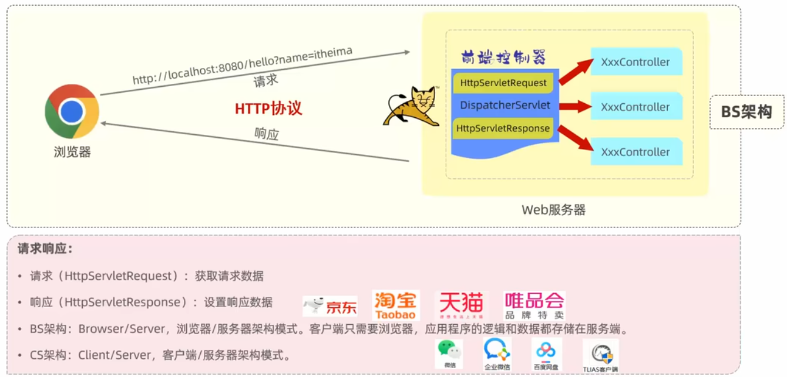
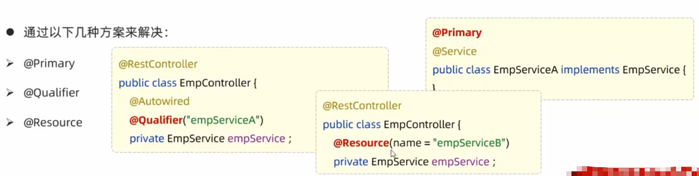

# JavaWeb

## Maven

**什么是maven?**

Maven是apache旗下的一个开源项目，是一款用于管理和构建java项目的工具。

**Maven的作用**

### 介绍

- Apache Maven 是一个项目管理和构建工具，它基于项目对象模型(POM)的概念，通过一小段描述信息来管理项目的构建。
- 作用:
  - 方便的依赖管理
  - 统一的项目结构
  - 标准的项目构建流程
- 官网:http://maven.apache.org/

### 安装

### Maven坐标

### 依赖管理

#### 依赖配置

- 依赖：指当前项目运行所需要的jar包，一个项目中可以引入多个依赖
- 配置
  - 1、在 pom.xml中编写`<dependencies>`标签
  - 2、在`<dependencies>`标签中 使用`<dependency>`引入坐标定义
  - 坐标的 `groupld，artifactld，version`
  - 点击刷新按钮，引入最新加入的坐标

#### 依赖传递

- 依赖具有传递性
  - 直接依赖：在当前项目中通过依赖配置建立的依赖关系
  - 间接依赖：被依赖的资源如果依赖其他资源，当前项目简介依赖其他资源

- 排除依赖

排除依赖指主动断开依赖的资源，被排除的资源无需指定版本。

#### 依赖范围

依赖的jar包，默认情况下，可以在任何地方使用。可以通过`<scope>...</scope>`设置其作用范围。

>作用范围:
>
>- 主程序范围有效。(main文件夹范围内)
>- 测试程序范围有效。(test文件夹范围内)
>- 是否参与打包运行。(package指令范围内)

#### 生命周期

Maven的生命周期就是为了对所有的maven项目构建过程进行抽象和统一

Maven中有3套相互独立的生命周期:

- clean:清理工作。
- default:核心工作，如:编译、测试、打包、安装、部署等
- site:生成报告、发布站点等。

>clean：移除上一次构建生成的文件
>compile：编译项目源代码
>test：使用合适的单元测试框架运行测试(junit)
>package：将编译后的文件打包，如:jar、war等
>install：安装项目到本地仓库

## HTTP协议

### HTTP-概述

- 概念:Hyper Text Transfer Protocol，超文本传输协议，规定了浏览器和服务器之间数据传输的规则。
- 特点:
  1. 基于TCP协议:面向连接，安全
  2. 基于请求-响应模型的:一次清求对应一次响应
  3. HTTP协议是无状态的协议:对于事务处理没有记忆能力。每次请求-响应都是独立的。
    1. 缺点:多次请求间不能共享数据。
    2. 优点:速度快

### HTTP-请求协议

### HTTP-相应协议

| 状态码分类 | 说明                                                         |
| ---------- | ------------------------------------------------------------ |
| 1xx        | **响应中**——临时状态码，表示请求已经接受，告诉客户端应该继续请求或者如果它已经完成则忽略它 |
| 2xx        | **成功**——表示请求已经被成功接收，处理已完成                 |
| 3xx        | **重定向**——重定向到其它地方：它让客户端再发起一个请求以完成整个处理。 |
| 4xx        | **客户端错误**——处理发生错误，责任在客户端，如：客户端的请求一个不存在的资源，客户端未被授权，禁止访问等 |
| 5xx        | **服务器端错误**——处理发生错误，责任在服务端，如：服务端抛出异常，路由出错，HTTP版本不支持等 |

| 状态码 | 英文描述                               | 解释                                                         |
| ------ | -------------------------------------- | ------------------------------------------------------------ |
| 200    | **`OK`**                               | 客户端请求成功，即**处理成功**，这是我们最想看到的状态码     |
| 302    | **`Found`**                            | 指示所请求的资源已移动到由`Location`响应头给定的 URL，浏览器会自动重新访问到这个页面 |
| 304    | **`Not Modified`**                     | 告诉客户端，你请求的资源至上次取得后，服务端并未更改，你直接用你本地缓存吧。隐式重定向 |
| 400    | **`Bad Request`**                      | 客户端请求有**语法错误**，不能被服务器所理解                 |
| 403    | **`Forbidden`**                        | 服务器收到请求，但是**拒绝提供服务**，比如：没有权限访问相关资源 |
| 404    | **`Not Found`**                        | **请求资源不存在**，一般是URL输入有误，或者网站资源被删除了  |
| 405    | **`Method Not Allowed`**               | 请求方式有误，比如应该用GET请求方式的资源，用了POST          |
| 428    | **`Precondition Required`**            | **服务器要求有条件的请求**，告诉客户端要想访问该资源，必须携带特定的请求头 |
| 429    | **`Too Many Requests`**                | 指示用户在给定时间内发送了**太多请求**（“限速”），配合 Retry-After(多长时间后可以请求)响应头一起使用 |
| 431    | **` Request Header Fields Too Large`** | **请求头太大**，服务器不愿意处理请求，因为它的头部字段太大。请求可以在减少请求头域的大小后重新提交。 |
| 500    | **`Internal Server Error`**            | **服务器发生不可预期的错误**。服务器出异常了，赶紧看日志去吧 |
| 503    | **`Service Unavailable`**              | **服务器尚未准备好处理请求**，服务器刚刚启动，还未初始化好   |

### HTTP-协议解析

## Web服务器-Tomcat

### Tomcat-基本使用

- 启动：bin/startup.bat
- 停止：bin/shutdown.bat
- Tomcat部署项目：

将项目放置到webapps目录下，即部署完成

### 入门程序解析

> - 起步依赖
>   - spring-boot-starter-web
>   - spring-boot-starter-test
>
> - 内嵌Tomcat服务器
>   - 基于Springboot开发的web应用程序，内置了tomcat服务器，当启
>     动类运行时，会自动启动内嵌的tomdat服务器

## 请求响应

### 请求

#### Postman

#### 简单参数

- 原始方式

- SpringBoot方式

#### 实体参数

- 简单实体对象:请求参数名与形参对象属性名相同，定义POJ0接收即可

#### 数组集合参数

- 数组参数：请求参数名与形参数组名称相同且请求参数为多个，定义数组类型形参即可接收参数

- 集合参数：集合参数:请求参数名与形参集合名称相同且请求参数为多个，@RequestParam 绑定参数关系

#### 日期参数

- 日期参数：使用 @DateTimeFormat 注解完成日期参数格式转换

#### Json参数

- JSON参数：JSON数据键名与形参对象属性名相同，定义POJO类型形参即可接收参数，需要使用 @RequestBody 标识

#### 路径参数

- 路径参数:通过请求URL直接传递参数，使用{...}来标识该路径参数，需要使用`@PathVariable`获取路径参数

### 响应

## 分层解耦

### 三层架构

### 分层解耦

- 内聚：软件中各个功能模块内部的功能联系
- 耦合：衡量软件中各个层/模块之间的依赖、关联的程度
- 软件设计原则：高内聚低耦合。

### IOC & DI入门

### IOC详解

#### Bean的声明

> 注意事项：
>
> - 声明bean的时候，可以通过value属性指定bean的名字，如果没有指定，默认为类名首字母小写。
> - 使用以上四个注解都可以声明bean，但是在springboot集成web开发中，声明控制器bean只能用@Controller。

#### Bean组件扫描

- 前面声明bean的四大注解，要想生效，还需要被组件扫描注解@ComponentScan扫描。
- @Componentscan注解虽然没有显式配置，但是实际上已经包含在了启动类声明注解 @SpringBootApplication中，默认扫描的范围是启动类所在包及其子包。

### DI详解

#### Bean注入

- @Autowired注解，默认是按照类型进行，如果存在多个相同类型的bean，将会报出如下错误:

> 1、依赖注入的注解
>
> - @Autowired:默认按照类型自动装配
> - 如果同类型的bean存在多个:
>   - @Primary
>   - @Autowired+@Qualifier("bean的名称")
>   - @Resource(name="bean的名称”)
>
> 2、@Resource与@Autowired区别
>
> - @Autowired 是spring框架提供的注解，而@Resource是JDK提供的注解
> - @Autowired 默认是按照类型注入，而@Resource默认是按照名称注入。