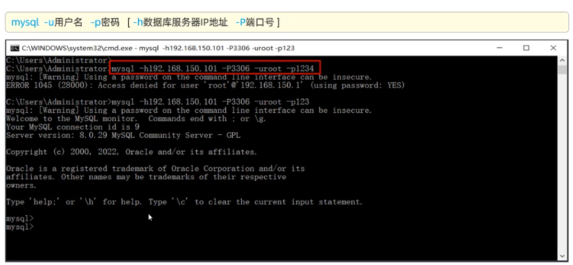
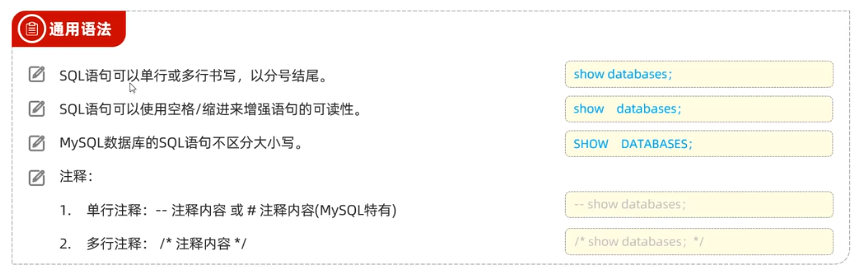
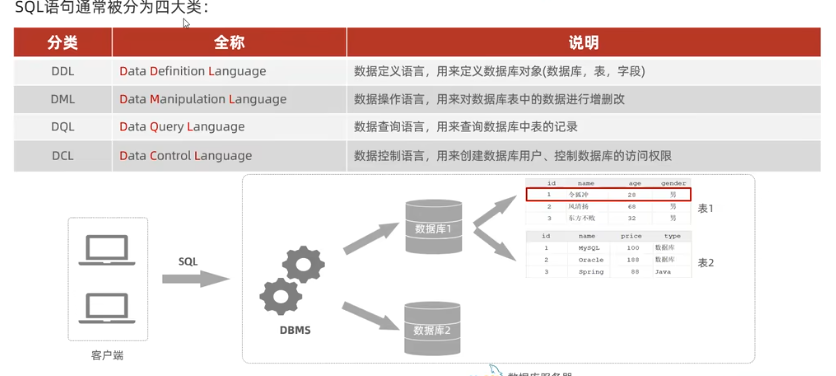
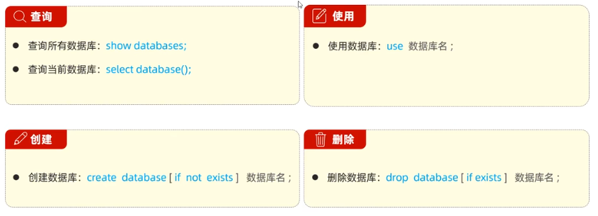
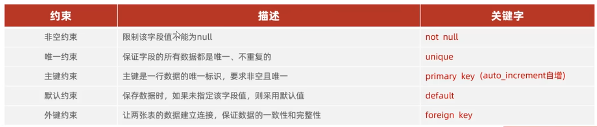
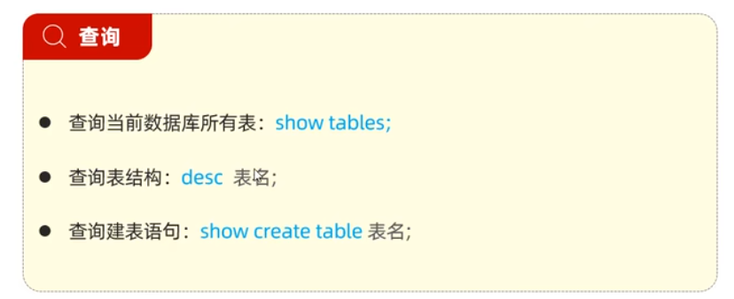
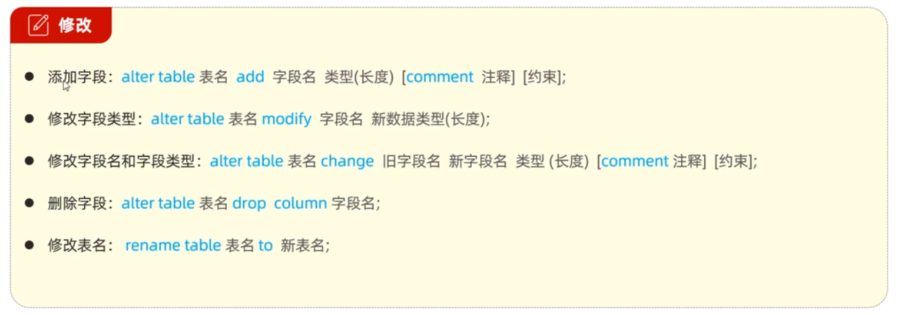

# Mysql 基础

## Mysql 概述

> 什么是数据库？
>
> - 数据库：DataBase（DB），是存储和管理数据的仓库
> - 数据库管理系统:DataBase ManagementSystem(DBMS)，操纵和管理数据库的大型软件。
> - SQL:Structured QueryLanguage，操作关系型数据库的编程语言，定义了一套操作关系型数据库统一标准。

### 数据模型

- 关系型数据库(RDBMS):建立在关系模型基础上，由多张相互连接的 `二维表 ` 组成的数据库

### MYSQL 数据模型

- 创建数据库： `create database 数据库名字`

### SQL 简介

- SQL:一门操作关系型数据库的编程语言，定义操作所有关系型数据库的统一标准。

- SQL 语句通常被分为四大类：

## 数据库设计—DDL

### 数据库

> 上述语法中的 database，也可以替换成 schema。如:create schema db01;

### 表（创建、查询、修改、删除）

#### 创建

> 约束
>
> - 概念约束是作用于表中字段上的规则，用于限制存储在表中的数据，
> - 目的:保证数据库中数据的正确性、有效性和完整性。
>
> 

#### 数据类型

- MySQL 中的数据类型有很多，主要分为三类:数值类型、字符串类型、
  日期时间类型

> - 日期时间类型
> - date：YYYY-MM-DD 日期值
> - datetime：YYYY-MM-DD HH:MM:SS 混合日期和时间值
> - 字符串类型
> - char：`char(10):最多只能存10个字特,不足10个字符,占用10个字符空间   AB   性能高   浪费空间`
> - varchar：`varchar(10):最多只能存10个字符,不足10个字符,按照实际长度存储   ABC   性能低   节省空间`
>
> - 数值类型
> - tinyint：小整数值
> - int：大整数值
> - bigint：极大整数值
> - double：双精度浮点数值

#### 查询

#### 修改

#### 删除

> 再删除表时，表中的全部数据也会被删除

## 数据库操作-DML

> DML
>
> - DML 英文全称是 Data Manipulation Language(数据操作语言)，用来对数据库中表的数据记录进行增、删、改操作。
>
> 添加数据（INSERT）
>
> 修改数据（UPDATE）
>
> 删除数据（DELETE）

## 数据库操作—DQL

## 多表设计

## 事务

## 多表查询

## 索引
