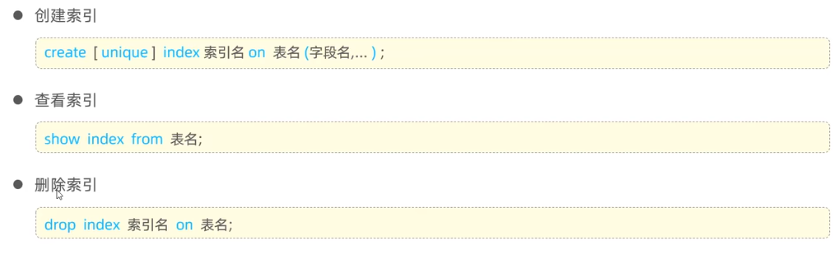

# Mysql 基础

## Mysql 概述

> 什么是数据库？
>
> - 数据库：DataBase（DB），是存储和管理数据的仓库
> - 数据库管理系统:DataBase ManagementSystem(DBMS)，操纵和管理数据库的大型软件。
> - SQL:Structured QueryLanguage，操作关系型数据库的编程语言，定义了一套操作关系型数据库统一标准。


### 数据模型

- 关系型数据库(RDBMS):建立在关系模型基础上，由多张相互连接的 `二维表 ` 组成的数据库

### MYSQL 数据模型

- 创建数据库： `create database 数据库名字`

### SQL 简介

- SQL:一门操作关系型数据库的编程语言，定义操作所有关系型数据库的统一标准。


- SQL 语句通常被分为四大类：


## 数据库设计—DDL

### 数据库


> 上述语法中的 database，也可以替换成 schema。如:create schema db01;

### 表（创建、查询、修改、删除）

#### 创建


> 约束
>
> - 概念约束是作用于表中字段上的规则，用于限制存储在表中的数据，
> - 目的:保证数据库中数据的正确性、有效性和完整性。
>
> 

#### 数据类型

- MySQL 中的数据类型有很多，主要分为三类:数值类型、字符串类型、
  日期时间类型

> - 日期时间类型
> - date：YYYY-MM-DD 日期值
> - datetime：YYYY-MM-DD HH:MM:SS 混合日期和时间值
> - 字符串类型
> - char：`char(10):最多只能存10个字特,不足10个字符,占用10个字符空间   AB   性能高   浪费空间`
> - varchar：`varchar(10):最多只能存10个字符,不足10个字符,按照实际长度存储   ABC   性能低   节省空间`
>
> - 数值类型
> - tinyint：小整数值
> - int：大整数值
> - bigint：极大整数值
> - double：双精度浮点数值

#### 查询


#### 修改


#### 删除


> 再删除表时，表中的全部数据也会被删除

## 数据库操作-DML

> DML
>
> - DML 英文全称是 Data Manipulation Language(数据操作语言)，用来对数据库中表的数据记录进行增、删、改操作。
>
> 添加数据（INSERT）
>
> 修改数据（UPDATE）
>
> 删除数据（DELETE）

#### 添加数据


```sql
-- 插入新数据
insert into tb_emp(username,name,gender,create_date,update_date) values ('zhangwuji','张无忌',1,now(),now());

-- 为emp表的所有字段插入值
insert into tb_emp(id, username, password, name, gender, image, job, entry_date, create_date, update_date)
values (null,'zhiruo','123','周芷若',2,'1.jpg',1,'2021-01-01',now(),now());

insert into tb_emp values (null,'zhiruo2','123','周芷若2',2,'1.jpg',1,'2021-01-01',now(),now());

-- 批量插入数据
insert into tb_emp(username,name,gender,create_date,update_date)
values
    ('zhangsan','张三',1,now(),now()),
    ('lisi','李四',1,now(),now()),
    ('wangwu','王五',1,now(),now());
```

> 1、插入数据时，指定的字段顺序需要与值的顺序是一一对应的。
>
> 2、字符串和日期型数据应该包含在引号中。
>
> 3、插入的数据大小，应该在字段的规定范围内。

#### 修改数据


```sql
-- 将emp表的 ID为1的员工 的姓名 name 改为"张三"
update tb_emp set name = '张三',update_date = now() where id = 1;

-- 将emp表的所有员工的入职日期改为 "2010-01-01"
update tb_emp set entry_date = '2010-01-01',update_date = now();
```

> 修改语句的条件可以有，也可以没有，如果没有条件，则会修改整张表的数据

#### 删除数据


```sql
-- 删除emp表中ID为1的员工
delete from tb_emp where id = 1;

-- 删除emp表的所有员工
delete from tb_emp;
```

> 1、DELETE语句的条件可以有，也可以没有，如果没有条件，则会删除整张表的数据
>
> 2、DELETE语句不能删除某一个字段的值（如果要操作，可以使用UPDATE，将该字段的值为NULL）

## 数据库操作—DQL

> DQL
>
> - DQL英文全称是Data Query Language(数据查询语言)，用来查询数据库表中的记录。
> - 关键字:SELECT


### 基本查询


> `*`   号代表查询所有字段，在实际开发中尽量少用（不直观，影响效率）

```sql
-- 查询指定字段 name,entrydate 并返回
select name,entrydate from tb_emp;

-- 查询返回所有字段
select * from tb_emp;

-- 查询所有员工的 name， entrydate 并起别名（姓名，入职日期）
select name as 姓名, entrydate as 入职日期 from tb_emp;

select name  姓名, entrydate  入职日期 from tb_emp;

select name as "姓 名", entrydate as 入职日期 from tb_emp;

-- 查询已有的员工关联了哪几种职位（不要重复）
select distinct job from tb_emp;
```

### 条件查询


```sql
-- =================== DOL:条件查询 =========================
-- 1.查询 姓名 为 杨逍 的员工
select * from tb_emp where name = '杨逍';

-- 2、查询 id小于等于5 的员工信息
select * from tb_emp where id <= 5;

-- 3、查询 没有分配职位 的员工信息
select * from tb_emp where job is null;

-- 4、查询 有职位 的员工信息
select * from tb_emp where job is not null ;

-- 5.查询 密码不等于'123456' 的员工信息
select * from tb_emp where password != '123456';
或
select * from tb_emp where password <> '123456';

-- 6、查询 入职日期在2000-01-01'(包含)到·2010-01-01'(包含)之间的员工信息
select * from tb_emp where entrydate >= '2000-01-01' and entrydate <= '2010-01-01';
或
select * from tb_emp where entrydate between '2000-01-01' and '2010-01-01';

-- 7、查询 入职日期在2000-01-01'(包含)到·2010-01-01'(包含)之间 且 性别为女 的员工信息
select * from tb_emp where entrydate between '2000-01-01' and '2010-01-01'and gender = 2;

-- 8、査询 职位是2(讲师)，3(学工主管)，4(教研主管)的员工信息
select * from tb_emp where job = 2 or job = 3 or job = 4;
或
select * from tb_emp where job in (2,3,4);

-- 9、查询 姓名 为两个字的员工信息
select * from tb_emp where name like '__';

-- 10、查询 姓'张”的员工信息
select * from tb_emp where name like '张%';
```

### 分组查询

#### 集合函数


> - null值不参与所有聚合函数运算。
> - 统计数量可以使用:`count(*)`  `count(字段)`   `count(常量)`，推荐使用`count(*)`。

```sql
-- 1、统计该企业员工数量
select count(id) from tb_emp;

select count(1) from tb_emp;

-- 推荐使用
select count(*) from tb_emp;

-- 2、统计该企业最早入职的员工
select min(entrydate) from tb_emp;

-- 3、统计该企业最迟入职的员工
select max(entrydate) from tb_emp;

-- 4、统计该企业员工 ID 的平均值
select avg(id) from tb_emp;

-- 5、统计该企业员工的 ID 之和
select sum(id) from tb_emp;
```

#### 分组查询


> where与having区别
>
> - 执行时机不同：where 是分组之前进行过滤，不满足where条件，不参与分组；而having是分组之后对结果进行过滤。
> - 判断条件不同：where不能对聚合函数进行判断，而having可以。

> 注意事项：
>
> - 分组之后，查询的字段一般为聚合函数和分组字段，查询其他字段无任何意义。
> - 执行顺序：where > 聚合函数 > having。

```sql
-- 根据性别分组，统计男性和女性员工的数量
select gender,count(*) from tb_emp group by gender;

-- 先查询入职时间在 '2015-01-01' (包含) 以前的员工，并对结果根据职位分组，获取员工数量大于等于2的职位
select job,count(*) from tb_emp where entrydate <= '2015-01-01' group by job having count(*) >= 2;
```

### 排序查询


> 注意事项：如果是多字段排序，当第一个字段值相同时，才会根据第二个字段进行排序

```sql
-- 1。根据入期时间，对员工进行开序排序
select * from tb_emp order by entrydate asc;

-- 2、粮据入联时间，对员工进行降序排序
select * from tb_emp order by entrydate desc ;

-- 3.根据 入职时间 对公司的员工进行 升序排序, 入期时间相同，再按照 更新时间 进行降序排序
select * from tb_emp order by entrydate,update_time desc;
```

### 分页查询


> 起始索引 = （页码 - 1）* 每页展示记录数

> 注意事项
>
> - 1、起始索引从0开始，起始索引=(查询页码-1)*每页显示记录数。
> - 2、分页查询是数据库的方言，不同的数据库有不同的实现，MySQL中是LIMIT。
> - 3、如果查询的是第一页数据，起始索引可以省略，直接简写为limit 10。

```sql
-- 1、从 起始索引0开始查询员工数据，每贝展示5条记录
select * from tb_emp limit 0,5;

-- 2、查询 第1页 员工数据，每页展示5条记录
select * from tb_emp limit 0,5;

-- 3、查询第2页员工数据，每页展示5条记录
select * from tb_emp limit 5,5;

-- 4、查询 第3页 员工数据，每页展示5条记录
select * from tb_emp limit 10,5;
```

### 注意


```sql

select if(gender = 1,'男性员工','女性员工') as 性别,count(*) from tb_emp group by gender;


select case job when 1 then '班主任' when 2 then '讲师' when 3 then '学工主管' when 4 then '教研主管' else '未分配角色' end as 职位,
       count(*)
from tb_emp
group by job;
```

## 多表设计

#### 概述

项目开发中，在进行数据库表结构设计时，会根据业务需求及业务模块之间的关系，分析并设计表结构，由于业务之间相互关联，所以各个表结构之间也存在着各种联系，基本上分为三种:

- 一对多（多对一）
- 多对多
- 一对一

#### 一对多


#### 外键约束


#### 一对一


### 多对多


## 多表查询

- 多表查询：指从多张表中查询数据

> 连接查询
>
> - 内连接：相当于查询A、B交集部分数据
> - 外连接
>   - 左外连接:查询左表所有数据(包括两张表交集部分数据)
>   - 右外连接:查询右表所有数据(包括两张表交集部分数据
> - 子查询

### 内连接


```sql
-- 查询员工的姓名，及所属的部门名称(隐式内连接实现)
select tb_emp.name,tb_dept.name from tb_emp,tb_dept where tb_emp.dept_id = tb_dept.id;

-- 查询员工的姓名，及所属的部门名称(显式内连接实现)
select tb_emp.name,tb_dept.name from tb_emp inner join tb_dept on tb_emp.dept_id = tb_dept.id;
```

### 外连接


```sql
-- 查询员工表 所有 员工的姓名，和对应的部门名称(左外连接)
select tb_emp.name,tb_dept.name from tb_emp left join tb_dept on tb_emp.dept_id = tb_dept.id;

-- 查询部门表所有 部门的名称，利对应的员工名称(右外连接)
select tb_emp.name,tb_dept.name from tb_emp right join tb_dept on tb_emp.dept_id = tb_dept.id;
```

### 子查询


#### 标量子查询

> - 子查询返回的结果是单个值(数字、字符串、日期等)，最简单的形式
> - 常用的操作符:`= <> > >= < <=`

```sql
-- 査询"教研部”的所有员工信息

select * from tb_emp where dept_id = (select id from tb_dept where name = '教研部');

-- 查询在“方东白”入职之后的员工信息

select * from tb_emp where entrydate > (select entrydate from tb_emp where name = '方东白') order by entrydate desc ;
```

#### 列子查询

> - 子查询返回的结果是一列(可以是多行)
> - 常用的操作符:`in、notin`等

```sql
-- 查询“教研部”称“咨询部”的所有员工信息

select * from tb_emp where dept_id in (select id from tb_dept where name='教研部' or name='咨询部');
```

#### 行子查询

> - 子查询返回的结果是一行（可以是多列）
> - 常用的操作符：`=、<>、in、not in`

```sql
-- 查询与"韦一笑”的入职日期及职位都相同的员工信息

select * from tb_emp where (entrydate,job) = (select entrydate,job from tb_emp where name = '韦一笑');
```

#### 表子查询

> - 子查询返回的结果是多行多列，常作为临时表
> - 常用的操作符：`in`

```sql

-- 查询入职日期是"2006-01-01”之后的员工信息，及其部门名称
select e.*,tb_dept.name from (select * from tb_emp where entrydate > '2006-01-01') e,tb_dept  where e.dept_id = tb_dept.id;
```

### 案例

```sql
-- 查询价格低于 10元 的菜品的名称、价格及其 菜品的分类名称
select dish.name, dish.price, category.name
from dish,
     category
where dish.category_id = category.id
  and dish.price < 10;

-- 查询所有价格在 10元(含)到50元(含)之间 且 状态为 "起售" 的菜品名称、价格及其分类名称 (即使菜品没有分类也需要将菜晶查询出来)
select dish.name, dish.price, category.name
from dish
         left join category on dish.category_id = category.id
where price between 10 and 50
  and dish.status = 1;

-- 查询每个分类下最贵的菜品，展示出分类的名称、最贵的菜品的价格
select category.name, max(dish.price)
from dish,
     category
where dish.category_id = category.id
group by category.name;

-- 查询各个分类下 菜品状态为"起售",并且 该分类下菜品总数量大于等于3 的 分类名称
select category.name, count(*)
from dish,
     category
where dish.category_id = category.id
  and dish.status = 1
group by category.name
having count(*) >= 3;

-- 查询出"商务套餐A"中包含了哪些菜品 (展示出套餐名称、价格,包含的菜品名称、价格、份数)
select setmeal.name, setmeal.price, dish.name, dish.price, setmeal_dish.copies
from setmeal,
     dish,
     setmeal_dish
where setmeal.id = setmeal_dish.setmeal_id
  and setmeal_dish.dish_id = dish.id
  and setmeal.name = '商务套餐A';

-- 查询出低于菜品平均价格的菜品信息(展示出菜品名称、菜品价格)
select avg(price) from dish;

select name,price from dish where price < (select avg(price) from dish);

```

## 事务

### 介绍&操作

>事务 是一组操作的集合，它是一个不可分割的工作单位。事务会把所有的操作作为一个整体一起向系统提交或撤销操作请求，即这些操作     `要么同时成功，要么同时失败`。


```sql
start transaction;

delete from tb_dept where id =3;

commit;

rollback;
```

### 四大特性


## 索引

> 索引(index)是帮助数据库 高效获取数据 的 数据结构


### 结构

> MySQL数据库支持的索引结构有很多，如:Hash索引、B+Tree索引、Ful-Text索引等。我们平常所说的索引，如果没有特别指明，都是指默认的 B+Tree 结构组织的索引。


### 语法



```sql
create index idx_emp_name on tb_emp(name);

show index from tb_emp;

drop index idx_emp_name on tb_emp;
```

>主键字段，在建表时，会自动创建主键索引。
>添加唯一约束时，数据库实际上会添加唯一索引。


