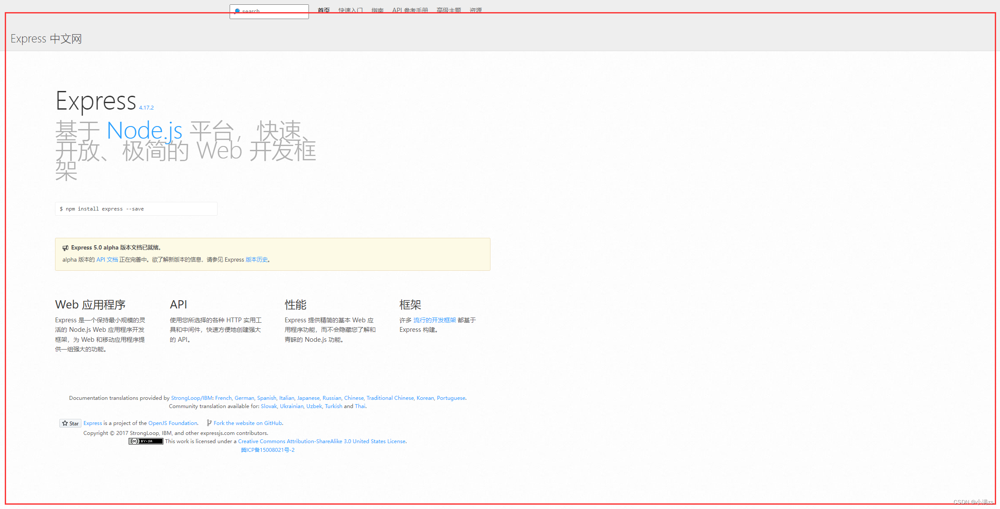
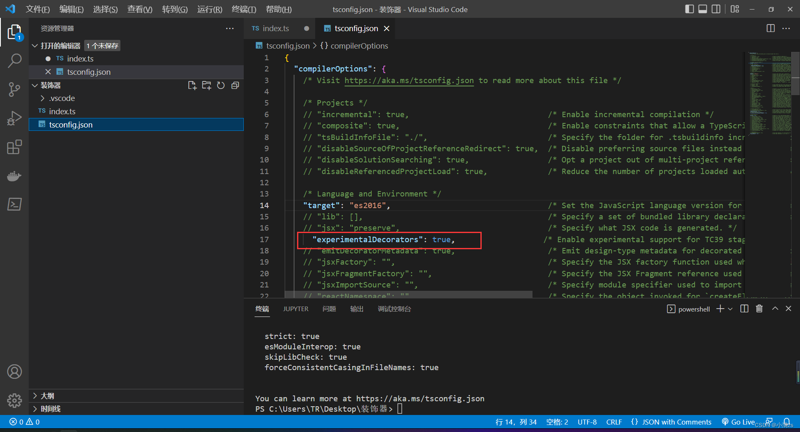
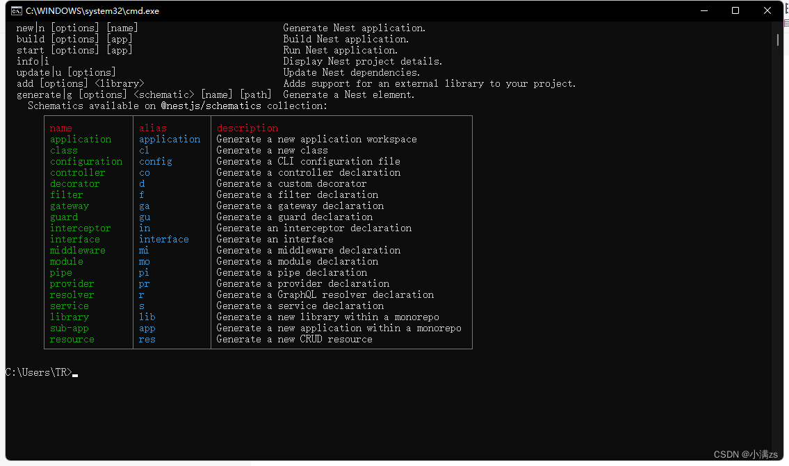
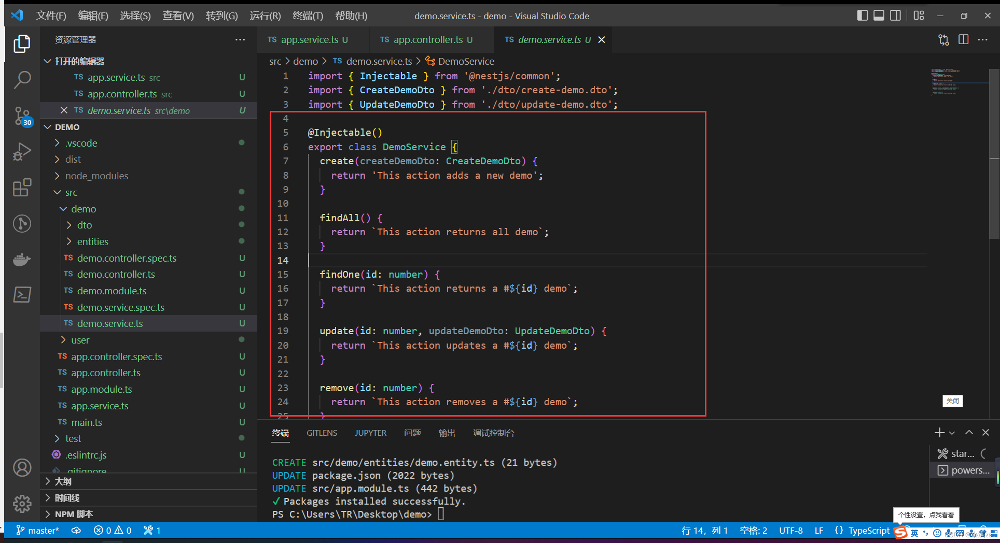
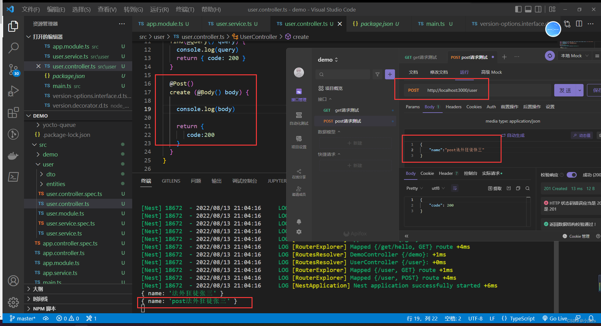
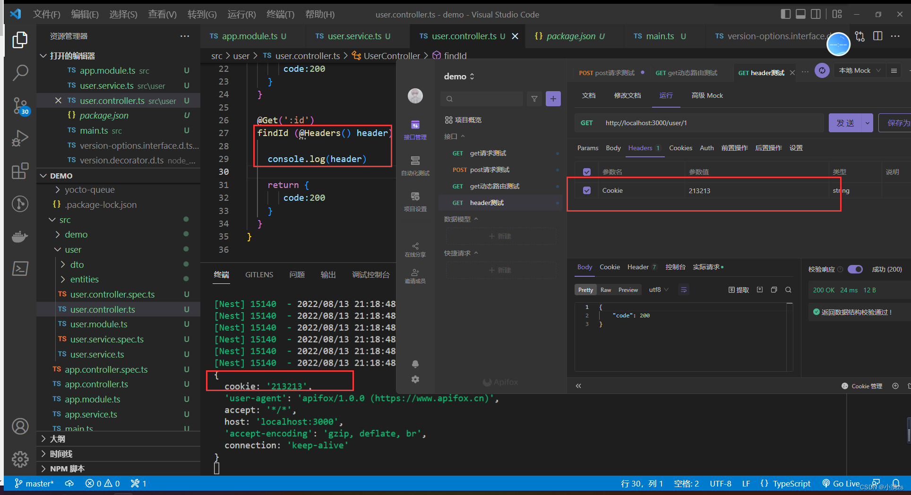
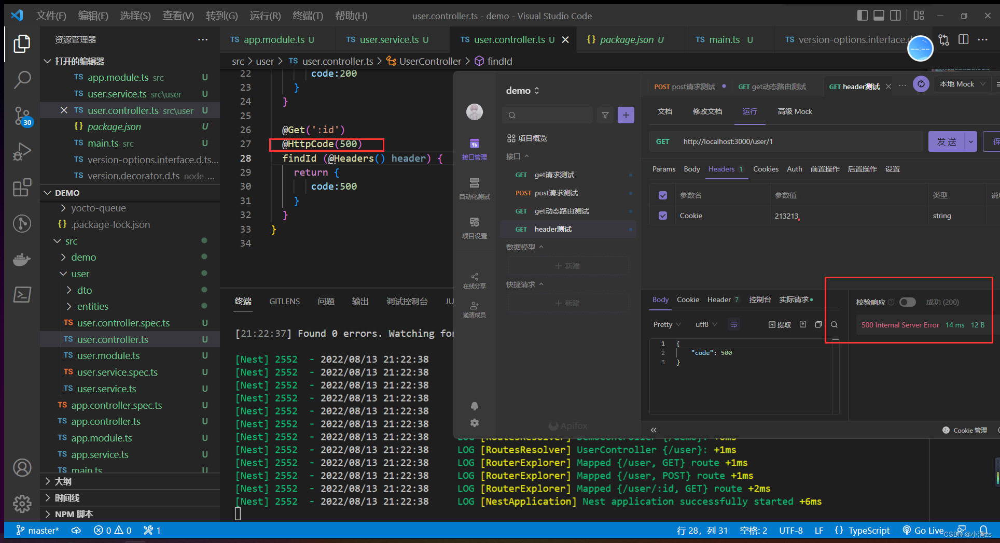
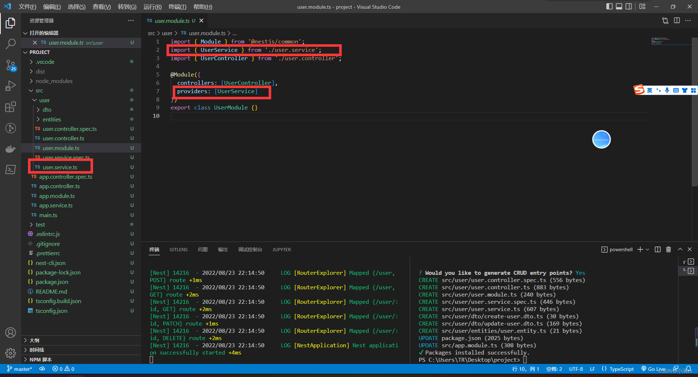

# Nest JS 学习

## 1、介绍nestjs

Nestjs 是一个用于构建高效可扩展的一个基于Node js 服务端 应用程序开发框架

并且完全支持typeScript  结合了 AOP 面向切面的编程方式

nestjs 还是一个spring MVC 的风格 其中有依赖注入 IOC 控制反转 都是借鉴了Angualr

nestjs 的底层代码运用了 express 和  Fastify 在他们的基础上提供了一定程度的抽象，同时也将其 API 直接暴露给开发人员。这样可以轻松使用每个平台的无数第三方模块

nest js 英文官网 [NestJS - A progressive Node.js framework](https://nestjs.com/)

nestjs 中文网  [NestJS 简介 | NestJS 中文文档 | NestJS 中文网](https://nestjs.bootcss.com/)

nestjs 中文网2  [Nest.js 中文文档](https://docs.nestjs.cn/)

### nestjs内置框架express 默认express

能够快速构建服务端应用程序，且学习成本非常低，容易上手



 express 文档 [Express - 基于 Node.js 平台的 web 应用开发框架 - Express 中文文档 | Express 中文网](https://www.expressjs.com.cn/)

###nestjs唯二内置框架 Fastify

- 高性能： 据我们所知，Fastify 是这一领域中最快的 web 框架之一，另外，取决于代码的复杂性，Fastify 最多可以处理每秒 3 万次的请求。
- 可扩展： Fastify 通过其提供的钩子（hook）、插件和装饰器（decorator）提供完整的可扩展性。
- 基于 Schema： 即使这不是强制性的，我们仍建议使用 JSON Schema 来做路由（route）验证及输出内容的序列化，Fastify 在内部将 schema 编译为高效的函数并执行。
- 日志： 日志是非常重要且代价高昂的。我们选择了最好的日志记录程序来尽量消除这一成本，这就是 Pino!
- 对开发人员友好： 框架的使用很友好，帮助开发人员处理日常工作，并且不牺牲性能和安全性。
- 支持 TypeScript： 我们努力维护一个 TypeScript 类型声明文件，以便支持不断成长的 TypeScript 社区。

##2、IOC控制反转 DI依赖注入

在学习`nestjs`之前需要先了解其设计模式

IOC

Inversion of Control字面意思是`控制反转`，具体定义是高层模块不应该依赖低层模块，二者都应该依赖其抽象；抽象不应该依赖细节；细节应该依赖抽象。

DI

依赖注入（Dependency Injection）其实和IoC是同根生，这两个原本就是一个东西，只不过由于控制反转概念比较含糊（可能只是理解为容器控制对象这一个层面，很难让人想到谁来维护对象关系），所以2004年大师级人物Martin Fowler又给出了一个新的名字：“依赖注入”。 类A依赖类B的常规表现是在A中使用B的instance。

```typescript
class A {
    name: string
    constructor(name: string) {
        this.name = name
    }
}
 
 
class B {
    age:number
    entity:A
    constructor (age:number) {
        this.age = age;
        this.entity = new A('张三')
    }
}
 
const c = new B(18)
 
c.entity.name
```

我们可以看到，**B** 中代码的实现是需要依赖 **A** 的，**两者的代码耦合度非常高。当两者之间的业务逻辑复杂程度增加的情况下，维护成本与代码可读性都会随着增加，并且很难再多引入额外的模块进行功能拓展**。

为了解决这个问题可以使用IOC容器

```typescript
class A {
    name: string
    constructor(name: string) {
        this.name = name
    }
}
 
 
class C {
    name: string
    constructor(name: string) {
        this.name = name
    }
}
//中间件用于解耦
class Container {
    modeuls: any
    constructor() {
        this.modeuls = {}
    }
    provide(key: string, modeuls: any) {
        this.modeuls[key] = modeuls
    }
    get(key) {
        return this.modeuls[key]
    }
}
 
const mo = new Container()
mo.provide('a', new A('张三1'))
mo.provide('c', new C('张三2'))
 
class B {
    a: any
    c: any
    constructor(container: Container) {
        this.a = container.get('a')
        this.c = container.get('c')
    }
}
 
new B(mo)
```

其实就是写了一个中间件，来收集依赖，主要是为了解耦，减少维护成本

##3、前置知识装饰器

###1、什么是装饰器

装饰器是一种特殊的类型声明，他可以附加在类，方法，属性，参数上面

装饰器写法 **tips（需要开启一项配置）**



###类装饰器 主要是通过@符号添加装饰器

他会自动把class的构造函数传入到装饰器的第一个参数 target

然后通过prototype可以自定义添加属性和方法

```typescript
function decotators (target:any) {
    target.prototype.name = '张三'
}
 
@decotators
 
class User{
 
    constructor () {
 
    }
 
}
 
const user:any = new User()
 
console.log(user.name)
```

### 属性装饰器

同样使用@符号给属性添加装饰器

他会返回两个参数

1.原形对象

2.属性的名称

```typescript
const currency: PropertyDecorator = (target: any, key: string | symbol) => {
    console.log(target, key)
}
 
 
class Xiaoman {
    @currency
    public name: string
    constructor() {
        this.name = ''
    }
    getName() {
        return this.name
    }
}
```

### 参数装饰器

同样使用@符号给属性添加装饰器

他会返回两个参数

1.原形对象

2.方法的名称

3.参数的位置从0开始

```typescript
const currency: ParameterDecorator = (target: any, key: string | symbol,index:number) => {
    console.log(target, key,index)
}
 
 
class Xiaoman {
    public name: string
    constructor() {
        this.name = ''
    }
    getName(name:string,@currency age:number) {
        return this.name
    }
}
```

### 方法装饰器 

同样使用@符号给属性添加装饰器

他会返回两个参数

1.原形对象

2.方法的名称

3.属性描述符 可写对应writable，可枚举对应enumerable，可配置对应configurable

```typescript
const currency: MethodDecorator = (target: any, key: string | symbol,descriptor:any) => {
    console.log(target, key,descriptor)
}
 
 
class Xiaoman {
    public name: string
    constructor() {
        this.name = ''
    }
    @currency
    getName(name:string,age:number) {
        return this.name
    }
}
```

###实现一个GET请求

安装依赖npm install axios -S

定义控制器 Controller

```typescript
class Controller {
    constructor() {
 
    }
    getList () {
 
    }
  
}
```

定义装饰器

这时候需要使用装饰器工厂

应为装饰器默认会塞入一些参数

定义 descriptor 的类型 通过 descriptor描述符里面的value 把axios的结果返回给当前使用装饰器的函数

```typescript
import axios from 'axios'
 
const Get = (url: string): MethodDecorator => {
    return (target, key, descriptor: PropertyDescriptor) => {
        const fnc = descriptor.value;
        axios.get(url).then(res => {
            fnc(res, {
                status: 200,
            })
        }).catch(e => {
            fnc(e, {
                status: 500,
            })
        })
    }
}
 
//定义控制器
class Controller {
    constructor() {
 
    }
    @Get('https://api.apiopen.top/api/getHaoKanVideo?page=0&size=10')
    getList (res: any, status: any) {
        console.log(res.data.result.list, status)
    }
  
}
```

##4、nestjs cli

#### 通过cli创建nestjs项目

```js
npm i -g @nestjs/cli

nest new [项目名称]
```

启动项目 我们需要`热更新`就启动npm run start:dev就可以了

```json
    "start": "nest start",
    "start:dev": "nest start --watch",
    "start:debug": "nest start --debug --watch",
    "start:prod": "node dist/main",
```

#### 目录介绍

1.main.ts 入口文件主文件 类似于vue 的main.ts

通过 NestFactory.create(AppModule) 创建一个app 就是类似于绑定一个根组件App.vue

 app.listen(3000); 监听一个端口

```js
import { NestFactory } from '@nestjs/core';
import { AppModule } from './app.module';
 
 
 
async function bootstrap() {
  const app = await NestFactory.create(AppModule);
  await app.listen(3000);
}
bootstrap();
```

2.Controller.ts 控制器

你可以理解成vue 的路由

private readonly appService: AppService 这一行代码就是依赖注入不需要实例化 appService 它内部会自己实例化的我们主需要放上去就可以了

```typescript
import { Controller, Get } from '@nestjs/common';
import { AppService } from './app.service';
 
@Controller()
export class AppController {
  constructor(private readonly appService: AppService) {}
 
  @Get()
  getHello(): string {
    return this.appService.getHello();
  }
}
 
//-----------------------------------------------------
//修改地址之后
 
import { Controller, Get } from '@nestjs/common';
import { AppService } from './app.service';
 
@Controller('/get')
export class AppController {
  constructor(private readonly appService: AppService) {}
 
  @Get('/hello')
  getHello(): string {
    return this.appService.getHello();
  }
}
```

 3.app.service.ts

这个文件主要实现业务逻辑的 当然Controller可以实现逻辑，但是就是单一的无法复用，放到app.service有别的模块也需要就可以实现复用

```typescript
import { Injectable } from '@nestjs/common';
 
@Injectable()
export class AppService {
  getHello(): string {
    return 'Hello World!';
  }
}
```

##5、nestjs cli 常用命令

###nest --help 可以查看nestjs所有的命令



#### 1.生成controller.ts

```js
nest g co user
```

#### 2.生成 module.ts

```js
nest g mo user
```

#### 3.生成service.ts

```js
nest g s user
```

#### 以上步骤一个一个生成的太慢了我们可以直接使用一个命令生成CURD

```js
 nest g resource user
```



`nest-cli.json`添加此配置，不会生成测试文件

```json
{
"generateOptions": {
    "spec": false
  }
}
```

##6、nestjs 控制器

### Controller Request （获取前端传过来的参数）

`nestjs`提供了方法参数装饰器 用来帮助我们快速获取参数 如下

| @Request()              | req                             |
| :---------------------- | ------------------------------- |
| @Response()             | res                             |
| @Next()                 | next                            |
| @Session()              | req.session                     |
| @Param(key?: string)    | req.params`/`req.params[key]    |
| @Body(key?: string)     | req.body`/`req.body[key]        |
| @Query(key?: string)    | req.query`/`req.query[key]      |
| @Headers(name?: string) | req.headers`/`req.headers[name] |
| @HttpCode               |                                 |

#### 1.获取get请求传参

可以使用Request装饰器或者 Query 装饰器 跟express 完全一样

 也可以使用Query 直接获取 不需要在通过req.query 了

```typescript
import { Controller, Get, Post, Body, Patch, Param, Delete, Version, Request, Query } from '@nestjs/common';
import { UserService } from './user.service';
import { CreateUserDto } from './dto/create-user.dto';
import { UpdateUserDto } from './dto/update-user.dto';
 
@Controller('user')
export class UserController {
  constructor(private readonly userService: UserService) { }
 
  @Get()
  find(@Query() query) {
    console.log(query)
    return { code: 200 }
  }
}
```

#### 2.post 获取参数

 可以使用Request装饰器 或者 Body 装饰器 跟express 完全一样

或者直接使用Body 装饰器

也可以直接读取key



```typescript
import { Controller, Get, Post, Body, Patch, Param, Delete, Version, Request, Query } from '@nestjs/common';
import { UserService } from './user.service';
import { CreateUserDto } from './dto/create-user.dto';
import { UpdateUserDto } from './dto/update-user.dto';
 
@Controller('user')
export class UserController {
  constructor(private readonly userService: UserService) { }
 
  @Get()
  find(@Query() query) {
    console.log(query)
    return { code: 200 }
  }
 
  @Post()
  create (@Body() body) {
     
    console.log(body)
 
    return {
       code:200
    }
  }
}
```

#### 3.动态路由

 可以使用Request装饰器 或者 Param 装饰器 跟express 完全一样

```typescript
import { Controller, Get, Post, Body, Patch, Param, Delete, Version, Request, Query } from '@nestjs/common';
import { UserService } from './user.service';
import { CreateUserDto } from './dto/create-user.dto';
import { UpdateUserDto } from './dto/update-user.dto';
 
@Controller('user')
export class UserController {
  constructor(private readonly userService: UserService) { }
 
  @Get()
  find(@Query() query) {
    console.log(query)
    return { code: 200 }
  }
 
  @Post()
  create (@Body('name') body) {
     
    console.log(body)
 
    return {
       code:200
    }
  }
 
  @Get(':id')
  findId (@Param() param) {
     
    console.log(param)
 
    return {
       code:200
    }
  }
}
```

#### 4.读取header 信息

我在调试工具随便加了一个cookie



```typescript
import { Controller, Get, Post, Body, Patch, Param, Delete, Version, Request, Query, Ip, Header, Headers } from '@nestjs/common';
import { UserService } from './user.service';
import { CreateUserDto } from './dto/create-user.dto';
import { UpdateUserDto } from './dto/update-user.dto';
 
@Controller('user')
export class UserController {
  constructor(private readonly userService: UserService) { }
 
  @Get()
  find(@Query() query) {
    console.log(query)
    return { code: 200 }
  }
 
  @Post()
  create (@Body('name') body) {
     
    console.log(body)
 
    return {
       code:200
    }
  }
 
  @Get(':id')
  findId (@Headers() header) {
     
    console.log(header)
 
    return {
       code:200
    }
  }
}
```

#### 5.状态码

使用 HttpCode 装饰器 控制接口返回的状态码 



```typescript
import { Controller, Get, Post, Body, Patch, Param, Delete, Version, Request, Query, Ip, Header, Headers, HttpCode } from '@nestjs/common';
import { UserService } from './user.service';
import { CreateUserDto } from './dto/create-user.dto';
import { UpdateUserDto } from './dto/update-user.dto';
 
@Controller('user')
export class UserController {
  constructor(private readonly userService: UserService) { }
 
  @Get()
  find(@Query() query) {
    console.log(query)
    return { code: 200 }
  }
 
  @Post()
  create (@Body('name') body) {
     
    console.log(body)
 
    return {
       code:200
    }
  }
 
  @Get(':id')
  @HttpCode(500)
  findId (@Headers() header) {
    return {
       code:500
    }
  }
}
```

## 7、nestjs 提供者

Providers
Providers 是 Nest 的一个基本概念。许多基本的 Nest 类可能被视为 provider - service, repository, factory, helper 等等。 他们都可以通过 constructor 注入依赖关系。 这意味着对象可以彼此创建各种关系，并且“连接”对象实例的功能在很大程度上可以委托给 Nest运行时系统。 Provider 只是一个用 @Injectable() 装饰器注释的类。

#### 1.基本用法

module 引入 service 在 providers 注入 



在Controller 就可以使用注入好的service 了 


#### 2.service 第二种用法(自定义名称)

第一种用法就是一个[语法糖](https://so.csdn.net/so/search?q=语法糖&spm=1001.2101.3001.7020)

其实他的全称是这样的

```typescript
import { Module } from '@nestjs/common';
import { UserService } from './user.service';
import { UserController } from './user.controller';
 
@Module({
  controllers: [UserController],
  providers: [{
    provide: "user",
    useClass: UserService
  }]
})
export class UserModule { }
```

自定义名称之后 需要用对应的Inject 取 不然会找不到的

####  3.自定义注入值

通过 useValue

```typescript
import { Module } from '@nestjs/common';
import { UserService } from './user.service';
import { UserController } from './user.controller';
 
@Module({
  controllers: [UserController],
  providers: [{
    provide: "user",
    useClass: UserService
  }, {
    provide: "JD",
    useValue: ['TB', 'PDD', 'JD']
  }]
})
export class UserModule { }
```

####  3.工厂模式

如果服务 之间有相互的依赖 或者逻辑处理 可以使用 useFactory

```TypeScript
import { Module } from '@nestjs/common';
import { UserService } from './user.service';
import { UserService2 } from './user.service2';
import { UserService3 } from './user.service3';
import { UserController } from './user.controller';
 
@Module({
  controllers: [UserController],
  providers: [{
    provide: "user",
    useClass: UserService
  }, {
    provide: "JD",
    useValue: ['TB', 'PDD', 'JD']
  },
    UserService2,
  {
    provide: "Test",
    inject: [UserService2],
    useFactory(UserService2: UserService2) {
      return new UserService3(UserService2)
    }
  }
  ]
})
export class UserModule { }
```

####  4.异步模式

useFactory 返回一个promise 或者其他异步操作

```TypeScript
import { Module } from '@nestjs/common';
import { UserService } from './user.service';
import { UserService2 } from './user.service2';
import { UserService3 } from './user.service3';
import { UserController } from './user.controller';
 
@Module({
  controllers: [UserController],
  providers: [{
    provide: "user",
    useClass: UserService
  }, {
    provide: "JD",
    useValue: ['TB', 'PDD', 'JD']
  },
    UserService2,
  {
    provide: "Test",
    inject: [UserService2],
    useFactory(UserService2: UserService2) {
      return new UserService3(UserService2)
    }
  },
  {
    provide: "sync",
    async useFactory() {
      return await  new Promise((r) => {
        setTimeout(() => {
          r('sync')
        }, 3000)
      })
    }
  }
  ]
})
export class UserModule { }
```