# Nest JS 学习

## 1、介绍 nestjs

Nestjs 是一个用于构建高效可扩展的一个基于 Node js 服务端 应用程序开发框架

并且完全支持 typeScript 结合了 AOP 面向切面的编程方式

nestjs 还是一个 spring MVC 的风格 其中有依赖注入 IOC 控制反转 都是借鉴了 Angualr

nestjs 的底层代码运用了 express 和 Fastify 在他们的基础上提供了一定程度的抽象，同时也将其 API 直接暴露给开发人员。这样可以轻松使用每个平台的无数第三方模块

nest js 英文官网 [NestJS - A progressive Node.js framework](https://nestjs.com/)

nestjs 中文网 [NestJS 简介 | NestJS 中文文档 | NestJS 中文网](https://nestjs.bootcss.com/)

nestjs 中文网 2 [Nest.js 中文文档](https://docs.nestjs.cn/)

### nestjs 内置框架 express 默认 express

能够快速构建服务端应用程序，且学习成本非常低，容易上手

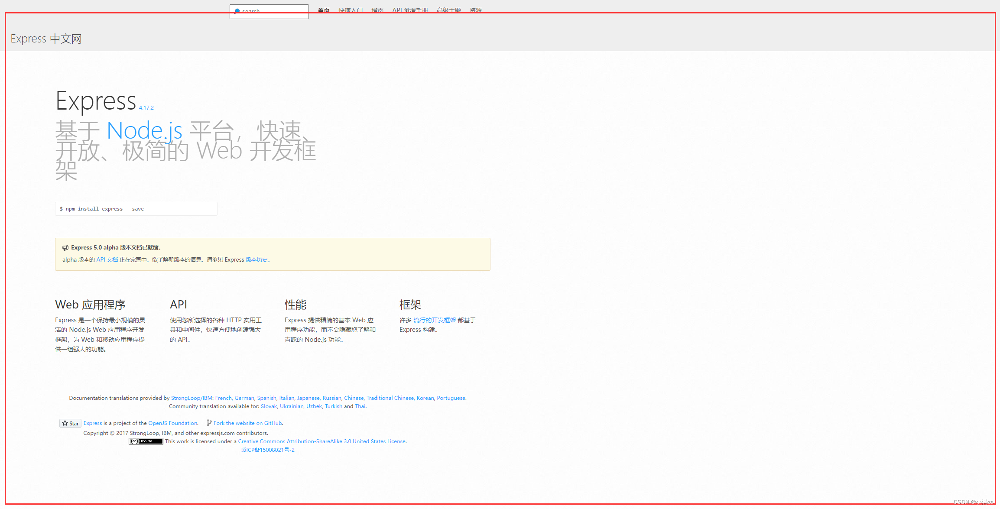

express 文档 [Express - 基于 Node.js 平台的 web 应用开发框架 - Express 中文文档 | Express 中文网](https://www.expressjs.com.cn/)

### nestjs 唯二内置框架 Fastify

- 高性能： 据我们所知，Fastify 是这一领域中最快的 web 框架之一，另外，取决于代码的复杂性，Fastify 最多可以处理每秒 3 万次的请求。
- 可扩展： Fastify 通过其提供的钩子（hook）、插件和装饰器（decorator）提供完整的可扩展性。
- 基于 Schema： 即使这不是强制性的，我们仍建议使用 JSON Schema 来做路由（route）验证及输出内容的序列化，Fastify 在内部将 schema 编译为高效的函数并执行。
- 日志： 日志是非常重要且代价高昂的。我们选择了最好的日志记录程序来尽量消除这一成本，这就是 Pino!
- 对开发人员友好： 框架的使用很友好，帮助开发人员处理日常工作，并且不牺牲性能和安全性。
- 支持 TypeScript： 我们努力维护一个 TypeScript 类型声明文件，以便支持不断成长的 TypeScript 社区。

## 2、IOC 控制反转 DI 依赖注入

在学习`nestjs`之前需要先了解其设计模式

IOC

Inversion of Control 字面意思是`控制反转`，具体定义是高层模块不应该依赖低层模块，二者都应该依赖其抽象；抽象不应该依赖细节；细节应该依赖抽象。

DI

依赖注入（Dependency Injection）其实和 IoC 是同根生，这两个原本就是一个东西，只不过由于控制反转概念比较含糊（可能只是理解为容器控制对象这一个层面，很难让人想到谁来维护对象关系），所以 2004 年大师级人物 Martin Fowler 又给出了一个新的名字：“依赖注入”。 类 A 依赖类 B 的常规表现是在 A 中使用 B 的 instance。

```typescript
class A {
  name: string;
  constructor(name: string) {
    this.name = name;
  }
}

class B {
  age: number;
  entity: A;
  constructor(age: number) {
    this.age = age;
    this.entity = new A("张三");
  }
}

const c = new B(18);

c.entity.name;
```

我们可以看到，**B** 中代码的实现是需要依赖 **A** 的，**两者的代码耦合度非常高。当两者之间的业务逻辑复杂程度增加的情况下，维护成本与代码可读性都会随着增加，并且很难再多引入额外的模块进行功能拓展**。

为了解决这个问题可以使用 IOC 容器

```typescript
class A {
  name: string;
  constructor(name: string) {
    this.name = name;
  }
}

class C {
  name: string;
  constructor(name: string) {
    this.name = name;
  }
}
//中间件用于解耦
class Container {
  modeuls: any;
  constructor() {
    this.modeuls = {};
  }
  provide(key: string, modeuls: any) {
    this.modeuls[key] = modeuls;
  }
  get(key) {
    return this.modeuls[key];
  }
}

const mo = new Container();
mo.provide("a", new A("张三1"));
mo.provide("c", new C("张三2"));

class B {
  a: any;
  c: any;
  constructor(container: Container) {
    this.a = container.get("a");
    this.c = container.get("c");
  }
}

new B(mo);
```

其实就是写了一个中间件，来收集依赖，主要是为了解耦，减少维护成本

## 3、前置知识装饰器

### 1、什么是装饰器

装饰器是一种特殊的类型声明，他可以附加在类，方法，属性，参数上面

装饰器写法 **tips（需要开启一项配置）**

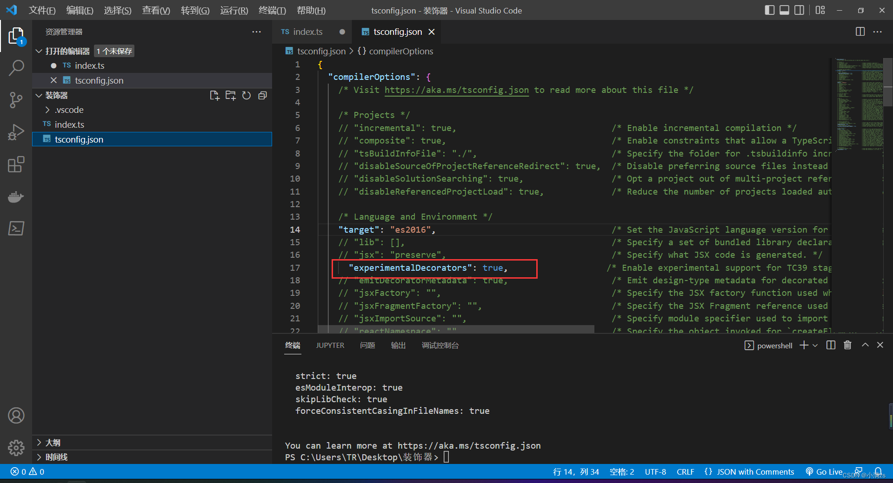

### 类装饰器 主要是通过@符号添加装饰器

他会自动把 class 的构造函数传入到装饰器的第一个参数 target

然后通过 prototype 可以自定义添加属性和方法

```typescript
function decotators(target: any) {
  target.prototype.name = "张三";
}

@decotators
class User {
  constructor() {}
}

const user: any = new User();

console.log(user.name);
```

### 属性装饰器

同样使用@符号给属性添加装饰器

他会返回两个参数

1.原形对象

2.属性的名称

```typescript
const currency: PropertyDecorator = (target: any, key: string | symbol) => {
  console.log(target, key);
};

class Xiaoman {
  @currency
  public name: string;
  constructor() {
    this.name = "";
  }
  getName() {
    return this.name;
  }
}
```

### 参数装饰器

同样使用@符号给属性添加装饰器

他会返回两个参数

1.原形对象

2.方法的名称

3.参数的位置从 0 开始

```typescript
const currency: ParameterDecorator = (
  target: any,
  key: string | symbol,
  index: number
) => {
  console.log(target, key, index);
};

class Xiaoman {
  public name: string;
  constructor() {
    this.name = "";
  }
  getName(name: string, @currency age: number) {
    return this.name;
  }
}
```

### 方法装饰器

同样使用@符号给属性添加装饰器

他会返回两个参数

1.原形对象

2.方法的名称

3.属性描述符 可写对应 writable，可枚举对应 enumerable，可配置对应 configurable

```typescript
const currency: MethodDecorator = (
  target: any,
  key: string | symbol,
  descriptor: any
) => {
  console.log(target, key, descriptor);
};

class Xiaoman {
  public name: string;
  constructor() {
    this.name = "";
  }
  @currency
  getName(name: string, age: number) {
    return this.name;
  }
}
```

### 实现一个 GET 请求

安装依赖 npm install axios -S

定义控制器 Controller

```typescript
class Controller {
  constructor() {}
  getList() {}
}
```

定义装饰器

这时候需要使用装饰器工厂

应为装饰器默认会塞入一些参数

定义 descriptor 的类型 通过 descriptor 描述符里面的 value 把 axios 的结果返回给当前使用装饰器的函数

```typescript
import axios from "axios";

const Get = (url: string): MethodDecorator => {
  return (target, key, descriptor: PropertyDescriptor) => {
    const fnc = descriptor.value;
    axios
      .get(url)
      .then((res) => {
        fnc(res, {
          status: 200,
        });
      })
      .catch((e) => {
        fnc(e, {
          status: 500,
        });
      });
  };
};

//定义控制器
class Controller {
  constructor() {}
  @Get("https://api.apiopen.top/api/getHaoKanVideo?page=0&size=10")
  getList(res: any, status: any) {
    console.log(res.data.result.list, status);
  }
}
```

## 4、nestjs cli

#### 通过 cli 创建 nestjs 项目

```js
npm i -g @nestjs/cli

nest new [项目名称]
```

启动项目 我们需要`热更新`就启动 npm run start:dev 就可以了

```json
    "start": "nest start",
    "start:dev": "nest start --watch",
    "start:debug": "nest start --debug --watch",
    "start:prod": "node dist/main",
```

#### 目录介绍

1.main.ts 入口文件主文件 类似于 vue 的 main.ts

通过 NestFactory.create(AppModule) 创建一个 app 就是类似于绑定一个根组件 App.vue

app.listen(3000); 监听一个端口

```js
import { NestFactory } from "@nestjs/core";
import { AppModule } from "./app.module";

async function bootstrap() {
  const app = await NestFactory.create(AppModule);
  await app.listen(3000);
}
bootstrap();
```

2.Controller.ts 控制器

你可以理解成 vue 的路由

private readonly appService: AppService 这一行代码就是依赖注入不需要实例化 appService 它内部会自己实例化的我们主需要放上去就可以了

```typescript
import { Controller, Get } from "@nestjs/common";
import { AppService } from "./app.service";

@Controller()
export class AppController {
  constructor(private readonly appService: AppService) {}

  @Get()
  getHello(): string {
    return this.appService.getHello();
  }
}

//-----------------------------------------------------
//修改地址之后

import { Controller, Get } from "@nestjs/common";
import { AppService } from "./app.service";

@Controller("/get")
export class AppController {
  constructor(private readonly appService: AppService) {}

  @Get("/hello")
  getHello(): string {
    return this.appService.getHello();
  }
}
```

3.app.service.ts

这个文件主要实现业务逻辑的 当然 Controller 可以实现逻辑，但是就是单一的无法复用，放到 app.service 有别的模块也需要就可以实现复用

```typescript
import { Injectable } from "@nestjs/common";

@Injectable()
export class AppService {
  getHello(): string {
    return "Hello World!";
  }
}
```

## 5、nestjs cli 常用命令

### nest --help 可以查看 nestjs 所有的命令

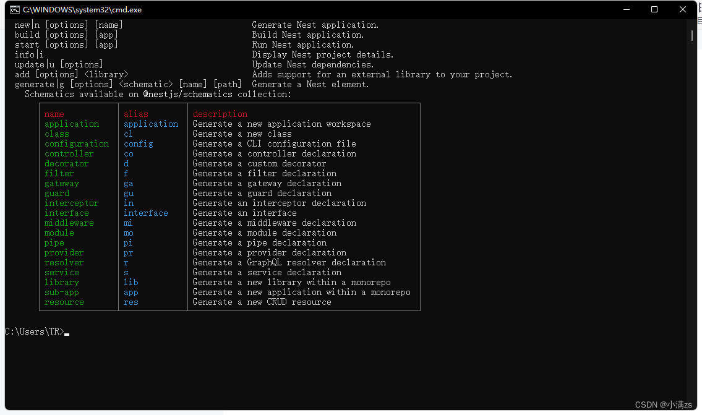

#### 1.生成 controller.ts

```js
nest g co user
```

#### 2.生成 module.ts

```js
nest g mo user
```

#### 3.生成 service.ts

```js
nest g s user
```

#### 以上步骤一个一个生成的太慢了我们可以直接使用一个命令生成 CURD

```js
 nest g resource user
```

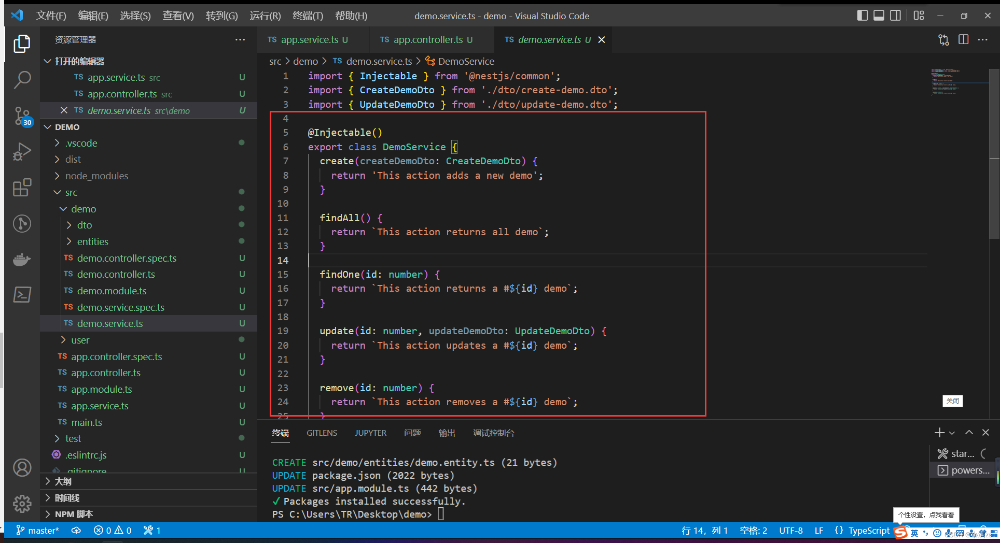

`nest-cli.json`添加此配置，不会生成测试文件

```json
{
  "generateOptions": {
    "spec": false
  }
}
```

## 6、nestjs 控制器

### Controller Request （获取前端传过来的参数）

`nestjs`提供了方法参数装饰器 用来帮助我们快速获取参数 如下

| @Request()              | req                             |
| :---------------------- | ------------------------------- |
| @Response()             | res                             |
| @Next()                 | next                            |
| @Session()              | req.session                     |
| @Param(key?: string)    | req.params`/`req.params[key]    |
| @Body(key?: string)     | req.body`/`req.body[key]        |
| @Query(key?: string)    | req.query`/`req.query[key]      |
| @Headers(name?: string) | req.headers`/`req.headers[name] |
| @HttpCode               |                                 |

#### 1.获取 get 请求传参

可以使用 Request 装饰器或者 Query 装饰器 跟 express 完全一样

也可以使用 Query 直接获取 不需要在通过 req.query 了

```typescript
import {
  Controller,
  Get,
  Post,
  Body,
  Patch,
  Param,
  Delete,
  Version,
  Request,
  Query,
} from "@nestjs/common";
import { UserService } from "./user.service";
import { CreateUserDto } from "./dto/create-user.dto";
import { UpdateUserDto } from "./dto/update-user.dto";

@Controller("user")
export class UserController {
  constructor(private readonly userService: UserService) {}

  @Get()
  find(@Query() query) {
    console.log(query);
    return { code: 200 };
  }
}
```

#### 2.post 获取参数

可以使用 Request 装饰器 或者 Body 装饰器 跟 express 完全一样

或者直接使用 Body 装饰器

也可以直接读取 key

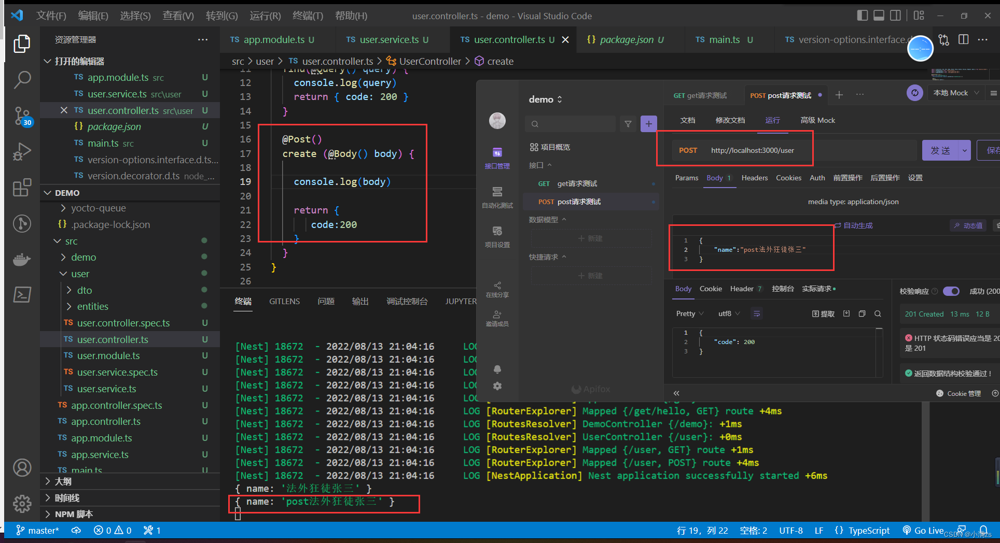

```typescript
import {
  Controller,
  Get,
  Post,
  Body,
  Patch,
  Param,
  Delete,
  Version,
  Request,
  Query,
} from "@nestjs/common";
import { UserService } from "./user.service";
import { CreateUserDto } from "./dto/create-user.dto";
import { UpdateUserDto } from "./dto/update-user.dto";

@Controller("user")
export class UserController {
  constructor(private readonly userService: UserService) {}

  @Get()
  find(@Query() query) {
    console.log(query);
    return { code: 200 };
  }

  @Post()
  create(@Body() body) {
    console.log(body);

    return {
      code: 200,
    };
  }
}
```

#### 3.动态路由

可以使用 Request 装饰器 或者 Param 装饰器 跟 express 完全一样

```typescript
import {
  Controller,
  Get,
  Post,
  Body,
  Patch,
  Param,
  Delete,
  Version,
  Request,
  Query,
} from "@nestjs/common";
import { UserService } from "./user.service";
import { CreateUserDto } from "./dto/create-user.dto";
import { UpdateUserDto } from "./dto/update-user.dto";

@Controller("user")
export class UserController {
  constructor(private readonly userService: UserService) {}

  @Get()
  find(@Query() query) {
    console.log(query);
    return { code: 200 };
  }

  @Post()
  create(@Body("name") body) {
    console.log(body);

    return {
      code: 200,
    };
  }

  @Get(":id")
  findId(@Param() param) {
    console.log(param);

    return {
      code: 200,
    };
  }
}
```

#### 4.读取 header 信息

我在调试工具随便加了一个 cookie

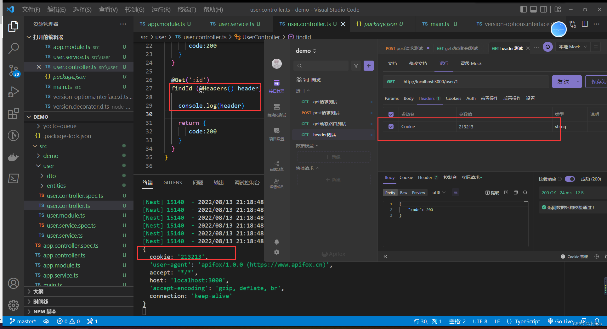

```typescript
import {
  Controller,
  Get,
  Post,
  Body,
  Patch,
  Param,
  Delete,
  Version,
  Request,
  Query,
  Ip,
  Header,
  Headers,
} from "@nestjs/common";
import { UserService } from "./user.service";
import { CreateUserDto } from "./dto/create-user.dto";
import { UpdateUserDto } from "./dto/update-user.dto";

@Controller("user")
export class UserController {
  constructor(private readonly userService: UserService) {}

  @Get()
  find(@Query() query) {
    console.log(query);
    return { code: 200 };
  }

  @Post()
  create(@Body("name") body) {
    console.log(body);

    return {
      code: 200,
    };
  }

  @Get(":id")
  findId(@Headers() header) {
    console.log(header);

    return {
      code: 200,
    };
  }
}
```

#### 5.状态码

使用 HttpCode 装饰器 控制接口返回的状态码

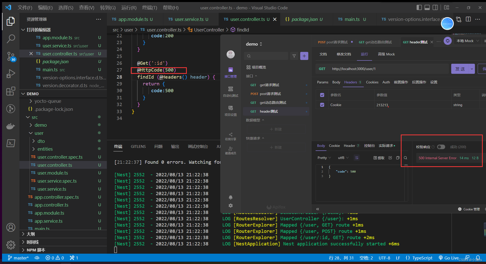

```typescript
import {
  Controller,
  Get,
  Post,
  Body,
  Patch,
  Param,
  Delete,
  Version,
  Request,
  Query,
  Ip,
  Header,
  Headers,
  HttpCode,
} from "@nestjs/common";
import { UserService } from "./user.service";
import { CreateUserDto } from "./dto/create-user.dto";
import { UpdateUserDto } from "./dto/update-user.dto";

@Controller("user")
export class UserController {
  constructor(private readonly userService: UserService) {}

  @Get()
  find(@Query() query) {
    console.log(query);
    return { code: 200 };
  }

  @Post()
  create(@Body("name") body) {
    console.log(body);

    return {
      code: 200,
    };
  }

  @Get(":id")
  @HttpCode(500)
  findId(@Headers() header) {
    return {
      code: 500,
    };
  }
}
```

## 7、nestjs 提供者

Providers
Providers 是 Nest 的一个基本概念。许多基本的 Nest 类可能被视为 provider - service, repository, factory, helper 等等。 他们都可以通过 constructor 注入依赖关系。 这意味着对象可以彼此创建各种关系，并且“连接”对象实例的功能在很大程度上可以委托给 Nest 运行时系统。 Provider 只是一个用 @Injectable() 装饰器注释的类。

### 1.基本用法

module 引入 service 在 providers 注入

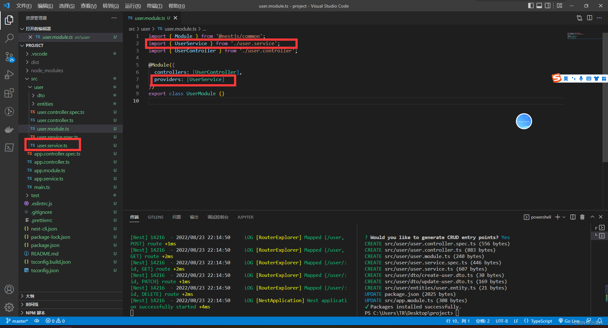

在 Controller 就可以使用注入好的 service 了


### 2.service 第二种用法(自定义名称)

第一种用法就是一个[语法糖](https://so.csdn.net/so/search?q=语法糖&spm=1001.2101.3001.7020)

其实他的全称是这样的

```typescript
import { Module } from "@nestjs/common";
import { UserService } from "./user.service";
import { UserController } from "./user.controller";

@Module({
  controllers: [UserController],
  providers: [
    {
      provide: "user",
      useClass: UserService,
    },
  ],
})
export class UserModule {}
```

自定义名称之后 需要用对应的 Inject 取 不然会找不到的

### 3.自定义注入值

通过 useValue

```typescript
import { Module } from "@nestjs/common";
import { UserService } from "./user.service";
import { UserController } from "./user.controller";

@Module({
  controllers: [UserController],
  providers: [
    {
      provide: "user",
      useClass: UserService,
    },
    {
      provide: "JD",
      useValue: ["TB", "PDD", "JD"],
    },
  ],
})
export class UserModule {}
```

#### 3.工厂模式

如果服务 之间有相互的依赖 或者逻辑处理 可以使用 useFactory

```TypeScript
import { Module } from '@nestjs/common';
import { UserService } from './user.service';
import { UserService2 } from './user.service2';
import { UserService3 } from './user.service3';
import { UserController } from './user.controller';

@Module({
  controllers: [UserController],
  providers: [{
    provide: "user",
    useClass: UserService
  }, {
    provide: "JD",
    useValue: ['TB', 'PDD', 'JD']
  },
    UserService2,
  {
    provide: "Test",
    inject: [UserService2],
    useFactory(UserService2: UserService2) {
      return new UserService3(UserService2)
    }
  }
  ]
})
export class UserModule { }
```

#### 4.异步模式

useFactory 返回一个 promise 或者其他异步操作

```TypeScript
import { Module } from '@nestjs/common';
import { UserService } from './user.service';
import { UserService2 } from './user.service2';
import { UserService3 } from './user.service3';
import { UserController } from './user.controller';

@Module({
  controllers: [UserController],
  providers: [{
    provide: "user",
    useClass: UserService
  }, {
    provide: "JD",
    useValue: ['TB', 'PDD', 'JD']
  },
    UserService2,
  {
    provide: "Test",
    inject: [UserService2],
    useFactory(UserService2: UserService2) {
      return new UserService3(UserService2)
    }
  },
  {
    provide: "sync",
    async useFactory() {
      return await  new Promise((r) => {
        setTimeout(() => {
          r('sync')
        }, 3000)
      })
    }
  }
  ]
})
export class UserModule { }
```

## 8、nestjs 上传图片-静态目录

### Nestjs 上传图片

#### 1.主要会用到两个包

multer @nestjs/platform-express **nestJs 自带了**

multer @types/multer 这两个需要安装

在 upload Module 使用 MulterModule register 注册存放图片的目录

需要用到 multer 的 diskStorage 设置存放目录 extname 用来读取文件后缀 filename 给文件重新命名

==upload.module.ts 文件==

```typescript
import { Module } from "@nestjs/common";
import { UploadService } from "./upload.service";
import { UploadController } from "./upload.controller";
// 引入
import { MulterModule } from "@nestjs/platform-express";
import { diskStorage } from "multer";
import { extname, join } from "path";

@Module({
  imports: [
    MulterModule.register({
      storage: diskStorage({
        // 设置文件保存的路径
        destination: join(__dirname, "../images"),
        filename: (_, file, callback) => {
          // 定义保存的文件名
          const fileName = `${
            new Date().getTime() + extname(file.originalname)
          }`;
          // 抛出
          return callback(null, fileName);
        },
      }),
    }),
  ],
  controllers: [UploadController],
  providers: [UploadService],
})
export class UploadModule {}
```

#### 2.controller 使用

使用 `UseInterceptors` 装饰器`FileInterceptor`是单个 `FilesInterceptor`是多个

参数 使用 `UploadedFile` 装饰器接受 file 文件

==upload.controller.ts 文件==

```typescript
import {
  Controller,
  Post,
  UseInterceptors,
  UploadedFile,
} from "@nestjs/common";
import { UploadService } from "./upload.service";
import { FileInterceptor } from "@nestjs/platform-express";
@Controller("upload")
export class UploadController {
  constructor(private readonly uploadService: UploadService) {}
  @Post("album")
  // 配置参数名称
  @UseInterceptors(FileInterceptor("file"))
  upload(@UploadedFile() file) {
    console.log(file);
    return {
      code: 200,
      msg: "上传成功",
    };
  }
}
```

#### 3.如果想要生成静态目录，并且访问上传之后的图片

==main.ts 文件==

```typescript
import { NestFactory } from "@nestjs/core";
import { AppModule } from "./app.module";
// 配置静态访问的路由
import { NestExpressApplication } from "@nestjs/platform-express";
import { join } from "path";

async function bootstrap() {
  const app = await NestFactory.create<NestExpressApplication>(AppModule);
  app.useStaticAssets(join(__dirname, "images"), {
    prefix: "/images",
  });
  await app.listen(3000);
}
bootstrap();
```

## 9、nestjs 下载图片

下载文件的方式有好多种

### 1.download 直接下载

这个文件信息应该存数据库 这儿演示就写死 了

```typescript
import {
  Controller,
  Post,
  Get,
  UseInterceptors,
  UploadedFile,
  Res,
} from "@nestjs/common";
import { UploadService } from "./upload.service";
import { FileInterceptor } from "@nestjs/platform-express";
import type { Response } from "express";
import { join } from "path";

@Controller("upload")
export class UploadController {
  constructor(private readonly uploadService: UploadService) {}
  /**
   * 上传图片
   * @param file
   */
  @Post("album")
  // 配置参数名称
  @UseInterceptors(FileInterceptor("file"))
  upload(@UploadedFile() file) {
    console.log(file);
    return {
      code: 200,
      msg: "上传成功",
    };
  }
  /**
   * 下载图片
   * @param res
   */
  @Get("export")
  downLoad(@Res() res: Response) {
    const url = join(__dirname, "../images/1701956065902.png");
    // res
    // console.log(url)
    res.download(url);
    // return  true
  }
}
```

### 2.使用文件流的方式下载

可以使用 compressing 把他压缩成一个 zip 包

import {zip} from 'compressing'

```typescript
@Get('stream')
async down (@Res() res:Response) {
    const url = join(__dirname,'../images/1662894316133.png')
    const tarStream  = new zip.Stream()
    await tarStream.addEntry(url)

    res.setHeader('Content-Type', 'application/octet-stream');

    res.setHeader(
        'Content-Disposition',
        `attachment; filename=genshen`,
    );

    tarStream.pipe(res)

}
```

前端接受流

```typescript
const useFetch = async (url: string) => {
  const res = await fetch(url).then((res) => res.arrayBuffer());
  console.log(res);
  const a = document.createElement("a");
  a.href = URL.createObjectURL(
    new Blob([res], {
      // type:"image/png"
    })
  );
  a.download = "file.zip";
  a.click();
};

const download = () => {
  useFetch("http://localhost:3000/upload/stream");
};
```

## 10、nestjs 和 RxJs

概念
RxJs 使用的是观察者模式，用来编写异步队列和事件处理。

Observable 可观察的物件

Subscription 监听 Observable

Operators 纯函数可以处理管道的数据 如 map filter concat reduce 等

案例
类似于迭代器 next 发出通知 complete 通知完成

subscribe 订阅 observable 发出的通知 也就是一个观察者

```typescript
import { Observable } from "rxjs";

//类似于迭代器 next 发出通知  complete通知完成
const observable = new Observable((subscriber) => {
  subscriber.next(1);
  subscriber.next(2);
  subscriber.next(3);

  setTimeout(() => {
    subscriber.next(4);
    subscriber.complete();
  }, 1000);
});

observable.subscribe({
  next: (value) => {
    console.log(value);
  },
});
```

案例 2

interval 五百毫秒执行一次 pipe 就是管道的意思 管道里面也是可以去掉接口的支持处理异步数据 去处理数据 这儿展示 了 map 和 filter 跟数组的方法是一样的 最后 通过观察者 subscribe 接受回调

```typescript
import { Observable, interval, take } from "rxjs";
import { map, filter, reduce, find, findIndex } from "rxjs/operators";

const subs = interval(500)
  .pipe(
    map((v) => ({ num: v })),
    filter((v) => v.num % 2 == 0)
  )
  .subscribe((e) => {
    console.log(e);
    if (e.num == 10) {
      subs.unsubscribe();
    }
  });
```

案例 3

Rxjs 也可以处理事件 不过我们在 Nestjs 里面就不用操作 DOM 了 你如果 Angular 或则 Vue 框架看可以使用 fromEvent

```typescript
import { Observable, interval, take, of, retry, fromEvent } from "rxjs";
import { map, filter, reduce, find, findIndex } from "rxjs/operators";

const dom = fromEvent(document, "click").pipe(map((e) => e.target));
dom.subscribe((e) => {});
```

## 11、nestjs 响应拦截器

拦截器
拦截器具有一系列有用的功能，这些功能受面向切面编程（AOP）技术的启发。它们可以：

- 在函数执行之前/之后绑定额外的逻辑
- 转换从函数返回的结果
- 转换从函数抛出的异常
- 扩展基本函数行为
- 根据所选条件完全重写函数 (例如, 缓存目的)
- 我们现在没有给我们的 Nestjs 规范返回给前端的格式现在比较乱

我们想给他返回一个标准的 json 格式 就要给我们的数据做一个全局 format

```cobol
{
  data, //数据
  status:0,
  message:"成功",
  success:true
}
```

新建 common 文件夹 创建 response.ts

```typescript
import { Injectable, NestInterceptor, CallHandler } from "@nestjs/common";
import { map } from "rxjs/operators";
import { Observable } from "rxjs";

interface data<T> {
  data: T;
}

@Injectable()
export class Response<T = any> implements NestInterceptor {
  intercept(context, next: CallHandler): Observable<data<T>> {
    return next.handle().pipe(
      map((data) => {
        return {
          data,
          status: 0,
          success: true,
          message: "成功",
        };
      })
    );
  }
}
```

在 main.ts 注册

```vbscript
app.useGlobalInterceptors(new Response())
```

## 12、nestjs 异常拦截器

common 下面新建 filter.ts

创建一个异常过滤器，它负责捕获作为 HttpException 类实例的异常，并为它们设置自定义响应逻辑。为此，我们需要访问底层平台 Request 和 Response。我们将访问 Request 对象，以便提取原始 url 并将其包含在日志信息中。我们将使用 Response.json()方法，使用 Response 对象直接控制发送的响应。

```typescript
import {
  ExceptionFilter,
  Catch,
  ArgumentsHost,
  HttpException,
} from "@nestjs/common";

import { Request, Response } from "express";

@Catch(HttpException)
export class HttpFilter implements ExceptionFilter {
  catch(exception: HttpException, host: ArgumentsHost) {
    const ctx = host.switchToHttp();
    const request = ctx.getRequest<Request>();
    const response = ctx.getResponse<Response>();

    const status = exception.getStatus();

    response.status(status).json({
      data: exception.message,
      time: new Date().getTime(),
      success: false,
      path: request.url,
      status,
    });
  }
}
```

注册全局异常过滤器

```typescript
// 引入异常拦截器
import { HttpFilter } from "./common/filter";

app.useGlobalFilters(new HttpFilter());
```

## 13、nestjs 管道转换


管道 可以做两件事

1.转换，可以将前端传入的数据转成成我们需要的数据

2.验证 类似于前端的 rules 配置验证规则

我们先来讲一下转换 Nestjs 提供了八个内置转换 API

- ValidationPipe
- ParseIntPipe
- ParseFloatPipe
- ParseBoolPipe
- ParseArrayPipe
- ParseUUIDPipe
- ParseEnumPipe
- DefaultValuePipe

### 案例 1 我们接受的动态参数希望是一个 number 类型 现在是 string

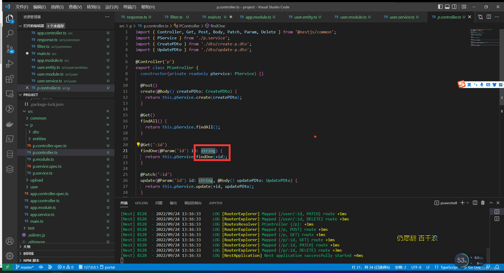

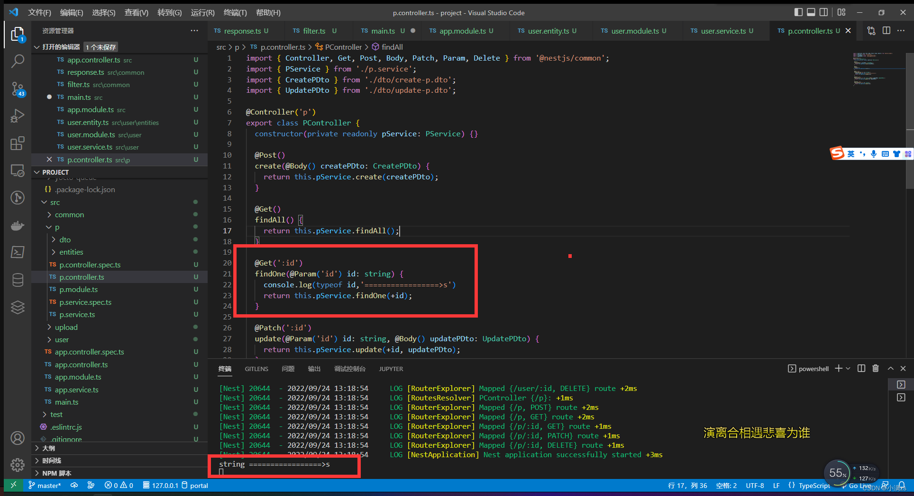

这时候就可以通过内置的管道 去做转换

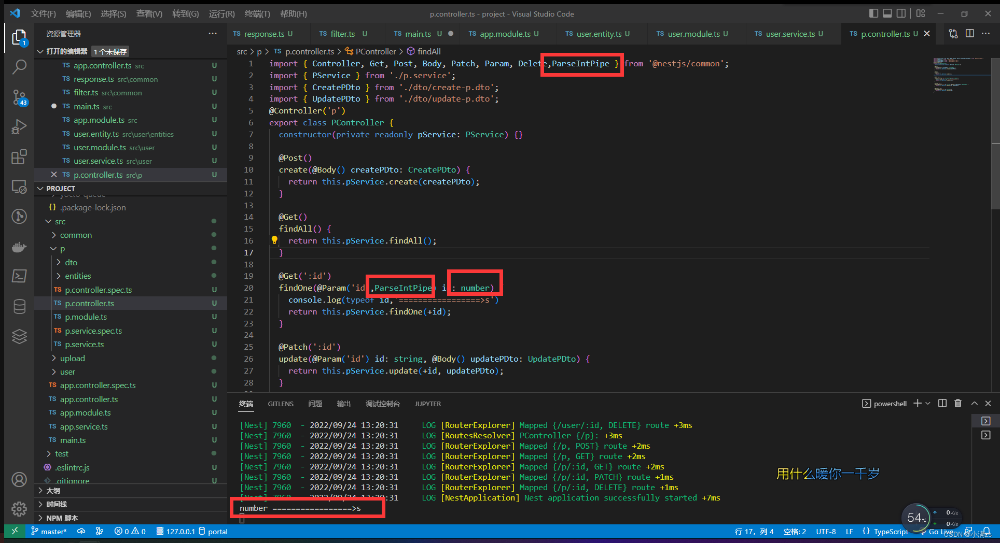

```typescript
 @Get(':id')
  findOne(@Param('id', ParseIntPipe) id: number) {
    console.log(typeof id); // number
    return this.pService.findOne(+id);
  }

```

### 案例 2 验证 UUID

安装 uuid

npm install uuid -S

npm install @types/uuid -D

生成一个 uuid

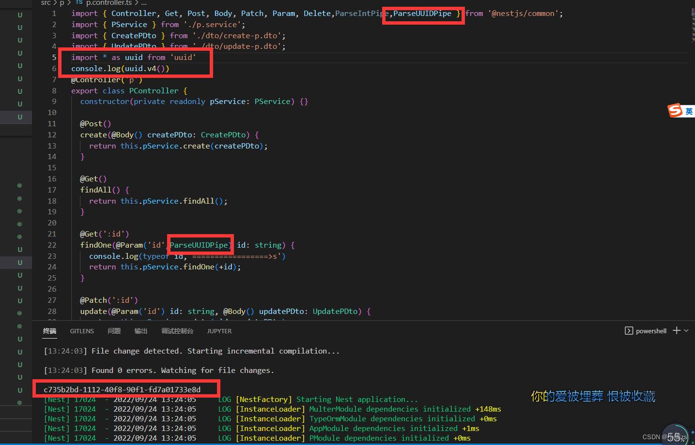

## 14、nestjs 管道验证 DTO

### 1.先创建一个 pipe 验证管道

`nest g pi 文件名字`

```typescript
import { ArgumentMetadata, Injectable, PipeTransform } from "@nestjs/common";

@Injectable()
export class LoginPipe implements PipeTransform {
  transform(value: any, metadata: ArgumentMetadata) {
    console.log(value, metadata);
    //{ name: '张三' } { metatype: [class CreateLoginDto], type: 'body', data:undefined }
    return value;
  }
}
```

### 2.安装验证器

```js
npm i --save class-validator class-transformer
```

```typescript
// create-login.dto.ts

import { IsNotEmpty, IsString } from "class-validator";
export class CreatePDto {
  @IsNotEmpty() //验证是否为空
  @IsString() //是否为字符串
  name: string;

  @IsNotEmpty()
  age: number;
}
```

### 3.controller 使用管道 和定义类型

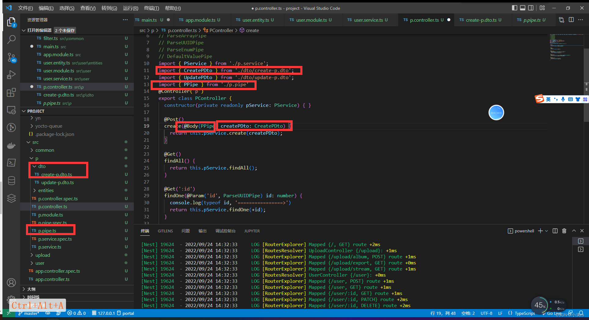

### 4.实现验证 transform

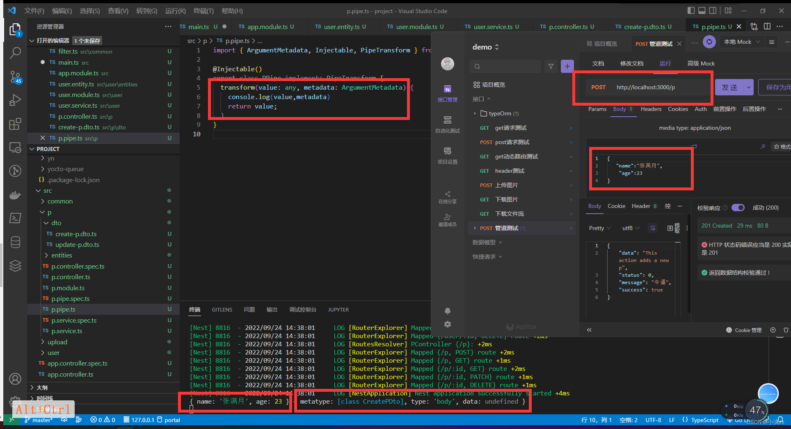

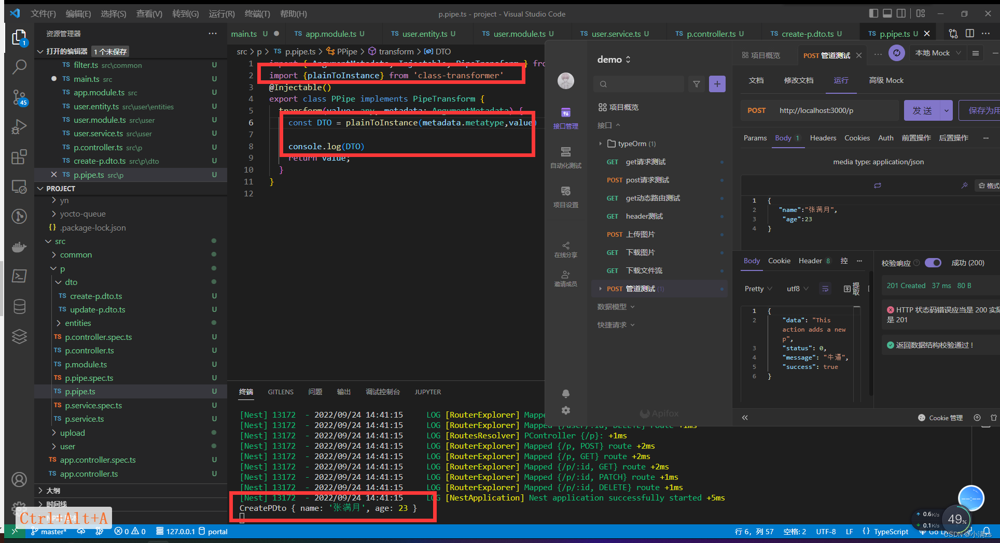

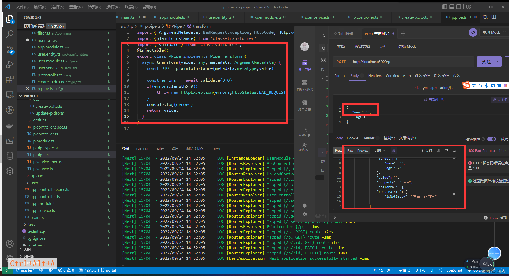

```typescript
// login.pipe.ts
import { ArgumentMetadata, Injectable, PipeTransform } from "@nestjs/common";
import { plainToInstance } from "class-transformer";
import { validate } from "class-validator";

@Injectable()
export class LoginPipe implements PipeTransform {
  async transform(value: any, metadata: ArgumentMetadata) {
    const DTO = plainToInstance(metadata.metatype, value);
    console.log(DTO); //CreateLoginDto { name: '123' }
    const error = await validate(DTO);
    console.log(error);
    // [ValidationError {
    //    target: CreateLoginDto { name: '123' },
    //    value: '123',
    //    property: 'name',
    //    children: [],
    //    constraints: { isLength: '长度为5-10位' }
    //  }
    // ]
    if (error.length > 0) {
      throw new HttpException(error, HttpStatus.BAD_REQUEST);
    }
    return value;
  }
}
```

### 5.注册全局 DTO 验证管道

```typescript
// main.ts

import { NestFactory } from "@nestjs/core";
import { AppModule } from "./app.module";
// 配置静态访问的路由
import { NestExpressApplication } from "@nestjs/platform-express";
import { join } from "path";
// 引入响应拦截器
import { Response } from "./common/response";
// 引入异常拦截器
import { HttpFilter } from "./common/filter";
// 引入全局验证
import { ValidationPipe } from "@nestjs/common";

async function bootstrap() {
  const app = await NestFactory.create<NestExpressApplication>(AppModule);
  // 注册全局响应拦截器
  app.useGlobalInterceptors(new Response());
  // 注册全局异常过滤器
  app.useGlobalFilters(new HttpFilter());
  app.useStaticAssets(join(__dirname, "images"), {
    prefix: "/images",
  });

  app.useGlobalPipes(new ValidationPipe());

  await app.listen(3000);
}
bootstrap();
```

## 15、nestjs 爬虫

其实爬虫是一个对计算机综合能力要求比较高的技术活。

首先是要对网络协议尤其是 http 协议有基本的了解, 能够分析网站的数据请求响应。学会使用一些工具，简单的情况使用 chrome devtools 的 network 面板就够了

- cheerio: 是 jquery 核心功能的一个快速灵活而又简洁的实现，主要是为了用在服务器端需要对 DOM 进行操作的地方，让你在服务器端和 html 愉快的玩耍。
- axios 网络请求库可以发送 http 请求

```typescript
import { Injectable } from "@nestjs/common";
import axios from "axios";
import * as cheerio from "cheerio";
import * as fs from "fs";
import * as path from "path";

@Injectable()
export class SpiderService {
  async findAll() {
    const urlList: any = [];
    const getCosPlay = async () => {
      const body = await axios
        .get("https://www.yeitu.com/dongman/cosplay/20160416_10878.html")
        .then((res) => res.data);
      const $ = cheerio.load(body);
      $(".article-body a img").each(function () {
        urlList.push($(this).attr("src"));
      });
    };
    await getCosPlay();
    console.log(urlList);
    this.writeFile(urlList);
    return "cos";
  }
  // 写入本地
  writeFile(urls: string[]) {
    urls.forEach(async (url) => {
      const buffer = await axios
        .get(url, { responseType: "arraybuffer" })
        .then((res) => res.data);
      const ws = fs.createWriteStream(
        path.join(__dirname, "../images/cos" + new Date().getTime() + ".jpg")
      );
      ws.write(buffer);
    });
  }
}
```

## 16、nestjs 连接数据库

#### ORM 框架（typeOrm）

typeOrm 是 `TypeScript` 中最成熟的对象关系映射器( `ORM` )。因为它是用 `TypeScript` 编写的，所以可以很好地与 `Nest` 框架集成

##### 安装依赖

```
npm install --save @nestjs/typeorm typeorm mysql2
```

##### 如果使用的是 vsCode 安装数据库可视化工具

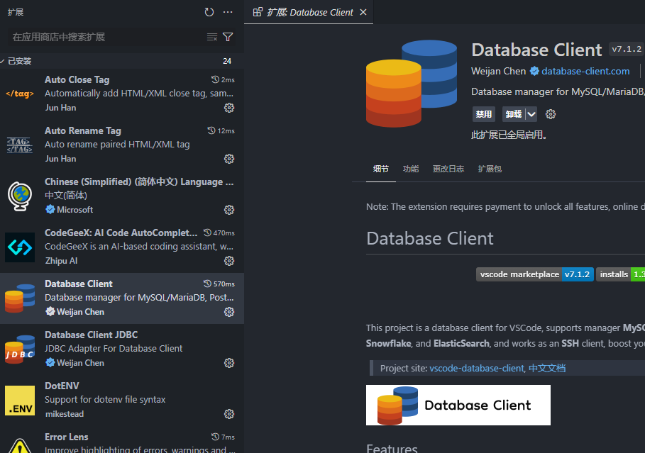

##### 在 app.module.ts 注册

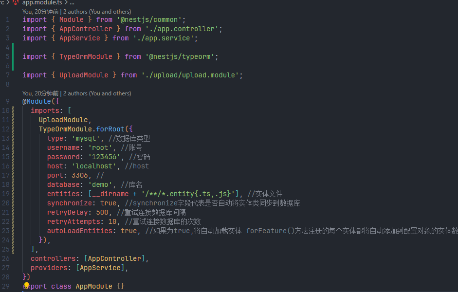

##### 定义实体

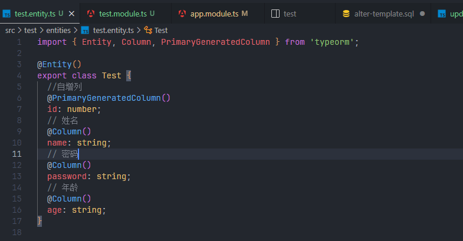

##### 关联实体

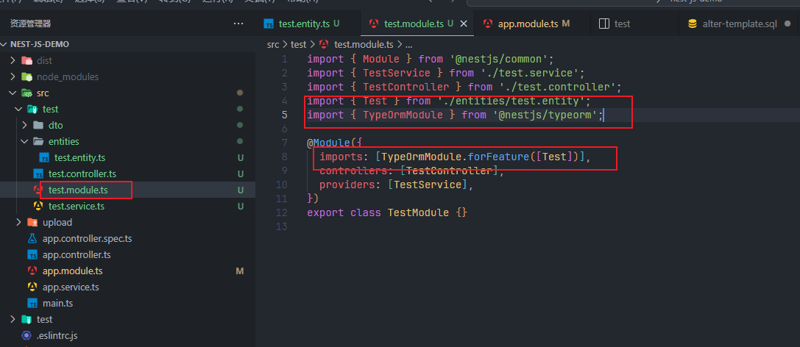

## 17、nestjs 实体

> 什么是实体

> 实体是一个映射到数据库表的类。 你可以通过定义一个新类来创建一个实体，并用`@Entity()`来标记：

```ts
import { Entity, Column, PrimaryGeneratedColumn } from "typeorm";

@Entity()
export class Test {
  @PrimaryGeneratedColumn()
  id: number;

  @Column()
  name: string;

  @Column()
  password: string;

  @Column()
  age: number;
}
```

#### 列类型

```ts
@Column({type:"varchar",length:200})
password: string

@Column({ type: "int"})
age: number

@CreateDateColumn({type:"timestamp"})
create_time:Date
```

mysql 所有类型

`int, tinyint, smallint, mediumint, bigint, float, double, dec, decimal, numeric, date, datetime, timestamp, time, year, char, varchar, nvarchar, text, tinytext, mediumtext, blob, longtext, tinyblob, mediumblob, longblob, enum, json, binary, geometry, point, linestring, polygon, multipoint, multilinestring, multipolygon, geometrycollection`

#### 自动生成列

```ts
@Generated('uuid')
uuid:string
```

#### 枚举列

```ts
  @Column({
    type:"enum",
    enum:['1','2','3','4'],
    default:'1'
  })
  xx:string
```

#### 列选项

```ts
@Column({
    type:"varchar",
    name:"ipaaa", //数据库表中的列名
    nullable:true, //在数据库中使列NULL或NOT NULL。 默认情况下，列是nullable：false
    comment:"注释",
    select:true,  //定义在进行查询时是否默认隐藏此列。 设置为false时，列数据不会显示标准查询。 默认情况下，列是select：true
    default:"xxxx", //加数据库级列的DEFAULT值
    primary:false, //将列标记为主要列。 使用方式和@ PrimaryColumn相同。
    update:true, //指示"save"操作是否更新列值。如果为false，则只能在第一次插入对象时编写该值。 默认值为"true"
    collation:"", //定义列排序规则。
})
ip:string
```

ColumnOptions 中可用选项列表：

- type: ColumnType - 列类型。其中之一在上面.
- name: string - 数据库表中的列名。
  默认情况下，列名称是从属性的名称生成的。 你也可以通过指定自己的名称来更改它。
- length: number - 列类型的长度。 例如，如果要创建 varchar（150）类型，请指定列类型和长度选项。
- width: number - 列类型的显示范围。 仅用于 MySQL integer types(opens new window)
- onUpdate: string - ON UPDATE 触发器。 仅用于 MySQL (opens new window).
- nullable: boolean - 在数据库中使列 NULL 或 NOT NULL。 默认情况下，列是 nullable：false。
- update: boolean - 指示"save"操作是否更新列值。如果为 false，则只能在第一次插入对象时编写该值。 默认值为"true"。
- select: boolean - 定义在进行查询时是否默认隐藏此列。 设置为 false 时，列数据不会显示标准查询。 默认情况下，列是 select：true
- default: string - 添加数据库级列的 DEFAULT 值。
- primary: boolean - 将列标记为主要列。 使用方式和@ PrimaryColumn 相同。
- unique: boolean - 将列标记为唯一列（创建唯一约束）。
- comment: string - 数据库列备注，并非所有数据库类型都支持。
- precision: number - 十进制（精确数字）列的精度（仅适用于十进制列），这是为值存储的最大位数。仅用于某些列类型。
- scale: number - 十进制（精确数字）列的比例（仅适用于十进制列），表示小数点右侧的位数，且不得大于精度。 仅用于某些列类型。
- zerofill: boolean - 将 ZEROFILL 属性设置为数字列。 仅在 MySQL 中使用。 如果是 true，MySQL 会自动将 UNSIGNED 属性添加到此列。
- unsigned: boolean - 将 UNSIGNED 属性设置为数字列。 仅在 MySQL 中使用。
- charset: string - 定义列字符集。 并非所有数据库类型都支持。
- collation: string - 定义列排序规则。
- enum: string[]|AnyEnum - 在 enum 列类型中使用，以指定允许的枚举值列表。 你也可以指定数组或指定枚举类。
- asExpression: string - 生成的列表达式。 仅在 MySQL (opens new window)中使用。
- generatedType: "VIRTUAL"|"STORED" - 生成的列类型。 仅在 MySQL (opens new window)中使用。
- hstoreType: "object"|"string" -返回 HSTORE 列类型。 以字符串或对象的形式返回值。 仅在 Postgres 中使用。
- array: boolean - 用于可以是数组的 postgres 列类型（例如 int []）
- transformer: { from(value: DatabaseType): EntityType, to(value: EntityType): DatabaseType } - 用于将任意类型 EntityType 的属性编组为数据库支持的类型 DatabaseType。

#### simple-array 列类型

> 有一种称为`simple-array`的特殊列类型，它可以将原始数组值存储在单个字符串列中。 所有值都以逗号分隔

```ts
@Entity()
export class User {
  @PrimaryGeneratedColumn()
  id: number;

  @Column("simple-array")
  names: string[];
}
```

#### simple-json 列类型

还有一个名为`simple-json`的特殊列类型，它可以存储任何可以通过 JSON.stringify 存储在数据库中的值。 当你的数据库中没有 json 类型而你又想存储和加载对象，该类型就很有用了。 例如

```ts
@Entity()
export class User {
  @PrimaryGeneratedColumn()
  id: number;

  @Column("simple-json")
  profile: { name: string; nickname: string };
}
```
